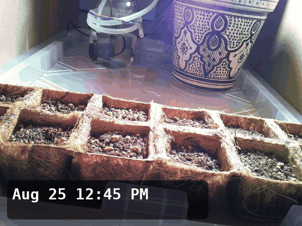

# `archive-extras/`

> **Archive note:** This file was not on the Raspberry Pi. The experimenter added it to the public archive to help you find your way.

**You are in:** the only folder that was not on the Raspberry Pi. The experimenter made the items in this folder for the archive, from the data on the Raspberry Pi.

| File | What it is |
|---|---|
| [`timelapse.gif`](timelapse.gif) | A short film of the experiment: 121 frames, approximately three for each day. The experimenter made it from the photos in this archive. |

---

**Go up:** [the top of the archive](../README.md)
