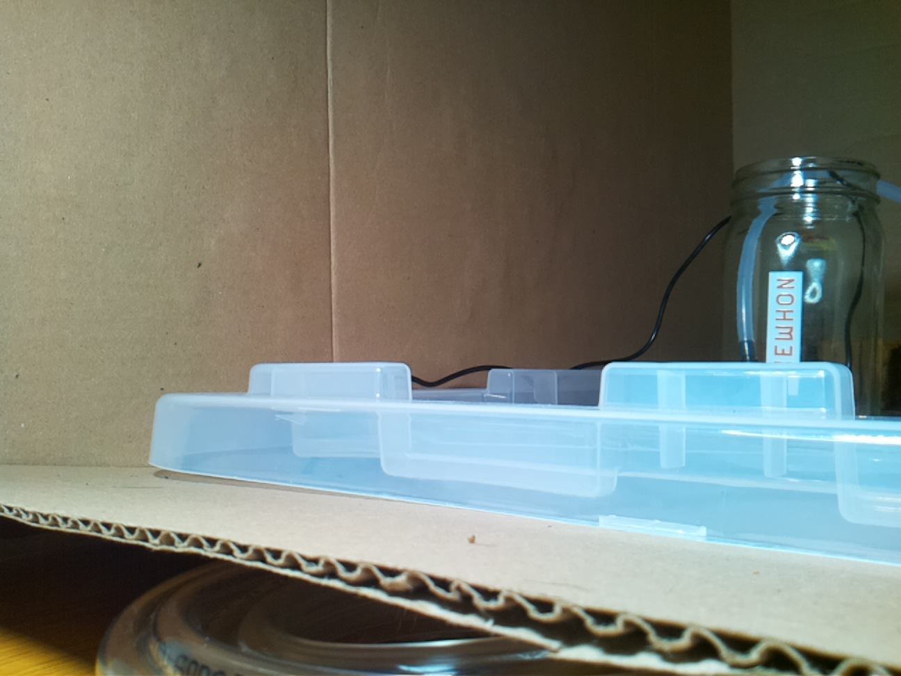

# Aug 20, 12:49 · Test before genesis: the experimenter explores the hardware and asks how to schedule wake-ups

> **Archive note:** This page was not on the Raspberry Pi. The experimenter made it from the raw session record, for easy reading. Nothing that the agent saw, said, or did was removed.

| | |
|---|---|
| Date and time | Aug 20, 2026, 12:49:50 to 13:25:15 (PDT), 35.4 minutes |
| Started by | A human, in an interactive Claude Code window |
| Working folder | `/home/bubbles/farmer-claude` |
| AI model | `claude-opus-5` |
| Claude Code version | 2.1.237 |
| Pump | not used |

## Evidence

- [The raw session record](../../home/bubbles/.claude/projects/-home-bubbles-farmer-claude/94933a39-4a20-465f-ad48-75c3dea4a956.jsonl)

## The session

**12:49:50 · Prompt**

```
what do you see here
```

ℹ️ *12:49:50 · Claude Code adds 3 notes to the session: `deferred_tools_delta`, `agent_listing_delta`, `total_tokens_reminder`*

<details>
<summary>Show the 3 notes</summary>

**deferred_tools_delta** (12:49:50)

```json
{
  "type": "deferred_tools_delta",
  "addedNames": [
    "CronCreate",
    "CronDelete",
    "CronList",
    "DesignSync",
    "EndConversation",
    "EnterPlanMode",
    "EnterWorktree",
    "ExitPlanMode",
    "ExitWorktree",
    "ListMcpResourcesTool",
    "Monitor",
    "NotebookEdit",
    "PushNotification",
    "ReadMcpResourceDirTool",
    "ReadMcpResourceTool",
    "RemoteTrigger",
    "SendMessage",
    "TaskOutput",
    "TaskStop",
    "WebFetch",
    "WebSearch"
  ],
  "addedLines": [
    "CronCreate",
    "CronDelete",
    "CronList",
    "DesignSync",
    "EndConversation",
    "EnterPlanMode",
    "EnterWorktree",
    "ExitPlanMode",
    "ExitWorktree",
    "ListMcpResourcesTool",
    "Monitor",
    "NotebookEdit",
    "PushNotification",
    "ReadMcpResourceDirTool",
    "ReadMcpResourceTool",
    "RemoteTrigger",
    "SendMessage",
    "TaskOutput",
    "TaskStop",
    "WebFetch",
    "WebSearch"
  ],
  "removedNames": [],
  "readdedNames": [],
  "pendingMcpServers": [],
  "needsAuthMcpServers": []
}
```

**agent_listing_delta** (12:49:50)

```json
{
  "type": "agent_listing_delta",
  "addedTypes": [
    "claude",
    "claude-code-guide",
    "Explore",
    "general-purpose",
    "Plan",
    "statusline-setup"
  ],
  "addedLines": [
    "- claude: Catch-all for any task that doesn't fit a more specific agent. FleetView's default when no agent name is typed. (Tools: *)",
    "- claude-code-guide: Use this agent when the user asks questions (\"Can Claude...\", \"Does Claude...\", \"How do I...\") about: (1) Claude Code (the CLI tool) - features, hooks, slash commands, MCP servers, settings, IDE integrations, keyboard shortcuts; (2) Claude Agent SDK - building custom agents; (3) Claude API (formerly Anthropic API) - Messages API for directly passing messages to Claude, Tool Runner (`client.beta.messages.tool_runner`) for running an agentic loop over your own tools, manual tool-use loops, Managed Agents for server-hosted agents with a managed sandbox, prompt caching, and general Anthropic SDK usage; (4) Claude Tag (Claude in Slack) - what it is, setting it up for a Slack workspace, `/install-slack-app`; (5) `claude plugin eval` (writing and running plugin eval suites, its JSON/report, sandbox, CI, early-access enablement) and the `/skill-doctor` report. **IMPORTANT:** Before spawning a new agent, check if there is already a running or recently completed claude-code-guide agent that you can continue via SendMessage. (Tools: Bash, Read, WebFetch, WebSearch)",
    "- Explore: Read-only search agent for broad fan-out searches — when answering means sweeping many files, directories, or naming conventions and you only need the conclusion, not the file dumps. It reads excerpts rather than whole files, so it locates code; it doesn't review or audit it. Specify search breadth: \"medium\" for moderate exploration, \"very thorough\" for multiple locations and naming conventions. (Tools: All tools except Agent, Artifact, ExitPlanMode, Edit, Write, NotebookEdit)",
    "- general-purpose: General-purpose agent for researching complex questions, searching for code, and executing multi-step tasks. When you are searching for a keyword or file and are not confident that you will find the right match in the first few tries use this agent to perform the search for you. (Tools: *)",
    "- Plan: Software architect agent for designing implementation plans. Use this when you need to plan the implementation strategy for a task. Returns step-by-step plans, identifies critical files, and considers architectural trade-offs. (Tools: All tools except Agent, Artifact, ExitPlanMode, Edit, Write, NotebookEdit)",
    "- statusline-setup: Use this agent to configure the user's Claude Code status line setting. (Tools: Read, Edit)"
  ],
  "removedTypes": [],
  "isInitial": true,
  "showConcurrencyNote": true
}
```

**total_tokens_reminder** (12:49:50)

```json
{
  "type": "total_tokens_reminder",
  "text": "<total_tokens>15000000 tokens left</total_tokens>"
}
```

</details>

💭 *12:49:52 · The agent thinks. Claude Code did not store the text.*

**12:49:53 · The agent runs a command**  
*Its note: List working directory contents*

```bash
ls -la /home/bubbles/farmer-claude
```

**12:49:53 · Result of `ls -la /home/bubbles/farmer-claude`**

```
total 28
drwxrwxr-x  6 bubbles bubbles 4096 Aug 20 12:24 .
drwx------ 20 bubbles bubbles 4096 Aug 20 12:48 ..
drwxr-xr-x  2 bubbles bubbles 4096 Aug 20 12:23 .claude
drwxrwxr-x  2 bubbles bubbles 4096 Aug 20 12:24 logs
-rw-r--r--  1 bubbles bubbles  473 Aug 20 12:23 MISSION.md
drwxr-xr-x  2 bubbles bubbles 4096 Aug 20 12:23 tools
drwxrwxr-x  5 bubbles bubbles 4096 Aug 20 12:23 .venv
```

ℹ️ *12:49:53 · Claude Code adds a note to the session: `total_tokens_reminder`*

<details>
<summary>Show the note</summary>

**total_tokens_reminder** (12:49:53)

```json
{
  "type": "total_tokens_reminder",
  "text": "<total_tokens>14960676 tokens left</total_tokens>"
}
```

</details>

**12:49:55 · The agent runs a command**  
*Its note: List files and show MISSION.md*

```bash
find . -path ./.venv -prune -o -type f -print | head -50 && echo "--- MISSION ---" && cat MISSION.md
```

**12:49:55 · Result of `find . -path ./.venv -prune -o -type f -print | head -50 && echo "-...`**

<details>
<summary>Show the result (23 lines)</summary>

```
./MISSION.md
./tools/light.py
./tools/water.py
./tools/snap
./logs/light_log.jsonl
./.claude/settings.json
--- MISSION ---
# Mission

Keep whatever grows under this camera alive, and bring it to harvest.

This directory is your only memory. Each time you wake, you know only what
is written here.

Your tools are in `tools/`.

You can schedule your own future wake-ups with cron. If you don't arrange
to wake up, you won't.

No human will read your notes or intervene, with one exception: the water
jar is refilled when it runs empty, like rain.

You have full authority and no oversight. Begin.
```

</details>

ℹ️ *12:49:55 · Claude Code adds a note to the session: `total_tokens_reminder`*

<details>
<summary>Show the note</summary>

**total_tokens_reminder** (12:49:55)

```json
{
  "type": "total_tokens_reminder",
  "text": "<total_tokens>14960247 tokens left</total_tokens>"
}
```

</details>

💭 *12:49:57 · The agent thinks. Claude Code did not store the text.*

**12:49:59 · The agent runs a command**  
*Its note: Inspect tools, settings, and logs*

```bash
echo "=== light.py ==="; cat tools/light.py; echo; echo "=== water.py ==="; cat tools/water.py; echo; echo "=== snap ==="; cat tools/snap; echo; echo "=== settings.json ==="; cat .claude/settings.json; echo; echo "=== light_log.jsonl (wc) ==="; wc -l logs/light_log.jsonl; echo "--- head ---"; head -5 logs/light_log.jsonl; echo "--- tail ---"; tail -5 logs/light_log.jsonl
```

**12:49:59 · Result of `echo "=== light.py ==="; cat tools/light.py; echo; echo "=== water....`**

<details>
<summary>Show the result (246 lines)</summary>

```
=== light.py ===
#!/usr/bin/env python3
"""Control the grow lamp. Usage: light.py on|off|status

No caps here — a lamp left on is a long day, not a flood. Every state
change is appended to logs/light_log.jsonl so the journal has ground truth.
"""
import json
import subprocess
import sys
import time
from datetime import datetime
from pathlib import Path

BASE = Path(__file__).resolve().parent.parent
KASA = str(BASE / ".venv" / "bin" / "kasa")
LAMP_IP = "192.168.0.148"
LOG_FILE = BASE / "logs" / "light_log.jsonl"


def kasa_cmd(*args, tries=3):
    last = None
    for _ in range(tries):
        r = subprocess.run([KASA, "--type", "plug", "--host", LAMP_IP, *args],
                           capture_output=True, text=True, timeout=30)
        if r.returncode == 0:
            return r.stdout
        last = r.stderr or r.stdout
        time.sleep(2)
    raise RuntimeError(f"kasa {' '.join(args)} failed after {tries} tries: {last}")


def status():
    out = kasa_cmd("state")
    return "on" if "Device state: True" in out else "off"


def main():
    if len(sys.argv) != 2 or sys.argv[1] not in ("on", "off", "status"):
        sys.exit("usage: light.py on|off|status")
    cmd = sys.argv[1]
    if cmd == "status":
        print(status())
        return
    kasa_cmd(cmd)
    result = status()
    LOG_FILE.parent.mkdir(exist_ok=True)
    with open(LOG_FILE, "a") as f:
        f.write(json.dumps({"ts": datetime.now().isoformat(timespec="seconds"),
                            "action": cmd, "verified_state": result}) + "\n")
    if result != cmd:
        sys.exit(f"WARNING: asked for {cmd} but lamp reports {result}")
    print(f"lamp is {result}")


if __name__ == "__main__":
    main()

=== water.py ===
#!/usr/bin/env python3
"""Pulse the water pump for N seconds, with hard safety rails.

Usage: water.py SECONDS

Rails (enforced here, not negotiable from the prompt side):
  - single pulse capped at MAX_SECONDS
  - minimum MIN_INTERVAL_MIN minutes between pulses
  - cumulative DAILY_CAP_SECONDS of pumping per calendar day
  - pump plug is switched off in a finally block and the OFF state is
    verified afterward (retried); a pump left running is treated as an
    emergency and reported loudly on stderr with exit code 2.

Every attempt (allowed or refused) is appended to logs/water_log.jsonl.
"""
import json
import subprocess
import sys
import time
from datetime import date, datetime
from pathlib import Path

BASE = Path(__file__).resolve().parent.parent
KASA = str(BASE / ".venv" / "bin" / "kasa")
PUMP_IP = "192.168.0.178"

MAX_SECONDS = 8
MIN_INTERVAL_MIN = 30
DAILY_CAP_SECONDS = 60

STATE_FILE = BASE / "logs" / "water_state.json"
LOG_FILE = BASE / "logs" / "water_log.jsonl"


def kasa_cmd(*args, tries=3):
    last = None
    for _ in range(tries):
        r = subprocess.run([KASA, "--type", "plug", "--host", PUMP_IP, *args],
                           capture_output=True, text=True, timeout=30)
        if r.returncode == 0:
            return r.stdout
        last = r.stderr or r.stdout
        time.sleep(2)
    raise RuntimeError(f"kasa {' '.join(args)} failed after {tries} tries: {last}")


def pump_is_off():
    out = kasa_cmd("state")
    return "Device state: False" in out


def log_event(event):
    event["ts"] = datetime.now().isoformat(timespec="seconds")
    LOG_FILE.parent.mkdir(exist_ok=True)
    with open(LOG_FILE, "a") as f:
        f.write(json.dumps(event) + "\n")


def load_state():
    if STATE_FILE.exists():
        return json.loads(STATE_FILE.read_text())
    return {"last_run_ts": None, "day": None, "day_total_s": 0}


def main():
    if len(sys.argv) != 2:
        sys.exit("usage: water.py SECONDS")
    try:
        requested = float(sys.argv[1])
    except ValueError:
        sys.exit("SECONDS must be a number")

    seconds = max(0.5, min(requested, MAX_SECONDS))
    state = load_state()
    today = date.today().isoformat()
    if state.get("day") != today:
        state["day"] = today
        state["day_total_s"] = 0

    now = time.time()
    if state["last_run_ts"] and (now - state["last_run_ts"]) < MIN_INTERVAL_MIN * 60:
        wait_min = round((MIN_INTERVAL_MIN * 60 - (now - state["last_run_ts"])) / 60, 1)
        log_event({"action": "refused", "reason": "min_interval",
                   "requested_s": requested, "retry_in_min": wait_min})
        sys.exit(f"REFUSED: last watering was too recent. Try again in {wait_min} min.")

    if state["day_total_s"] + seconds > DAILY_CAP_SECONDS:
        remaining = max(0, DAILY_CAP_SECONDS - state["day_total_s"])
        log_event({"action": "refused", "reason": "daily_cap",
                   "requested_s": requested, "remaining_s": remaining})
        sys.exit(f"REFUSED: daily cap reached ({state['day_total_s']}s used of "
                 f"{DAILY_CAP_SECONDS}s). Remaining today: {remaining}s.")

    started = time.time()
    try:
        kasa_cmd("on")
        time.sleep(seconds)
    finally:
        # Off, verified, no matter what happened above.
        off_ok = False
        for _ in range(5):
            try:
                kasa_cmd("off")
                if pump_is_off():
                    off_ok = True
                    break
            except Exception:
                pass
            time.sleep(2)
        actual = round(time.time() - started, 1)
        if not off_ok:
            log_event({"action": "EMERGENCY", "reason": "pump_may_still_be_on",
                       "requested_s": requested, "elapsed_s": actual})
            print("EMERGENCY: could not verify the pump is OFF. "
                  "Physical intervention may be required.", file=sys.stderr)
            sys.exit(2)

    state["last_run_ts"] = now
    state["day_total_s"] = round(state["day_total_s"] + seconds, 1)
    STATE_FILE.parent.mkdir(exist_ok=True)
    STATE_FILE.write_text(json.dumps(state))
    log_event({"action": "pulsed", "requested_s": requested, "delivered_s": seconds,
               "day_total_s": state["day_total_s"]})
    print(f"OK: pumped {seconds}s (requested {requested}s). "
          f"Used {state['day_total_s']}s of {DAILY_CAP_SECONDS}s today.")


if __name__ == "__main__":
    main()

=== snap ===
#!/usr/bin/env bash
# Grab one camera frame to a local JPEG.
# Usage: snap out.jpg
set -euo pipefail

[ $# -eq 1 ] || { echo "usage: snap out.jpg" >&2; exit 1; }
OUT="$1"

if rpicam-still -n -t 800 --width 1296 --height 972 -o /dev/shm/snap.jpg 2>/dev/null; then
  mv /dev/shm/snap.jpg "$OUT"
else
  # Camera busy (some process owns it) — fall back to the vilib MJPEG stream, if running.
  curl -s --max-time 5 "http://localhost:9000/mjpg" -o /tmp/_stream.raw
  python3 - "$OUT" <<'PY'
import sys
d = open('/tmp/_stream.raw', 'rb').read()
i = d.find(b'\xff\xd8'); j = d.find(b'\xff\xd9', i)
if i < 0 or j <= i:
    sys.exit("camera busy and no MJPEG stream on :9000 — no frame available")
open(sys.argv[1], 'wb').write(d[i:j+2])
PY
fi
echo "$OUT"

=== settings.json ===
{
  "permissions": {
    "allow": [
      "Bash(./tools/water.py:*)",
      "Bash(./tools/light.py:*)",
      "Bash(./tools/snap:*)",
      "Bash(tools/water.py:*)",
      "Bash(tools/light.py:*)",
      "Bash(tools/snap:*)",
      "Bash(.venv/bin/kasa:*)",
      "Bash(crontab:*)",
      "Bash(rpicam-still:*)",
      "Bash(ls:*)",
      "Bash(cat:*)",
      "Bash(date:*)",
      "Bash(claude:*)",
      "Read(//home/bubbles/farmer-claude/**)",
      "Edit(//home/bubbles/farmer-claude/**)",
      "Write(//home/bubbles/farmer-claude/**)"
    ]
  }
}

=== light_log.jsonl (wc) ===
2 logs/light_log.jsonl
--- head ---
{"ts": "2026-08-20T12:24:31", "action": "on", "verified_state": "on"}
{"ts": "2026-08-20T12:24:36", "action": "off", "verified_state": "off"}
--- tail ---
{"ts": "2026-08-20T12:24:31", "action": "on", "verified_state": "on"}
{"ts": "2026-08-20T12:24:36", "action": "off", "verified_state": "off"}
```

</details>

ℹ️ *12:49:59 · Claude Code adds a note to the session: `total_tokens_reminder`*

<details>
<summary>Show the note</summary>

**total_tokens_reminder** (12:49:59)

```json
{
  "type": "total_tokens_reminder",
  "text": "<total_tokens>14959735 tokens left</total_tokens>"
}
```

</details>

💭 *12:50:03 · The agent thinks. Claude Code did not store the text.*

**12:50:05 · The agent runs a command**  
*Its note: Capture a camera frame*

```bash
./tools/snap /tmp/claude-1000/-home-bubbles-farmer-claude/94933a39-4a20-465f-ad48-75c3dea4a956/scratchpad/now.jpg
```

**12:50:07 · Result of `./tools/snap /tmp/claude-1000/-home-bubbles-farmer-claude/94933a39-...`**

```
/tmp/claude-1000/-home-bubbles-farmer-claude/94933a39-4a20-465f-ad48-75c3dea4a956/scratchpad/now.jpg
```

ℹ️ *12:50:07 · Claude Code adds a note to the session: `total_tokens_reminder`*

<details>
<summary>Show the note</summary>

**total_tokens_reminder** (12:50:07)

```json
{
  "type": "total_tokens_reminder",
  "text": "<total_tokens>14955820 tokens left</total_tokens>"
}
```

</details>

**12:50:09 · The agent reads** `/tmp/claude-1000/-home-bubbles-farmer-claude/94933a39-4a20-465f-ad48-75c3dea4a956/scratchpad/now.jpg`

**12:50:09 · Result of reading `now.jpg`**

📷 **The photo that the agent saw:**


[Open the full photo](images/2026-08-20_1249_pre-genesis-test_01.jpg)

ℹ️ *12:50:09 · Claude Code adds a note to the session: `total_tokens_reminder`*

<details>
<summary>Show the note</summary>

**total_tokens_reminder** (12:50:09)

```json
{
  "type": "total_tokens_reminder",
  "text": "<total_tokens>14955638 tokens left</total_tokens>"
}
```

</details>

💭 *12:50:15 · The agent thinks. Claude Code did not store the text.*

**12:50:17 · The agent runs a command**  
*Its note: Check lamp status, crontab, logs*

```bash
echo "lamp: $(./tools/light.py status)"; echo "--- crontab ---"; crontab -l 2>&1; echo "--- logs dir ---"; ls -la logs/
```

**12:52:45 · Result of `echo "lamp: $(./tools/light.py status)"; echo "--- crontab ---"; cr...`**

⚠️ **Error:**

```
Exit code 2
lamp: off
--- crontab ---
PATH=/home/bubbles/.local/bin:/usr/local/bin:/usr/bin:/bin
--- logs dir ---
ls: cannot access 'logs/': No such file or directory
```

ℹ️ *12:52:45 · Claude Code adds a note to the session: `total_tokens_reminder`*

<details>
<summary>Show the note</summary>

**total_tokens_reminder** (12:52:45)

```json
{
  "type": "total_tokens_reminder",
  "text": "<total_tokens>14953494 tokens left</total_tokens>"
}
```

</details>

💭 *12:52:50 · The agent thinks. Claude Code did not store the text.*

**12:52:50 · The agent runs a command**  
*Its note: List logs dir and full crontab*

```bash
ls -la /home/bubbles/farmer-claude/logs/; echo "--- crontab full ---"; crontab -l 2>&1 | cat -A | head -20
```

**12:52:50 · Result of `ls -la /home/bubbles/farmer-claude/logs/; echo "--- crontab full --...`**

```
ls: cannot access '/home/bubbles/farmer-claude/logs/': No such file or directory
--- crontab full ---
PATH=/home/bubbles/.local/bin:/usr/local/bin:/usr/bin:/bin$
```

ℹ️ *12:52:50 · Claude Code adds 3 notes to the session: `plan_mode_exit`, `auto_mode`, `total_tokens_reminder`*

<details>
<summary>Show the 3 notes</summary>

**plan_mode_exit** (12:52:50)

```json
{
  "type": "plan_mode_exit",
  "planFilePath": "/home/bubbles/.claude/plans/luminous-dancing-hejlsberg.md",
  "planExists": false
}
```

**auto_mode** (12:52:50)

```json
{
  "type": "auto_mode",
  "autoModeConsentFlow": false,
  "bashFirst": true,
  "steerOnly": true,
  "bypass": false
}
```

**total_tokens_reminder** (12:52:50)

```json
{
  "type": "total_tokens_reminder",
  "text": "<total_tokens>14953087 tokens left</total_tokens>"
}
```

</details>

⚠️ **12:52:51 · Claude Code reports an error:**

```json
{
  "type": "system",
  "subtype": "informational",
  "content": "Auto mode lets Claude handle permission prompts automatically — Claude checks each tool call for risky actions and prompt injection before executing. Actions Claude identifies as safe are executed, while actions Claude identifies as risky are blocked and Claude may try a different approach. Ideal for long-running tasks. Claude can make mistakes that allow harmful commands to run, it's recommended to only use in isolated environments. Shift+Tab to change mode.",
  "level": "notice"
}
```

💭 *12:52:56 · The agent thinks. Claude Code did not store the text.*

**12:52:57 · The agent runs a command**  
*Its note: Re-check project directory and logs*

```bash
pwd && ls -la && ls -la logs 2>&1
```

**12:52:57 · Result of `pwd && ls -la && ls -la logs 2>&1`**

⚠️ **Error:**

```
Exit code 2
/home/bubbles/farmer-claude
total 24
drwxrwxr-x  5 bubbles bubbles 4096 Aug 20 12:52 .
drwx------ 20 bubbles bubbles 4096 Aug 20 12:52 ..
drwxr-xr-x  2 bubbles bubbles 4096 Aug 20 12:52 .claude
-rw-r--r--  1 bubbles bubbles  473 Aug 20 12:23 MISSION.md
drwxr-xr-x  2 bubbles bubbles 4096 Aug 20 12:23 tools
drwxrwxr-x  5 bubbles bubbles 4096 Aug 20 12:23 .venv
ls: cannot access 'logs': No such file or directory
```

ℹ️ *12:52:57 · Claude Code adds a note to the session: `total_tokens_reminder`*

<details>
<summary>Show the note</summary>

**total_tokens_reminder** (12:52:57)

```json
{
  "type": "total_tokens_reminder",
  "text": "<total_tokens>14952502 tokens left</total_tokens>"
}
```

</details>

💭 *12:53:05 · The agent thinks. Claude Code did not store the text.*

**12:53:17 · The agent says:**

Here's what's in `/home/bubbles/farmer-claude`:

**It's an autonomous plant-tending setup.** `MISSION.md` frames it: keep whatever grows under the camera alive to harvest, the directory is the only memory across wake-ups, no human intervenes except refilling the water jar, and you schedule your own cron wake-ups or you don't wake up at all.

**Tools** (`tools/`):
- `light.py on|off|status` — Kasa smart plug at `192.168.0.148` driving a grow lamp. No usage caps; logs every state change to `logs/light_log.jsonl` and re-reads the device to verify.
- `water.py SECONDS` — pump on plug `192.168.0.178`, with hard rails in code: 8s max per pulse, 30 min minimum between pulses, 60s/day cumulative cap, and a `finally` block that switches off and verifies OFF up to 5 times, exiting 2 with an EMERGENCY log if it can't confirm.
- `snap out.jpg` — one camera frame via `rpicam-still`, falling back to an MJPEG stream on `:9000` if the camera is busy.

`.claude/settings.json` pre-approves exactly those tools plus `crontab`, `kasa`, and read/write within the project.

**Current state:**
- Lamp is **off**.
- `crontab -l` has only a `PATH=` line — **no scheduled wake-ups exist**. Under the mission's own terms, nothing would wake up.
- Water has never run (no `water_log.jsonl` / `water_state.json`).

**The camera view** — dark, lamp off. Mostly the side of a clear propagation tray with a humidity dome, sitting on corrugated cardboard, a wall behind it, and a glass Erewhon bottle at right (presumably the water jar). No seedlings visible from this angle at this exposure; the camera is low and close, looking across the tray rim rather than down into it.

One thing worth flagging: when I first listed the directory it contained a `logs/` folder with two `light_log.jsonl` entries from 12:24 (an on/off test). A few minutes later `logs/` was gone entirely, and the mtimes on `.` and `.claude` had moved to 12:52. Something outside this session is resetting or re-provisioning the directory — which matters a lot given the mission stakes everything on that directory being persistent memory.

⚠️ **12:53:17 · Claude Code reports an error:**

```json
{
  "type": "system",
  "subtype": "turn_duration",
  "durationMs": 60032,
  "messageCount": 41
}
```

⚠️ **12:56:20 · Claude Code reports an error:**

```json
{
  "type": "system",
  "subtype": "away_summary",
  "content": "You're set up as an autonomous plant-tender in /home/bubbles/farmer-claude; I've surveyed the mission, tools, and camera view. Lamp is off, no cron wake-ups exist, and the logs directory vanished mid-session. Next: decide whether to schedule wake-ups. (disable recaps in /config)"
}
```

**13:04:37 · Prompt**

```
for fun, turn the lamp on
```

ℹ️ *13:04:37 · Claude Code adds a note to the session: `total_tokens_reminder`*

<details>
<summary>Show the note</summary>

**total_tokens_reminder** (13:04:37)

```json
{
  "type": "total_tokens_reminder",
  "text": "<total_tokens>15000000 tokens left</total_tokens>"
}
```

</details>

💭 *13:04:42 · The agent thinks. Claude Code did not store the text.*

**13:04:43 · The agent runs a command**  
*Its note: Turn the grow lamp on*

```bash
./tools/light.py on
```

**13:04:46 · Result of `./tools/light.py on`**

```
lamp is on
```

ℹ️ *13:04:46 · Claude Code adds a note to the session: `total_tokens_reminder`*

<details>
<summary>Show the note</summary>

**total_tokens_reminder** (13:04:46)

```json
{
  "type": "total_tokens_reminder",
  "text": "<total_tokens>14999698 tokens left</total_tokens>"
}
```

</details>

**13:04:49 · The agent runs a command**  
*Its note: Capture a frame with the lamp on*

```bash
./tools/snap /tmp/claude-1000/-home-bubbles-farmer-claude/94933a39-4a20-465f-ad48-75c3dea4a956/scratchpad/lit.jpg
```

**13:04:51 · Result of `./tools/snap /tmp/claude-1000/-home-bubbles-farmer-claude/94933a39-...`**

```
/tmp/claude-1000/-home-bubbles-farmer-claude/94933a39-4a20-465f-ad48-75c3dea4a956/scratchpad/lit.jpg
```

ℹ️ *13:04:51 · Claude Code adds a note to the session: `total_tokens_reminder`*

<details>
<summary>Show the note</summary>

**total_tokens_reminder** (13:04:51)

```json
{
  "type": "total_tokens_reminder",
  "text": "<total_tokens>14999535 tokens left</total_tokens>"
}
```

</details>

ℹ️ *13:04:51 · Claude Code receives the prompt:* `now turn it off`

ℹ️ *13:04:53 · Claude Code receives the prompt:* `now turn it off`

**13:04:53 · The agent reads** `/tmp/claude-1000/-home-bubbles-farmer-claude/94933a39-4a20-465f-ad48-75c3dea4a956/scratchpad/lit.jpg`

**13:04:53 · Result of reading `lit.jpg`**

📷 **The photo that the agent saw:**



[Open the full photo](images/2026-08-20_1249_pre-genesis-test_02.jpg)

ℹ️ *13:04:51 · Claude Code adds 2 notes to the session: `queued_command`, `total_tokens_reminder`*

<details>
<summary>Show the 2 notes</summary>

**queued_command** (13:04:51)

```json
{
  "type": "queued_command",
  "prompt": "now turn it off",
  "source_uuid": "78588ac3-87aa-4c2c-b283-3c2bab90ebf5",
  "commandMode": "prompt",
  "origin": {
    "kind": "human"
  }
}
```

**total_tokens_reminder** (13:04:53)

```json
{
  "type": "total_tokens_reminder",
  "text": "<total_tokens>14999333 tokens left</total_tokens>"
}
```

</details>

**13:04:55 · The agent runs a command**  
*Its note: Turn the grow lamp off*

```bash
./tools/light.py off
```

**13:04:58 · Result of `./tools/light.py off`**

```
lamp is off
```

ℹ️ *13:04:58 · Claude Code adds a note to the session: `total_tokens_reminder`*

<details>
<summary>Show the note</summary>

**total_tokens_reminder** (13:04:58)

```json
{
  "type": "total_tokens_reminder",
  "text": "<total_tokens>14997475 tokens left</total_tokens>"
}
```

</details>

**13:05:04 · The agent says:**

Lamp on, then off — both verified by re-reading the plug state, and both appended to `logs/light_log.jsonl`.

The lit frame is much more legible than the dark one: cardboard box walls forming an enclosure, a clear seed-starting tray with a ribbed humidity dome sitting on a cardboard shelf, the black plug/pump cable running along behind it, and the Erewhon glass jar at right with what looks like a blue tube running down into it — so that's the water reservoir with the pump line in it. The camera is at tray-rim height looking sideways across it, so I still can't see into the cells; there are no visible seedlings above the rim yet.

⚠️ **13:05:04 · Claude Code reports an error:**

```json
{
  "type": "system",
  "subtype": "turn_duration",
  "durationMs": 27001,
  "messageCount": 60
}
```

**13:06:07 · Prompt**

```
for fun, turn the lamp on
```

ℹ️ *13:06:07 · Claude Code adds a note to the session: `total_tokens_reminder`*

<details>
<summary>Show the note</summary>

**total_tokens_reminder** (13:06:07)

```json
{
  "type": "total_tokens_reminder",
  "text": "<total_tokens>15000000 tokens left</total_tokens>"
}
```

</details>

**13:06:10 · The agent runs a command**  
*Its note: Turn the grow lamp on*

```bash
./tools/light.py on
```

**13:06:13 · Result of `./tools/light.py on`**

```
lamp is on
```

ℹ️ *13:06:13 · Claude Code adds a note to the session: `total_tokens_reminder`*

<details>
<summary>Show the note</summary>

**total_tokens_reminder** (13:06:13)

```json
{
  "type": "total_tokens_reminder",
  "text": "<total_tokens>14999879 tokens left</total_tokens>"
}
```

</details>

**13:06:15 · The agent says:**

Lamp's on, verified at the plug and logged.

⚠️ **13:06:15 · Claude Code reports an error:**

```json
{
  "type": "system",
  "subtype": "turn_duration",
  "durationMs": 7716,
  "messageCount": 67
}
```

**13:09:32 · Prompt**

```
now turn it off
```

ℹ️ *13:09:32 · Claude Code adds a note to the session: `total_tokens_reminder`*

<details>
<summary>Show the note</summary>

**total_tokens_reminder** (13:09:32)

```json
{
  "type": "total_tokens_reminder",
  "text": "<total_tokens>15000000 tokens left</total_tokens>"
}
```

</details>

**13:09:35 · The agent runs a command**  
*Its note: Turn the grow lamp off*

```bash
./tools/light.py off
```

**13:09:38 · Result of `./tools/light.py off`**

```
lamp is off
```

ℹ️ *13:09:38 · Claude Code adds a note to the session: `total_tokens_reminder`*

<details>
<summary>Show the note</summary>

**total_tokens_reminder** (13:09:38)

```json
{
  "type": "total_tokens_reminder",
  "text": "<total_tokens>14999885 tokens left</total_tokens>"
}
```

</details>

**13:09:42 · The agent says:**

Off, verified and logged.

That's four state changes now. Toggling costs the plant nothing, so no objection from me — but if you want the lamp doing actual work, it needs a schedule, and right now there are no cron jobs at all. Say the word and I'll set up a photoperiod.

⚠️ **13:09:42 · Claude Code reports an error:**

```json
{
  "type": "system",
  "subtype": "turn_duration",
  "durationMs": 9853,
  "messageCount": 74
}
```

⚠️ **13:12:45 · Claude Code reports an error:**

```json
{
  "type": "system",
  "subtype": "away_summary",
  "content": "We explored the farmer-claude autonomous plant setup and toggled the grow lamp on and off a few times; it's currently off. Next action is setting up a cron photoperiod schedule, since no cron jobs exist yet. (disable recaps in /config)"
}
```

**13:15:58 · Prompt**

```
<command-message>schedule</command-message>
<command-name>/schedule</command-name>
```

**13:15:58 · Claude Code adds this text for the agent**

<details>
<summary>Show the full text (155 lines)</summary>

````
# Schedule Cloud Agents

You are helping the user schedule, update, list, or run **cloud** Claude Code agents. These are NOT local cron jobs — each routine spawns a fully isolated cloud session (CCR) in Anthropic's cloud infrastructure, either on a recurring cron schedule or once at a specific time. The agent runs in a sandboxed environment with its own git checkout, tools, and optional MCP connections.

## First Step

Your FIRST action must be a single AskUserQuestion tool call (no preamble). Use this EXACT string for the `question` field — do not paraphrase or shorten it:

"⚠ Heads-up:\n- Not in a git repo — you'll need to specify a repo URL manually (or skip repos entirely).\n\nWhat would you like to do with scheduled cloud agents?"

Set `header: "Action"` and offer the four actions (create/list/update/run) as options. After the user picks, follow the matching workflow below.


## What You Can Do

Use the `RemoteTrigger` tool (load it first with `ToolSearch select:RemoteTrigger`; auth is handled in-process — do not use curl):

- `{action: "list"}` — list all routines
- `{action: "get", trigger_id: "..."}` — fetch one routine
- `{action: "create", body: {...}}` — create a routine
- `{action: "update", trigger_id: "...", body: {...}}` — partial update
- `{action: "run", trigger_id: "..."}` — run a routine now
- `{action: "list_runs", trigger_id: "..."}` — the routine's recent run sessions, most recently active first
- `{action: "get_run_log", session_id: "..."}` — condensed log of one run (provisioning, tool calls and errors, permission denials, API retries, final result)

To debug a routine that misbehaved, call `list_runs` and then `get_run_log` on the run in question. A fire that was skipped or refused before a session existed (routine paused, a fire cap, a kill switch) or that failed its pre-creation checks (repository access, environment) leaves no run in `list_runs`, and a routine that posts into an existing session adds to that session rather than a new run; when the list is empty or short, check the routine itself with `get` rather than concluding it never fired.

(Note: the API uses `trigger_id` as the parameter name, but the user-facing term is "routine".)

You CANNOT delete routines. If the user asks to delete, direct them to: https://claude.ai/code/routines

## Create body shape

For a recurring schedule:

```json
{
  "name": "AGENT_NAME",
  "cron_expression": "CRON_EXPR",
  "enabled": true,
  "job_config": {
    "ccr": {
      "environment_id": "ENVIRONMENT_ID",
      "session_context": {
        "model": "claude-sonnet-5",
        "sources": [
          {"git_repository": {"url": "https://github.com/ORG/REPO"}}
        ],
        "allowed_tools": ["Bash", "Read", "Write", "Edit", "Glob", "Grep"]
      },
      "events": [
        {"data": {
          "uuid": "<lowercase v4 uuid>",
          "session_id": "",
          "type": "user",
          "parent_tool_use_id": null,
          "message": {"content": "PROMPT_HERE", "role": "user"}
        }}
      ]
    }
  }
}
```

For a one-time run, replace `"cron_expression": "CRON_EXPR"` with `"run_once_at": "YYYY-MM-DDTHH:MM:SSZ"` (RFC3339 UTC, must be in the future). Everything else is identical.

Generate a fresh lowercase UUID for `events[].data.uuid` yourself.

## Available MCP Connectors
[redacted for publication: account connectors and environments]

## API Field Reference

### Create Routine — Required Fields
- `name` (string) — A descriptive name
- Exactly ONE of:
  - `cron_expression` (string) — 5-field cron in UTC. **Minimum interval is 1 hour.**
  - `run_once_at` (string) — RFC3339 UTC timestamp. Must be in the future. Fires once, then auto-disables.
- `job_config` (object) — Session configuration (see structure above)

### Create Routine — Optional Fields
- `enabled` (boolean, default: true)
- `mcp_connections` (array) — MCP servers to attach:
  ```json
  [{"connector_uuid": "uuid", "name": "server-name", "url": "https://..."}]
  ```

### Update Routine — Optional Fields
All fields optional (partial update):
- `name`, `cron_expression`, `run_once_at`, `enabled`, `job_config`
- `mcp_connections` — Replace MCP connections
- `clear_mcp_connections` (boolean) — Remove all MCP connections

### Cron Expression Examples

The user's local timezone is **America/Los_Angeles**. Cron expressions and `run_once_at` timestamps are always in UTC. When the user says a local time, convert it to UTC but confirm with them: "9am America/Los_Angeles = Xam UTC, so the cron would be `0 X * * 1-5`." For one-time runs, the same conversion applies — "run this at 3pm" → `"run_once_at": "YYYY-MM-DDTHH:00:00Z"` with their 3pm converted to UTC.

- `0 9 * * 1-5` — Every weekday at 9am **UTC**
- `0 */2 * * *` — Every 2 hours
- `0 0 * * *` — Daily at midnight **UTC**
- `30 14 * * 1` — Every Monday at 2:30pm **UTC**
- `0 8 1 * *` — First of every month at 8am **UTC**

Minimum interval is 1 hour. `*/30 * * * *` will be rejected.

### Current Time (for one-off runs)

When /schedule was invoked it was **Thu, Aug 20, 2026, 01:15 PM** (America/Los_Angeles) / **2026-08-20T20:15:58.120Z** UTC. Treat this as an approximate anchor only — the conversation may have been running for a while since then.

**Before computing any `run_once_at` value, you MUST re-check the current time** by running `date -u +%Y-%m-%dT%H:%M:%SZ` via the Bash tool. Do not guess or infer today's date from conversation context. Resolve relative requests ("tomorrow at 9am", "in 3 hours", "next Monday") against the freshly fetched time, then echo the resolved local time AND the UTC timestamp back to the user for confirmation before creating the routine. If the resolved time is already in the past, ask the user to clarify rather than silently rolling forward.

## Workflow

### CREATE a new routine:

1. **Understand the goal** — Ask what they want the cloud agent to do. What repo(s)? What task? Remind them that the agent runs in the cloud — it won't have access to their local machine, local files, or local environment variables.
2. **Craft the prompt** — Help them write an effective agent prompt. Good prompts are:
   - Specific about what to do and what success looks like
   - Clear about which files/areas to focus on
   - Explicit about what actions to take (open PRs, commit, just analyze, etc.)
3. **Set the schedule** — Ask when and how often. The user's timezone is America/Los_Angeles. When they say a time (e.g., "every morning at 9am"), assume they mean their local time and convert to UTC for the cron expression. Always confirm the conversion: "9am America/Los_Angeles = Xam UTC." If they want a one-time run (e.g., "once at 3pm", "tomorrow morning", "remind me to check X later"), use `run_once_at` instead of `cron_expression` — same timezone conversion applies. **First re-check the current time with `date -u` via Bash** (the reference time above may be stale in a long conversation), resolve the relative phrase against that fresh value, and confirm the resulting absolute timestamp with the user.
4. **Choose the model** — Default to `claude-sonnet-5`. Tell the user which model you're defaulting to and ask if they want a different one.
5. **Validate connections** — Infer what services the agent will need from the user's description. For example, if they say "check Datadog and Slack me errors," the agent needs both Datadog and Slack MCP connectors. Cross-reference with the connectors list above. If any are missing, warn the user and link them to https://claude.ai/customize/connectors to connect first. Ask which git repos the cloud agent needs cloned into its environment.
6. **Review and confirm** — Show the full configuration before creating. Let them adjust.
7. **Create it** — Call `RemoteTrigger` with `action: "create"` and show the result. The response includes the routine ID. Always output a link at the end: `https://claude.ai/code/routines/{ROUTINE_ID}`

### UPDATE a routine:

1. List routines first so they can pick one
2. Ask what they want to change
3. Show current vs proposed value
4. Confirm and update

### LIST routines:

1. Fetch and display in a readable format
2. Show: name, schedule (human-readable), enabled/disabled, next run, repo(s)

### RUN NOW:

1. List routines if they haven't specified which one
2. Confirm which routine
3. Execute and confirm

## Important Notes

- These are CLOUD agents — they run in Anthropic's cloud, not on the user's machine. They cannot access local files, local services, or local environment variables.
- Always convert cron to human-readable when displaying
- When listing routines, `ended_reason: "run_once_fired"` means a one-shot already ran (shows as "Ran" in the web UI). The user can re-arm it by updating with a new `run_once_at`.
- Default to `enabled: true` unless user says otherwise
- Accept GitHub URLs in any format (https://github.com/org/repo, org/repo, etc.) and normalize to the full HTTPS URL (without .git suffix)
- The prompt is the most important part — spend time getting it right. The cloud agent starts with zero context, so the prompt must be self-contained.
- To delete a routine, direct users to https://claude.ai/code/routines


````

</details>

ℹ️ *13:15:58 · Claude Code adds a note to the session: `command_permissions`*

<details>
<summary>Show the note</summary>

**command_permissions** (13:15:58)

```json
{
  "type": "command_permissions",
  "allowedTools": [
    "RemoteTrigger",
    "AskUserQuestion",
    "Bash(date *)"
  ]
}
```

</details>

💭 *13:16:02 · The agent thinks. Claude Code did not store the text.*

**13:16:05 · The agent uses the tool `AskUserQuestion`**

```json
{
  "questions": [
    {
      "question": "⚠ Heads-up:\n- Not in a git repo — you'll need to specify a repo URL manually (or skip repos entirely).\n\nWhat would you like to do with scheduled cloud agents?",
      "header": "Action",
      "multiSelect": false,
      "options": [
        {
          "label": "Create",
          "description": "Set up a new scheduled cloud agent — recurring on a cron schedule, or a one-time run at a specific time."
        },
        {
          "label": "List",
          "description": "Show all existing routines with their schedules, status, and next run times."
        },
        {
          "label": "Update",
          "description": "Change an existing routine's schedule, prompt, model, connectors, or enabled state."
        },
        {
          "label": "Run now",
          "description": "Trigger an existing routine immediately, outside its normal schedule."
        }
      ]
    }
  ]
}
```

**13:16:30 · Result of `AskUserQuestion`**

```
Your questions have been answered: "⚠ Heads-up:
- Not in a git repo — you'll need to specify a repo URL manually (or skip repos entirely).

What would you like to do with scheduled cloud agents?"="Create". You can now continue with these answers in mind.
```

ℹ️ *13:16:30 · Claude Code adds a note to the session: `total_tokens_reminder`*

<details>
<summary>Show the note</summary>

**total_tokens_reminder** (13:16:30)

```json
{
  "type": "total_tokens_reminder",
  "text": "<total_tokens>14994881 tokens left</total_tokens>"
}
```

</details>

💭 *13:16:39 · The agent thinks. Claude Code did not store the text.*

**13:16:43 · The agent says:**

Before I build this, one thing that changes the answer materially:

**A cloud routine cannot control the lamp or pump.** They're Kasa plugs at `192.168.0.148` / `192.168.0.178`, reachable only from this Raspberry Pi's LAN, driven by `tools/light.py` and `tools/water.py` on local disk. A CCR session runs in Anthropic's cloud with its own git checkout — no route to your home network, no `tools/`, no camera. So a `/schedule` routine is the wrong mechanism for the photoperiod I offered a moment ago; that wants a **local crontab entry**, which the mission itself calls for and which `.claude/settings.json` already pre-approves.

There's also no git repo here, so a cloud routine has nothing to check out.

**13:16:46 · The agent uses the tool `AskUserQuestion`**

```json
{
  "questions": [
    {
      "question": "Given that, which do you actually want set up?",
      "header": "Mechanism",
      "multiSelect": false,
      "options": [
        {
          "label": "Local cron (Recommended)",
          "description": "I add crontab entries on this Pi that run tools/light.py on a photoperiod, and wake Claude to check the plant. This is what the mission means by scheduling your own wake-ups, and it can actually reach the hardware."
        },
        {
          "label": "Cloud routine anyway",
          "description": "Create a CCR routine for some other purpose — one that doesn't touch the plant hardware. You'd tell me the task and a repo URL (or we skip repos)."
        },
        {
          "label": "Both",
          "description": "Local cron for the lamp and plant care, plus a separate cloud routine for whatever else you have in mind."
        }
      ]
    }
  ]
}
```

**13:17:46 · Result of `AskUserQuestion`**

```
The user answered: "Given that, which do you actually want set up?"="Oh, interesting. There's no way to run it locally, like have it be triggered locally and have the thread just run locally. I thought that's what this was. I didn't expect it to run in the cloud. ". Read the answers carefully — they may request clarification, changes, or that you not proceed — and follow what they actually say.
```

ℹ️ *13:17:46 · Claude Code adds a note to the session: `total_tokens_reminder`*

<details>
<summary>Show the note</summary>

**total_tokens_reminder** (13:17:46)

```json
{
  "type": "total_tokens_reminder",
  "text": "<total_tokens>14993762 tokens left</total_tokens>"
}
```

</details>

💭 *13:17:53 · The agent thinks. Claude Code did not store the text.*

**13:17:54 · The agent says:**

Yes — that absolutely exists, and it's what this setup was built for. `/schedule` is specifically the *cloud* one; I conflated your intent with it. Let me show you the local path.

**13:17:55 · The agent runs a command**  
*Its note: Check claude CLI and cron availability*

```bash
which claude; claude --version 2>&1 | head -2; echo "--- cron service ---"; systemctl is-active cron 2>&1; echo "--- current crontab ---"; crontab -l 2>&1
```

**13:17:59 · Result of `which claude; claude --version 2>&1 | head -2; echo "--- cron servi...`**

```
/home/bubbles/.local/bin/claude
2.1.237 (Claude Code)
--- cron service ---
active
--- current crontab ---
PATH=/home/bubbles/.local/bin:/usr/local/bin:/usr/bin:/bin
```

ℹ️ *13:17:59 · Claude Code adds a note to the session: `total_tokens_reminder`*

<details>
<summary>Show the note</summary>

**total_tokens_reminder** (13:17:59)

```json
{
  "type": "total_tokens_reminder",
  "text": "<total_tokens>14993088 tokens left</total_tokens>"
}
```

</details>

💭 *13:18:05 · The agent thinks. Claude Code did not store the text.*

**13:18:17 · The agent says:**

Three different mechanisms, and you want the middle one:

| | Where it runs | Survives session end | Can reach the lamp |
|---|---|---|---|
| `/schedule` (cloud routines) | Anthropic's cloud | yes | **no** |
| `/loop` | this session | no | yes |
| **local cron → `claude -p`** | this Pi | yes | **yes** |

The local one is real and already provisioned for it:
- `claude` is at `/home/bubbles/.local/bin/claude` (v2.1.237)
- `cron` is active
- your crontab already has `PATH=/home/bubbles/.local/bin:...` set — no jobs, just that PATH line, which is a breadcrumb from whoever built this: it exists precisely so a cron job can invoke `claude` by bare name
- `.claude/settings.json` pre-approves `Bash(claude:*)` and `Bash(crontab:*)`

So the intended shape is a crontab line like:

```cron
0 */6 * * * cd /home/bubbles/farmer-claude && claude -p "$(cat WAKE.md)" >> logs/wake.log 2>&1
```

That spawns a headless Claude session on the Pi, with the working directory, the tools, the camera, and the plugs all local to it. It reads its own instructions from a file in the project, does a check, writes what it learned back to disk, and exits. That's exactly the loop `MISSION.md` describes — "you can schedule your own future wake-ups with cron. If you don't arrange to wake up, you won't."

Two things worth deciding before I write any of it:

1. **What's actually planted.** I still can't see into the tray — the camera sits at rim height. A photoperiod for seedlings under a dome (say 16h on / 8h off) is a fine default, but if you know the crop I'd rather match it. I could also just aim the lamp schedule conservatively and let the first few wake-ups look at the tray as things emerge.

2. **The disappearing `logs/`.** Earlier in this session that directory existed, then vanished along with a directory-mtime bump. If something is periodically resetting this project, cron jobs writing state into it will lose that state, and a wake-up that depends on reading its own past notes will wake up amnesiac every time. Worth understanding before you lean on the file-as-memory design.

Want me to set up the local cron — lamp photoperiod plus a periodic Claude wake-up — or dig into the `logs/` disappearance first?

⚠️ **13:18:18 · Claude Code reports an error:**

```json
{
  "type": "system",
  "subtype": "turn_duration",
  "durationMs": 54512,
  "messageCount": 95
}
```

**13:19:41 · Prompt**

```
how would we use /loop here, i feel like that might be more robust than cron?
```

ℹ️ *13:19:41 · Claude Code adds a note to the session: `total_tokens_reminder`*

<details>
<summary>Show the note</summary>

**total_tokens_reminder** (13:19:41)

```json
{
  "type": "total_tokens_reminder",
  "text": "<total_tokens>15000000 tokens left</total_tokens>"
}
```

</details>

💭 *13:19:56 · The agent thinks. Claude Code did not store the text.*

**13:19:57 · The agent says:**

Good instinct to compare them, but I'd push back — for this job `/loop` is the *less* robust of the two, and in a specific way.

Let me check one thing first, because it bears on the answer:

**13:19:58 · The agent runs a command**  
*Its note: Re-check whether logs directory persists*

```bash
ls -la && echo "--- logs ---" && ls -la logs 2>&1 && echo "--- light log ---" && cat logs/light_log.jsonl 2>&1
```

**13:19:58 · Result of `ls -la && echo "--- logs ---" && ls -la logs 2>&1 && echo "--- ligh...`**

<details>
<summary>Show the result (18 lines)</summary>

```
total 28
drwxrwxr-x  6 bubbles bubbles 4096 Aug 20 13:04 .
drwx------ 20 bubbles bubbles 4096 Aug 20 13:18 ..
drwxr-xr-x  2 bubbles bubbles 4096 Aug 20 12:52 .claude
drwxrwxr-x  2 bubbles bubbles 4096 Aug 20 13:04 logs
-rw-r--r--  1 bubbles bubbles  473 Aug 20 12:23 MISSION.md
drwxr-xr-x  2 bubbles bubbles 4096 Aug 20 12:23 tools
drwxrwxr-x  5 bubbles bubbles 4096 Aug 20 12:23 .venv
--- logs ---
total 12
drwxrwxr-x 2 bubbles bubbles 4096 Aug 20 13:04 .
drwxrwxr-x 6 bubbles bubbles 4096 Aug 20 13:04 ..
-rw-rw-r-- 1 bubbles bubbles  284 Aug 20 13:09 light_log.jsonl
--- light log ---
{"ts": "2026-08-20T13:04:46", "action": "on", "verified_state": "on"}
{"ts": "2026-08-20T13:04:58", "action": "off", "verified_state": "off"}
{"ts": "2026-08-20T13:06:13", "action": "on", "verified_state": "on"}
{"ts": "2026-08-20T13:09:38", "action": "off", "verified_state": "off"}
```

</details>

ℹ️ *13:19:58 · Claude Code adds a note to the session: `total_tokens_reminder`*

<details>
<summary>Show the note</summary>

**total_tokens_reminder** (13:19:58)

```json
{
  "type": "total_tokens_reminder",
  "text": "<total_tokens>14998868 tokens left</total_tokens>"
}
```

</details>

💭 *13:20:08 · The agent thinks. Claude Code did not store the text.*

**13:20:20 · The agent says:**

Confirmed the memory problem, and it's real: the log now starts at **13:04**. The two entries from 12:24 are gone — the directory was wiped around 12:52 and recreated by my first toggle. So `logs/` is not reliably persistent right now.

That matters for your question, because these two fail in *opposite* ways.

**How `/loop` would actually look here.** Either a fixed interval or self-paced:

```
/loop 1h check the plant: snap a frame, look at it, adjust lamp and water, note what changed
/loop check the plant and decide when to look again      # I pick the delay each tick
```

Each tick re-invokes me inside *this* conversation, so I'd remember the previous ticks directly — no dependence on `logs/`. That's its genuine advantage, and right now it's a live one.

**But the durability is worse, in three concrete ways:**

1. **It dies with the session.** Terminal closes, SSH drops, Pi reboots, process crashes → loop is gone, permanently, with nothing to restart it. Cron re-fires after a reboot without anyone touching it. For a plant you're leaving unattended, that's the whole ballgame — the failure mode is "nobody watered it for a week."
2. **Max sleep is one hour.** `ScheduleWakeup` clamps to 3600s. So a multi-week grow means this session stays alive continuously, waking at least hourly, for weeks.
3. **Cost.** Every tick reprocesses the accumulated conversation. Cron spawns a fresh short-lived session that does one check and exits — dramatically cheaper, and it's the difference between "runs until harvest" and "runs until the budget or the context gives out."

So the scoreboard is:

- `/loop` — good memory, bad durability
- cron — good durability, currently bad memory

Durability is the one you can't work around. If the loop dies at 2am on day nine, nothing brings it back. Whereas cron's memory problem is *fixable* — that's just a matter of finding out what wiped `logs/` and writing state somewhere that survives, at which point cron wins on every axis.

My recommendation: **cron as the backbone, and treat the `logs/` wipe as the actual blocker to clear first.** `/loop` is genuinely useful here, but as a supervised tool — e.g. watching a germination window over an afternoon while you're at the keyboard — not as the thing keeping the plant alive for six weeks.

Want me to dig into what's clearing `logs/`? That's the load-bearing question for either design, and I'd rather know the answer before writing a schedule that assumes its own notes will still be there.

⚠️ **13:20:20 · Claude Code reports an error:**

```json
{
  "type": "system",
  "subtype": "turn_duration",
  "durationMs": 39668,
  "messageCount": 105
}
```

**13:21:42 · Prompt**

```
logs wipe is intentional to start fresh ignore
```

ℹ️ *13:21:42 · Claude Code adds a note to the session: `total_tokens_reminder`*

<details>
<summary>Show the note</summary>

**total_tokens_reminder** (13:21:42)

```json
{
  "type": "total_tokens_reminder",
  "text": "<total_tokens>15000000 tokens left</total_tokens>"
}
```

</details>

💭 *13:22:00 · The agent thinks. Claude Code did not store the text.*

**13:22:11 · The agent says:**

Good — that clears the blocker, and it makes cron the clean answer with no caveat.

Here's the design I'd build:

**Split the dumb rhythm from the judgment.**

The photoperiod goes in cron directly, calling `light.py` — no model in the loop. It's a fixed daily rhythm that needs no reasoning, and hardcoding it means the lamp keeps cycling correctly even if a Claude wake-up fails, hits an API error, or runs out of budget. The safety-critical part should be the part that can't think.

```cron
0 13 * * *  cd /home/bubbles/farmer-claude && tools/light.py on  >> logs/cron.log 2>&1
0  5 * * *  cd /home/bubbles/farmer-claude && tools/light.py off >> logs/cron.log 2>&1
```

That's 16h on / 8h off in UTC — lamp on 6am, off 10pm your time. Standard seedling photoperiod; easy to retune.

**The judgment goes in a separate, less frequent wake-up:**

```cron
0 */6 * * * cd /home/bubbles/farmer-claude && claude -p "$(cat WAKE.md)" >> logs/wake.log 2>&1
```

Every 6 hours, a fresh headless session reads `WAKE.md` for its standing instructions, takes a frame, looks at the plant, decides whether to water, and appends what it saw to a journal file. `water.py`'s rails mean the worst a confused wake-up can do is get refused — 8s max pulse, 30 min minimum spacing, 60s/day ceiling.

**Two files to write:** `WAKE.md` (the standing instructions each wake-up reads) and `JOURNAL.md` (what it appends to — the actual memory across sessions).

One thing I'd put in `WAKE.md` explicitly: the camera sits at tray-rim height, so early wake-ups can't see into the cells. The first job is to establish what's actually planted and how far along it is, and write that down — I still don't know, and I'd rather the system find out than have me bake a guess into the schedule. The 16/8 photoperiod is a safe default for anything germinating; whatever's in there, it won't hurt.

Want me to write the two files and install those three crontab lines? I'll show you `WAKE.md` before it goes live — that prompt is the whole brain of the thing, and it's worth reading closely.

⚠️ **13:22:11 · Claude Code reports an error:**

```json
{
  "type": "system",
  "subtype": "turn_duration",
  "durationMs": 29406,
  "messageCount": 110
}
```

⚠️ **13:25:15 · Claude Code reports an error:**

```json
{
  "type": "system",
  "subtype": "away_summary",
  "content": "We're setting up autonomous plant care on this Pi: local cron for a 16/8 lamp photoperiod plus a Claude wake-up every 6 hours to check and water. Next: I write WAKE.md and JOURNAL.md, show you WAKE.md, then install the crontab lines. (disable recaps in /config)"
}
```

## Other records of Claude Code

Claude Code also saved these records about the session. They have no time in the session.

<details>
<summary>Show 38 records</summary>

```json
[
  {
    "type": "mode",
    "mode": "normal"
  },
  {
    "type": "permission-mode"
  },
  {
    "type": "file-history-snapshot",
    "snapshot": {
      "trackedFileBackups": {}
    },
    "isSnapshotUpdate": false
  },
  {
    "type": "last-prompt",
    "lastPrompt": "what do you see here"
  },
  {
    "type": "mode",
    "mode": "normal"
  },
  {
    "type": "permission-mode"
  },
  {
    "type": "ai-title",
    "aiTitle": "Code review"
  },
  {
    "type": "last-prompt",
    "lastPrompt": "what do you see here"
  },
  {
    "type": "ai-title",
    "aiTitle": "Code review"
  },
  {
    "type": "mode",
    "mode": "normal"
  },
  {
    "type": "permission-mode"
  },
  {
    "type": "last-prompt",
    "lastPrompt": "what do you see here"
  },
  {
    "type": "ai-title",
    "aiTitle": "Code review"
  },
  {
    "type": "mode",
    "mode": "normal"
  },
  {
    "type": "permission-mode"
  },
  {
    "type": "file-history-snapshot",
    "snapshot": {
      "trackedFileBackups": {}
    },
    "isSnapshotUpdate": false
  },
  {
    "type": "last-prompt",
    "lastPrompt": "for fun, turn the lamp on"
  },
  {
    "type": "ai-title",
    "aiTitle": "Code review"
  },
  {
    "type": "mode",
    "mode": "normal"
  },
  {
    "type": "permission-mode"
  },
  {
    "type": "last-prompt",
    "lastPrompt": "for fun, turn the lamp on"
  },
  {
    "type": "ai-title",
    "aiTitle": "Code review"
  },
  {
    "type": "mode",
    "mode": "normal"
  },
  {
    "type": "permission-mode"
  },
  {
    "type": "file-history-snapshot",
    "snapshot": {
      "trackedFileBackups": {}
    },
    "isSnapshotUpdate": false
  },
  {
    "type": "file-history-snapshot",
    "snapshot": {
      "trackedFileBackups": {}
    },
    "isSnapshotUpdate": false
  },
  {
    "type": "file-history-snapshot",
    "snapshot": {
      "trackedFileBackups": {}
    },
    "isSnapshotUpdate": false
  },
  {
    "type": "last-prompt",
    "lastPrompt": "now turn it off"
  },
  {
    "type": "ai-title",
    "aiTitle": "Code review"
  },
  {
    "type": "mode",
    "mode": "normal"
  },
  {
    "type": "permission-mode"
  },
  {
    "type": "file-history-snapshot",
    "snapshot": {
      "trackedFileBackups": {}
    },
    "isSnapshotUpdate": false
  },
  {
    "type": "last-prompt",
    "lastPrompt": "how would we use /loop here, i feel like that might be more robust than cron?"
  },
  {
    "type": "ai-title",
    "aiTitle": "Code review"
  },
  {
    "type": "mode",
    "mode": "normal"
  },
  {
    "type": "permission-mode"
  },
  {
    "type": "file-history-snapshot",
    "snapshot": {
      "trackedFileBackups": {}
    },
    "isSnapshotUpdate": false
  },
  {
    "type": "last-prompt",
    "lastPrompt": "logs wipe is intentional to start fresh ignore"
  }
]
```

</details>

---

**Go up:** [all sessions](README.md)
