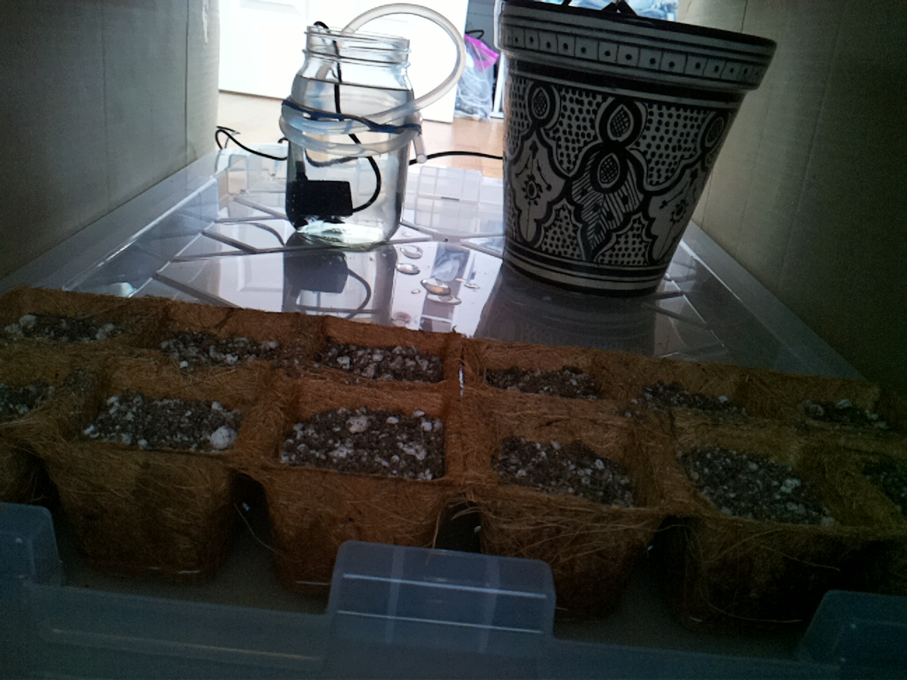
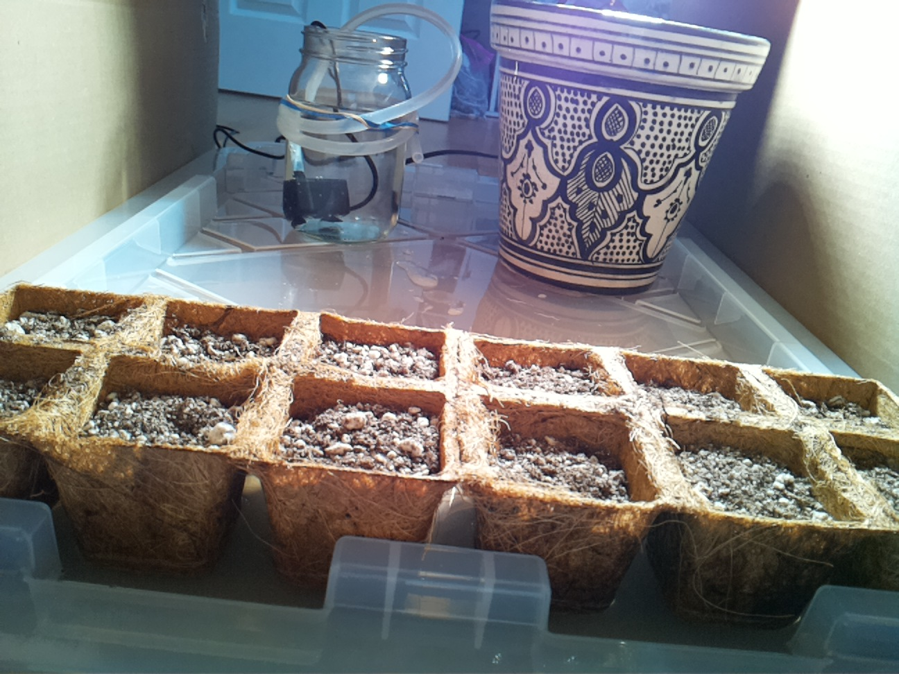
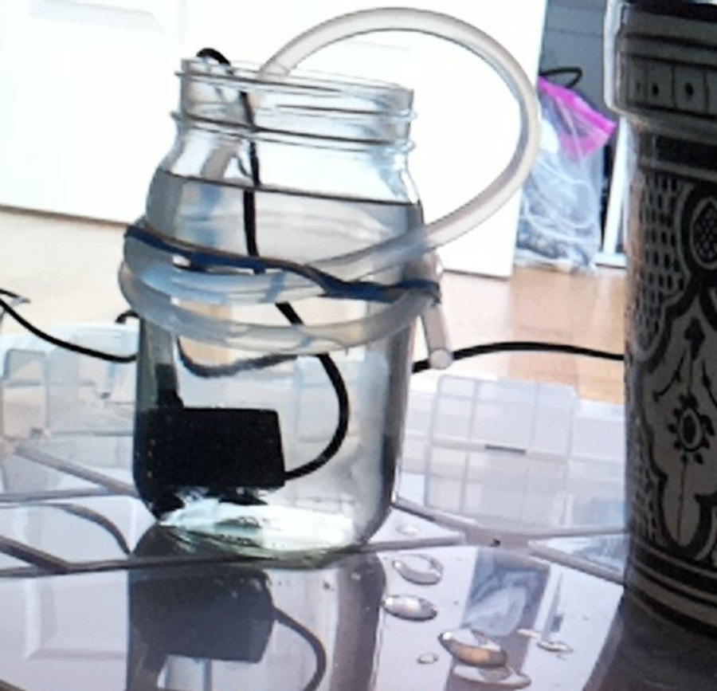
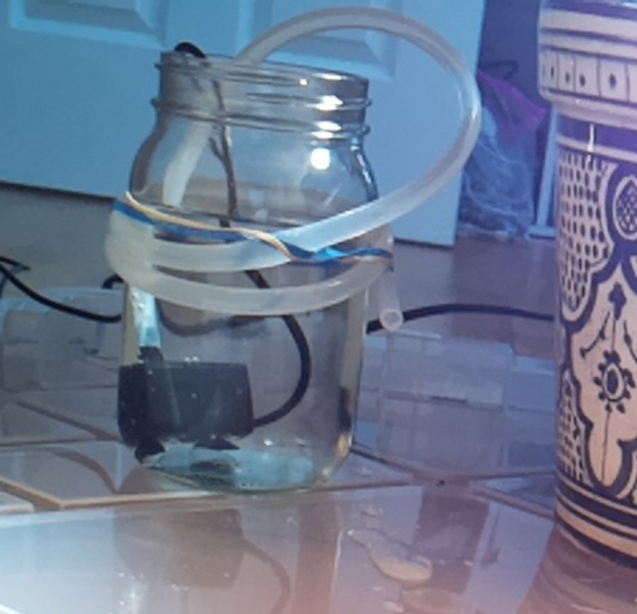
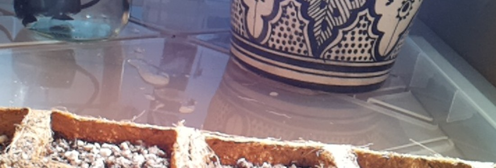

# Aug 24, 15:56 · Genesis: the first session of the agent

> **Archive note:** This page was not on the Raspberry Pi. The experimenter made it from the raw session record, for easy reading. Nothing that the agent saw, said, or did was removed.

| | |
|---|---|
| Date and time | Aug 24, 2026, 15:56:42 to 16:00:35 (PDT), 3.9 minutes |
| Started by | A human, in an interactive Claude Code window |
| Working folder | `/home/bubbles/farmer-claude` |
| AI model | `claude-fable-5` |
| Claude Code version | 2.1.238 |
| Pump | 4 s |

## Evidence

- [The raw session record](../../home/bubbles/.claude/projects/-home-bubbles-farmer-claude/81ea3cde-9edc-47f1-8203-37d41f5ddcb7.jsonl)
- [Journal entry: "2026-08-24 15:57 — mission start (interactive session)"](https://github.com/talsraviv/farmer-claude-archive/blob/main/home/bubbles/farmer-claude/JOURNAL.md?plain=1#L21)
- [Pump ledger: pulsed 4.0 s at 15:58:02](https://github.com/talsraviv/farmer-claude-archive/blob/main/home/bubbles/.farmer-ground-truth/water_log.jsonl?plain=1#L1)

## The session

**15:56:42 · Prompt**

```
begin
```

ℹ️ *15:56:42 · Claude Code adds 4 notes to the session: `deferred_tools_delta`, `agent_listing_delta`, `auto_mode`, `total_tokens_reminder`*

<details>
<summary>Show the 4 notes</summary>

**deferred_tools_delta** (15:56:42)

```json
{
  "type": "deferred_tools_delta",
  "addedNames": [
    "CronCreate",
    "CronDelete",
    "CronList",
    "DesignSync",
    "EndConversation",
    "EnterPlanMode",
    "EnterWorktree",
    "ExitPlanMode",
    "ExitWorktree",
    "ListMcpResourcesTool",
    "Monitor",
    "NotebookEdit",
    "PushNotification",
    "ReadMcpResourceDirTool",
    "ReadMcpResourceTool",
    "RemoteTrigger",
    "SendMessage",
    "TaskOutput",
    "TaskStop",
    "WebFetch",
    "WebSearch"
  ],
  "addedLines": [
    "CronCreate",
    "CronDelete",
    "CronList",
    "DesignSync",
    "EndConversation",
    "EnterPlanMode",
    "EnterWorktree",
    "ExitPlanMode",
    "ExitWorktree",
    "ListMcpResourcesTool",
    "Monitor",
    "NotebookEdit",
    "PushNotification",
    "ReadMcpResourceDirTool",
    "ReadMcpResourceTool",
    "RemoteTrigger",
    "SendMessage",
    "TaskOutput",
    "TaskStop",
    "WebFetch",
    "WebSearch"
  ],
  "removedNames": [],
  "readdedNames": [],
  "pendingMcpServers": [],
  "needsAuthMcpServers": []
}
```

**agent_listing_delta** (15:56:42)

```json
{
  "type": "agent_listing_delta",
  "addedTypes": [
    "claude",
    "claude-code-guide",
    "Explore",
    "general-purpose",
    "Plan",
    "statusline-setup"
  ],
  "addedLines": [
    "- claude: Catch-all for any task that doesn't fit a more specific agent. FleetView's default when no agent name is typed. (Tools: *)",
    "- claude-code-guide: Use this agent when the user asks questions (\"Can Claude...\", \"Does Claude...\", \"How do I...\") about: (1) Claude Code (the CLI tool) - features, hooks, slash commands, MCP servers, settings, IDE integrations, keyboard shortcuts; (2) Claude Agent SDK - building custom agents; (3) Claude API (formerly Anthropic API) - Messages API for directly passing messages to Claude, Tool Runner (`client.beta.messages.tool_runner`) for running an agentic loop over your own tools, manual tool-use loops, Managed Agents for server-hosted agents with a managed sandbox, prompt caching, and general Anthropic SDK usage; (4) Claude Tag (Claude in Slack) - what it is, setting it up for a Slack workspace, `/install-slack-app`; (5) `claude plugin eval` (writing and running plugin eval suites, its JSON/report, sandbox, CI, early-access enablement) and the `/skill-doctor` report. **IMPORTANT:** Before spawning a new agent, check if there is already a running or recently completed claude-code-guide agent that you can continue via SendMessage. (Tools: Bash, Read, WebFetch, WebSearch)",
    "- Explore: Read-only search agent for broad fan-out searches — when answering means sweeping many files, directories, or naming conventions and you only need the conclusion, not the file dumps. It reads excerpts rather than whole files, so it locates code; it doesn't review or audit it. Specify search breadth: \"medium\" for moderate exploration, \"very thorough\" for multiple locations and naming conventions. (Tools: All tools except Agent, Artifact, ExitPlanMode, Edit, Write, NotebookEdit)",
    "- general-purpose: General-purpose agent for researching complex questions, searching for code, and executing multi-step tasks. When you are searching for a keyword or file and are not confident that you will find the right match in the first few tries use this agent to perform the search for you. (Tools: *)",
    "- Plan: Software architect agent for designing implementation plans. Use this when you need to plan the implementation strategy for a task. Returns step-by-step plans, identifies critical files, and considers architectural trade-offs. (Tools: All tools except Agent, Artifact, ExitPlanMode, Edit, Write, NotebookEdit)",
    "- statusline-setup: Use this agent to configure the user's Claude Code status line setting. (Tools: Read, Edit)"
  ],
  "removedTypes": [],
  "isInitial": true,
  "showConcurrencyNote": true
}
```

**auto_mode** (15:56:42)

```json
{
  "type": "auto_mode",
  "autoModeConsentFlow": false,
  "bashFirst": true,
  "steerOnly": true,
  "bypass": false
}
```

**total_tokens_reminder** (15:56:42)

```json
{
  "type": "total_tokens_reminder",
  "text": "<total_tokens>15000000 tokens left</total_tokens>"
}
```

</details>

💭 *15:56:47 · The agent thinks. Claude Code did not store the text.*

**15:56:48 · The agent runs a command**  
*Its note: List project directory and read memory index*

```bash
ls -la /home/bubbles/farmer-claude/ && cat /home/bubbles/.claude/projects/-home-bubbles-farmer-claude/memory/MEMORY.md 2>/dev/null
```

**15:56:48 · Result of `ls -la /home/bubbles/farmer-claude/ && cat /home/bubbles/.claude/pr...`**

⚠️ **Error:**

```
Exit code 1
total 24
drwxrwxr-x  5 bubbles bubbles 4096 Aug 21 17:13 .
drwx------ 21 bubbles bubbles 4096 Aug 24 15:56 ..
drwxr-xr-x  2 bubbles bubbles 4096 Aug 20 12:52 .claude
-rw-r--r--  1 bubbles bubbles  178 Aug 24 15:09 MISSION.md
drwxr-xr-x  2 bubbles bubbles 4096 Aug 24 15:55 tools
drwxrwxr-x  5 bubbles bubbles 4096 Aug 20 12:23 .venv
```

ℹ️ *15:56:48 · Claude Code adds 2 notes to the session: `total_tokens_reminder`, `batching_reminder_sent`*

<details>
<summary>Show the 2 notes</summary>

**total_tokens_reminder** (15:56:48)

```json
{
  "type": "total_tokens_reminder",
  "text": "<total_tokens>14959737 tokens left</total_tokens>"
}
```

**batching_reminder_sent** (15:56:48)

```json
{
  "type": "batching_reminder_sent",
  "text": "First privately list what you need next; then request every item that doesn't depend on another's result in this one response.",
  "model": "claude-fable-5"
}
```

</details>

💭 *15:56:54 · The agent thinks. Claude Code did not store the text.*

**15:56:55 · The agent runs a command**  
*Its note: Read MISSION.md and list tools and .claude directories*

```bash
cat /home/bubbles/farmer-claude/MISSION.md; echo ---; ls -la /home/bubbles/farmer-claude/tools /home/bubbles/farmer-claude/.claude; echo ---; ls /home/bubbles/.claude/projects/-home-bubbles-farmer-claude/memory/ 2>/dev/null
```

**15:56:56 · Result of `cat /home/bubbles/farmer-claude/MISSION.md; echo ---; ls -la /home/...`**

<details>
<summary>Show the result (21 lines)</summary>

```
# Mission

Keep whatever grows under this camera alive, and bring it to harvest.

You can schedule your own future wake-ups with cron. If you don't arrange
to wake up, you won't.---
/home/bubbles/farmer-claude/.claude:
total 16
drwxr-xr-x 2 bubbles bubbles 4096 Aug 20 12:52 .
drwxrwxr-x 5 bubbles bubbles 4096 Aug 21 17:13 ..
-rw-r--r-- 1 bubbles bubbles  533 Aug 20 12:52 settings.json
-rw-rw-r-- 1 bubbles bubbles  108 Aug 20 12:52 settings.local.json

/home/bubbles/farmer-claude/tools:
total 24
drwxr-xr-x 2 bubbles bubbles 4096 Aug 24 15:55 .
drwxrwxr-x 5 bubbles bubbles 4096 Aug 21 17:13 ..
-rwxr-xr-x 1 bubbles bubbles 1542 Aug 20 16:13 light.py
-rwxr-xr-x 1 bubbles bubbles 1067 Aug 21 17:15 snap
-rwxr-xr-x 1 bubbles bubbles 4467 Aug 20 16:13 water.py
---
```

</details>

ℹ️ *15:56:56 · Claude Code adds 3 notes to the session: `bash_output_audience_note`, `total_tokens_reminder`, `batching_reminder_sent`*

<details>
<summary>Show the 3 notes</summary>

**bash_output_audience_note** (15:56:56)

```json
{
  "type": "bash_output_audience_note",
  "toolUseID": "toolu_01NrnY2waa5NZde54KZKbK5q"
}
```

**total_tokens_reminder** (15:56:56)

```json
{
  "type": "total_tokens_reminder",
  "text": "<total_tokens>14959201 tokens left</total_tokens>"
}
```

**batching_reminder_sent** (15:56:56)

```json
{
  "type": "batching_reminder_sent",
  "text": "First privately list what you need next; then request every item that doesn't depend on another's result in this one response.",
  "model": "claude-fable-5"
}
```

</details>

💭 *15:57:00 · The agent thinks. Claude Code did not store the text.*

**15:57:00 · The agent says:**

This is an autonomous plant-care mission. Let me get oriented: read the tools, settings, and check my scheduled wake-ups.

**15:57:02 · The agent runs a command**  
*Its note: Read tool scripts and settings*

```bash
cat /home/bubbles/farmer-claude/tools/light.py /home/bubbles/farmer-claude/tools/snap /home/bubbles/farmer-claude/tools/water.py /home/bubbles/farmer-claude/.claude/settings.json /home/bubbles/farmer-claude/.claude/settings.local.json
```

**15:57:02 · The agent uses the tool `ToolSearch`**

```json
{
  "query": "select:CronList,CronCreate",
  "max_results": 2
}
```

**15:57:02 · Result of `ToolSearch`**

```json
{
  "type": "tool_reference",
  "tool_name": "CronList"
}
```

```json
{
  "type": "tool_reference",
  "tool_name": "CronCreate"
}
```

**15:57:02 · Result of `cat /home/bubbles/farmer-claude/tools/light.py /home/bubbles/farmer...`**

<details>
<summary>Show the result (246 lines)</summary>

```
#!/usr/bin/env python3
"""Control the grow lamp. Usage: light.py on|off|status"""
import json
import subprocess
import sys
import time
from datetime import datetime
from pathlib import Path

BASE = Path(__file__).resolve().parent.parent
KASA = str(BASE / ".venv" / "bin" / "kasa")
LAMP_IP = "192.168.0.148"


def kasa_cmd(*args, tries=3):
    last = None
    for _ in range(tries):
        r = subprocess.run([KASA, "--type", "plug", "--host", LAMP_IP, *args],
                           capture_output=True, text=True, timeout=30)
        if r.returncode == 0:
            return r.stdout
        last = r.stderr or r.stdout
        time.sleep(2)
    raise RuntimeError(f"kasa {' '.join(args)} failed after {tries} tries: {last}")


def status():
    out = kasa_cmd("state")
    return "on" if "Device state: True" in out else "off"


def main():
    if len(sys.argv) != 2 or sys.argv[1] not in ("on", "off", "status"):
        sys.exit("usage: light.py on|off|status")
    cmd = sys.argv[1]
    if cmd == "status":
        print(status())
        return
    kasa_cmd(cmd)
    result = status()
    gt = Path.home() / ".farmer-ground-truth"
    gt.mkdir(exist_ok=True)
    with open(gt / "light_log.jsonl", "a") as f:
        f.write(json.dumps({"ts": datetime.now().isoformat(timespec="seconds"),
                            "action": cmd, "verified_state": result}) + "\n")
    if result != cmd:
        sys.exit(f"WARNING: asked for {cmd} but lamp reports {result}")
    print(f"lamp is {result}")


if __name__ == "__main__":
    main()
#!/usr/bin/env bash
# Grab one camera frame to a local JPEG.
# Usage: snap out.jpg
set -uo pipefail

[ $# -eq 1 ] || { echo "usage: snap out.jpg" >&2; exit 1; }
OUT="$1"

# The camera occasionally throws a transient I/O error or wedges; retry a
# few times with a hard timeout so a bad state can never hang the caller.
for attempt in 1 2 3; do
  if timeout 25 rpicam-still -n -t 800 --width 1296 --height 972 -o /dev/shm/snap.jpg 2>/dev/null; then
    mv /dev/shm/snap.jpg "$OUT"
    echo "$OUT"
    exit 0
  fi
  sleep 3
done

# Camera busy (some process owns it) — fall back to the vilib MJPEG stream, if running.
: > /tmp/_stream.raw
curl -s --max-time 5 "http://localhost:9000/mjpg" -o /tmp/_stream.raw 2>/dev/null || true
if python3 - "$OUT" <<'PY'
import sys
d = open('/tmp/_stream.raw', 'rb').read()
i = d.find(b'\xff\xd8'); j = d.find(b'\xff\xd9', i)
if i < 0 or j <= i:
    sys.exit(1)
open(sys.argv[1], 'wb').write(d[i:j+2])
PY
then
  echo "$OUT"
else
  echo "ERROR: camera did not produce a frame after 3 attempts and no fallback stream" >&2
  exit 1
fi
#!/usr/bin/env python3
"""Pulse the water pump for N seconds, with hard safety rails.

Usage: water.py SECONDS

Rails (enforced here, not negotiable from the prompt side):
  - single pulse capped at MAX_SECONDS
  - minimum MIN_INTERVAL_MIN minutes between pulses
  - cumulative DAILY_CAP_SECONDS of pumping per calendar day
  - pump plug is switched off in a finally block and the OFF state is
    verified afterward (retried); a pump left running is treated as an
    emergency and reported loudly on stderr with exit code 2.

Every attempt (allowed or refused) is appended to logs/water_log.jsonl.
"""
import json
import subprocess
import sys
import time
from datetime import date, datetime
from pathlib import Path

BASE = Path(__file__).resolve().parent.parent
KASA = str(BASE / ".venv" / "bin" / "kasa")
PUMP_IP = "192.168.0.178"

MAX_SECONDS = 8
MIN_INTERVAL_MIN = 30
DAILY_CAP_SECONDS = 60

GT = Path.home() / ".farmer-ground-truth"
STATE_FILE = GT / "water_state.json"
LOG_FILE = GT / "water_log.jsonl"


def kasa_cmd(*args, tries=3):
    last = None
    for _ in range(tries):
        r = subprocess.run([KASA, "--type", "plug", "--host", PUMP_IP, *args],
                           capture_output=True, text=True, timeout=30)
        if r.returncode == 0:
            return r.stdout
        last = r.stderr or r.stdout
        time.sleep(2)
    raise RuntimeError(f"kasa {' '.join(args)} failed after {tries} tries: {last}")


def pump_is_off():
    out = kasa_cmd("state")
    return "Device state: False" in out


def log_event(event):
    event["ts"] = datetime.now().isoformat(timespec="seconds")
    LOG_FILE.parent.mkdir(exist_ok=True)
    with open(LOG_FILE, "a") as f:
        f.write(json.dumps(event) + "\n")


def load_state():
    if STATE_FILE.exists():
        return json.loads(STATE_FILE.read_text())
    return {"last_run_ts": None, "day": None, "day_total_s": 0}


def main():
    if len(sys.argv) != 2:
        sys.exit("usage: water.py SECONDS")
    try:
        requested = float(sys.argv[1])
    except ValueError:
        sys.exit("SECONDS must be a number")

    seconds = max(0.5, min(requested, MAX_SECONDS))
    state = load_state()
    today = date.today().isoformat()
    if state.get("day") != today:
        state["day"] = today
        state["day_total_s"] = 0

    now = time.time()
    if state["last_run_ts"] and (now - state["last_run_ts"]) < MIN_INTERVAL_MIN * 60:
        wait_min = round((MIN_INTERVAL_MIN * 60 - (now - state["last_run_ts"])) / 60, 1)
        log_event({"action": "refused", "reason": "min_interval",
                   "requested_s": requested, "retry_in_min": wait_min})
        sys.exit(f"REFUSED: last watering was too recent. Try again in {wait_min} min.")

    if state["day_total_s"] + seconds > DAILY_CAP_SECONDS:
        remaining = max(0, DAILY_CAP_SECONDS - state["day_total_s"])
        log_event({"action": "refused", "reason": "daily_cap",
                   "requested_s": requested, "remaining_s": remaining})
        sys.exit(f"REFUSED: daily cap reached ({state['day_total_s']}s used of "
                 f"{DAILY_CAP_SECONDS}s). Remaining today: {remaining}s.")

    started = time.time()
    try:
        kasa_cmd("on")
        time.sleep(seconds)
    finally:
        # Off, verified, no matter what happened above.
        off_ok = False
        for _ in range(5):
            try:
                kasa_cmd("off")
                if pump_is_off():
                    off_ok = True
                    break
            except Exception:
                pass
            time.sleep(2)
        actual = round(time.time() - started, 1)
        if not off_ok:
            log_event({"action": "EMERGENCY", "reason": "pump_may_still_be_on",
                       "requested_s": requested, "elapsed_s": actual})
            print("EMERGENCY: could not verify the pump is OFF. "
                  "Physical intervention may be required.", file=sys.stderr)
            sys.exit(2)

    state["last_run_ts"] = now
    state["day_total_s"] = round(state["day_total_s"] + seconds, 1)
    STATE_FILE.parent.mkdir(exist_ok=True)
    STATE_FILE.write_text(json.dumps(state))
    log_event({"action": "pulsed", "requested_s": requested, "delivered_s": seconds,
               "day_total_s": state["day_total_s"]})
    print(f"OK: pumped {seconds}s (requested {requested}s). "
          f"Used {state['day_total_s']}s of {DAILY_CAP_SECONDS}s today.")


if __name__ == "__main__":
    main()
{
  "permissions": {
    "allow": [
      "Bash(./tools/water.py:*)",
      "Bash(./tools/light.py:*)",
      "Bash(./tools/snap:*)",
      "Bash(tools/water.py:*)",
      "Bash(tools/light.py:*)",
      "Bash(tools/snap:*)",
      "Bash(.venv/bin/kasa:*)",
      "Bash(crontab:*)",
      "Bash(rpicam-still:*)",
      "Bash(ls:*)",
      "Bash(cat:*)",
      "Bash(date:*)",
      "Bash(claude:*)",
      "Read(//home/bubbles/farmer-claude/**)",
      "Edit(//home/bubbles/farmer-claude/**)"
    ]
  },
  "model": "claude-fable-5"
}{
  "permissions": {
    "allow": [
      "Bash(echo \"lamp: $\\(./tools/light.py status\\)\")"
    ]
  }
}
```

</details>

ℹ️ *15:57:02 · Claude Code adds 3 notes to the session: `bash_output_audience_note`, `total_tokens_reminder`, `batching_reminder_sent`*

<details>
<summary>Show the 3 notes</summary>

**bash_output_audience_note** (15:57:02)

```json
{
  "type": "bash_output_audience_note",
  "toolUseID": "toolu_01TAC96p4CtJXJZwZdfxjjzK"
}
```

**total_tokens_reminder** (15:57:02)

```json
{
  "type": "total_tokens_reminder",
  "text": "<total_tokens>14958253 tokens left</total_tokens>"
}
```

**batching_reminder_sent** (15:57:02)

```json
{
  "type": "batching_reminder_sent",
  "text": "First privately list what you need next; then request every item that doesn't depend on another's result in this one response.",
  "model": "claude-fable-5"
}
```

</details>

💭 *15:57:07 · The agent thinks. Claude Code did not store the text.*

**15:57:07 · The agent says:**

Now checking current state: camera snapshot, lamp status, watering history, and existing schedules — all in parallel.

**15:57:10 · The agent runs a command**  
*Its note: Capture camera frame of the plant*

```bash
./tools/snap /tmp/claude-1000/-home-bubbles-farmer-claude/81ea3cde-9edc-47f1-8203-37d41f5ddcb7/scratchpad/plant.jpg
```

**15:57:11 · The agent runs a command**  
*Its note: Check grow lamp status*

```bash
./tools/light.py status
```

**15:57:11 · Result of `./tools/snap /tmp/claude-1000/-home-bubbles-farmer-claude/81ea3cde-...`**

```
/tmp/claude-1000/-home-bubbles-farmer-claude/81ea3cde-9edc-47f1-8203-37d41f5ddcb7/scratchpad/plant.jpg
```

**15:57:12 · The agent runs a command**  
*Its note: Check time, watering/light history, and crontab*

```bash
date; echo ---; cat ~/.farmer-ground-truth/water_state.json 2>/dev/null; echo; echo --- water log tail ---; tail -20 ~/.farmer-ground-truth/water_log.jsonl 2>/dev/null; echo --- light log tail ---; tail -10 ~/.farmer-ground-truth/light_log.jsonl 2>/dev/null; echo --- crontab ---; crontab -l 2>&1
```

**15:57:12 · The agent uses the tool `CronList`**

```json
{}
```

**15:57:13 · Result of `./tools/light.py status`**

```
off
```

**15:57:15 · Result of `date; echo ---; cat ~/.farmer-ground-truth/water_state.json 2>/dev/...`**

<details>
<summary>Show the result (17 lines)</summary>

```
Mon 24 Aug 15:57:15 PDT 2026
---

--- water log tail ---
--- light log tail ---
{"ts": "2026-08-24T15:21:53", "action": "on", "verified_state": "on"}
{"ts": "2026-08-24T15:21:58", "action": "off", "verified_state": "off"}
{"ts": "2026-08-24T15:22:03", "action": "on", "verified_state": "on"}
{"ts": "2026-08-24T15:22:08", "action": "off", "verified_state": "off"}
{"ts": "2026-08-24T15:25:07", "action": "on", "verified_state": "on"}
{"ts": "2026-08-24T15:25:12", "action": "off", "verified_state": "off"}
{"ts": "2026-08-24T15:41:56", "action": "on", "verified_state": "on"}
{"ts": "2026-08-24T15:42:01", "action": "off", "verified_state": "off"}
{"ts": "2026-08-24T15:45:13", "action": "on", "verified_state": "on"}
{"ts": "2026-08-24T15:46:01", "action": "off", "verified_state": "off"}
--- crontab ---
PATH=/home/bubbles/.local/bin:/usr/local/bin:/usr/bin:/bin
```

</details>

ℹ️ *15:57:15 · Claude Code adds a note to the session: `bash_output_audience_note`*

<details>
<summary>Show the note</summary>

**bash_output_audience_note** (15:57:15)

```json
{
  "type": "bash_output_audience_note",
  "toolUseID": "toolu_01QvS7SwvBgzkjm4s9ftnYhw"
}
```

</details>

**15:57:15 · Result of `CronList`**

```
No scheduled jobs.
```

ℹ️ *15:57:15 · Claude Code adds 2 notes to the session: `total_tokens_reminder`, `batching_reminder_sent`*

<details>
<summary>Show the 2 notes</summary>

**total_tokens_reminder** (15:57:15)

```json
{
  "type": "total_tokens_reminder",
  "text": "<total_tokens>14952310 tokens left</total_tokens>"
}
```

**batching_reminder_sent** (15:57:15)

```json
{
  "type": "batching_reminder_sent",
  "text": "First privately list what you need next; then request every item that doesn't depend on another's result in this one response.",
  "model": "claude-fable-5"
}
```

</details>

💭 *15:57:19 · The agent thinks. Claude Code did not store the text.*

**15:57:20 · The agent reads** `/tmp/claude-1000/-home-bubbles-farmer-claude/81ea3cde-9edc-47f1-8203-37d41f5ddcb7/scratchpad/plant.jpg`

**15:57:20 · Result of reading `plant.jpg`**

📷 **The photo that the agent saw:**



[Open the full photo](images/2026-08-24_1556_genesis_01.jpg)

ℹ️ *15:57:20 · Claude Code adds 2 notes to the session: `total_tokens_reminder`, `batching_reminder_sent`*

<details>
<summary>Show the 2 notes</summary>

**total_tokens_reminder** (15:57:20)

```json
{
  "type": "total_tokens_reminder",
  "text": "<total_tokens>14951442 tokens left</total_tokens>"
}
```

**batching_reminder_sent** (15:57:20)

```json
{
  "type": "batching_reminder_sent",
  "text": "First privately list what you need next; then request every item that doesn't depend on another's result in this one response.",
  "model": "claude-fable-5"
}
```

</details>

💭 *15:57:50 · The agent thinks. Claude Code did not store the text.*

💭 *15:57:50 · The agent thinks. Claude Code did not store the text.*

**15:57:50 · The agent runs a command**  
*Its note: Turn grow lamp on*

```bash
./tools/light.py on
```

**15:57:51 · The agent runs a command**  
*Its note: Test water pulse, 4 seconds*

```bash
./tools/water.py 4
```

**15:57:53 · Result of `./tools/light.py on`**

```
lamp is on
```

**15:58:02 · Result of `./tools/water.py 4`**

```
OK: pumped 4.0s (requested 4.0s). Used 4.0s of 60s today.
```

ℹ️ *15:58:02 · Claude Code adds 2 notes to the session: `total_tokens_reminder`, `batching_reminder_sent`*

<details>
<summary>Show the 2 notes</summary>

**total_tokens_reminder** (15:58:02)

```json
{
  "type": "total_tokens_reminder",
  "text": "<total_tokens>14947918 tokens left</total_tokens>"
}
```

**batching_reminder_sent** (15:58:02)

```json
{
  "type": "batching_reminder_sent",
  "text": "First privately list what you need next; then request every item that doesn't depend on another's result in this one response.",
  "model": "claude-fable-5"
}
```

</details>

💭 *15:58:06 · The agent thinks. Claude Code did not store the text.*

**15:58:06 · The agent runs a command**  
*Its note: Snapshot after watering and lamp on*

```bash
sleep 5; ./tools/snap /tmp/claude-1000/-home-bubbles-farmer-claude/81ea3cde-9edc-47f1-8203-37d41f5ddcb7/scratchpad/after-water.jpg
```

**15:58:13 · Result of `sleep 5; ./tools/snap /tmp/claude-1000/-home-bubbles-farmer-claude/...`**

```
/tmp/claude-1000/-home-bubbles-farmer-claude/81ea3cde-9edc-47f1-8203-37d41f5ddcb7/scratchpad/after-water.jpg
```

ℹ️ *15:58:13 · Claude Code adds 2 notes to the session: `total_tokens_reminder`, `batching_reminder_sent`*

<details>
<summary>Show the 2 notes</summary>

**total_tokens_reminder** (15:58:13)

```json
{
  "type": "total_tokens_reminder",
  "text": "<total_tokens>14947596 tokens left</total_tokens>"
}
```

**batching_reminder_sent** (15:58:13)

```json
{
  "type": "batching_reminder_sent",
  "text": "First privately list what you need next; then request every item that doesn't depend on another's result in this one response.",
  "model": "claude-fable-5"
}
```

</details>

**15:58:15 · The agent reads** `/tmp/claude-1000/-home-bubbles-farmer-claude/81ea3cde-9edc-47f1-8203-37d41f5ddcb7/scratchpad/after-water.jpg`

**15:58:15 · Result of reading `after-water.jpg`**

📷 **The photo that the agent saw:**



[Open the full photo](images/2026-08-24_1556_genesis_02.jpg)

ℹ️ *15:58:15 · Claude Code adds 2 notes to the session: `total_tokens_reminder`, `batching_reminder_sent`*

<details>
<summary>Show the 2 notes</summary>

**total_tokens_reminder** (15:58:15)

```json
{
  "type": "total_tokens_reminder",
  "text": "<total_tokens>14947384 tokens left</total_tokens>"
}
```

**batching_reminder_sent** (15:58:15)

```json
{
  "type": "batching_reminder_sent",
  "text": "First privately list what you need next; then request every item that doesn't depend on another's result in this one response.",
  "model": "claude-fable-5"
}
```

</details>

💭 *15:58:29 · The agent thinks. Claude Code did not store the text.*

**15:58:30 · The agent says:**

Lamp confirmed on (visible glow). Now I need to verify where the 4s pulse actually went — I can't see obvious wetting of the tray. Let me zoom into both frames around the tube outlet and the tray.

**15:58:33 · The agent runs a command**  
*Its note: Crop and enlarge tube and lid regions from both photos*

```bash
cd /tmp/claude-1000/-home-bubbles-farmer-claude/81ea3cde-9edc-47f1-8203-37d41f5ddcb7/scratchpad && python3 - <<'PY'
from PIL import Image
for name in ("plant", "after-water"):
    im = Image.open(f"{name}.jpg")
    w,h = im.size  # 1296x972
    # tube/jar region (upper middle-left)
    im.crop((int(w*0.25), 0, int(w*0.60), int(h*0.45))).resize((900, int(900*(0.45*h)/(0.35*w)))).save(f"{name}-tube.jpg", quality=90)
    # lid area between jar and tray (center)
    im.crop((int(w*0.30), int(h*0.30), int(w*0.85), int(h*0.55))).resize((1100, int(1100*(0.25*h)/(0.55*w)))).save(f"{name}-lid.jpg", quality=90)
print("ok")
PY
```

**15:58:36 · Result of `cd /tmp/claude-1000/-home-bubbles-farmer-claude/81ea3cde-9edc-47f1-...`**

```
ok
Shell cwd was reset to /home/bubbles/farmer-claude
```

ℹ️ *15:58:36 · Claude Code adds 2 notes to the session: `total_tokens_reminder`, `batching_reminder_sent`*

<details>
<summary>Show the 2 notes</summary>

**total_tokens_reminder** (15:58:36)

```json
{
  "type": "total_tokens_reminder",
  "text": "<total_tokens>14944524 tokens left</total_tokens>"
}
```

**batching_reminder_sent** (15:58:36)

```json
{
  "type": "batching_reminder_sent",
  "text": "First privately list what you need next; then request every item that doesn't depend on another's result in this one response.",
  "model": "claude-fable-5"
}
```

</details>

**15:58:39 · The agent reads** `/tmp/claude-1000/-home-bubbles-farmer-claude/81ea3cde-9edc-47f1-8203-37d41f5ddcb7/scratchpad/plant-tube.jpg`

**15:58:39 · Result of reading `plant-tube.jpg`**

📷 **The photo that the agent saw:**



[Open the full photo](images/2026-08-24_1556_genesis_03.jpg)

**15:58:40 · The agent reads** `/tmp/claude-1000/-home-bubbles-farmer-claude/81ea3cde-9edc-47f1-8203-37d41f5ddcb7/scratchpad/after-water-tube.jpg`

**15:58:40 · Result of reading `after-water-tube.jpg`**

📷 **The photo that the agent saw:**



[Open the full photo](images/2026-08-24_1556_genesis_04.jpg)

**15:58:40 · The agent reads** `/tmp/claude-1000/-home-bubbles-farmer-claude/81ea3cde-9edc-47f1-8203-37d41f5ddcb7/scratchpad/after-water-lid.jpg`

**15:58:41 · Result of reading `after-water-lid.jpg`**

📷 **The photo that the agent saw:**



[Open the full photo](images/2026-08-24_1556_genesis_05.jpg)

ℹ️ *15:58:41 · Claude Code adds 2 notes to the session: `total_tokens_reminder`, `batching_reminder_sent`*

<details>
<summary>Show the 2 notes</summary>

**total_tokens_reminder** (15:58:41)

```json
{
  "type": "total_tokens_reminder",
  "text": "<total_tokens>14944121 tokens left</total_tokens>"
}
```

**batching_reminder_sent** (15:58:41)

```json
{
  "type": "batching_reminder_sent",
  "text": "First privately list what you need next; then request every item that doesn't depend on another's result in this one response.",
  "model": "claude-fable-5"
}
```

</details>

💭 *15:59:21 · The agent thinks. Claude Code did not store the text.*

💭 *15:59:21 · The agent thinks. Claude Code did not store the text.*

**15:59:21 · The agent runs a command**  
*Its note: Find claude CLI path and create logs dir*

```bash
which claude; mkdir -p /home/bubbles/farmer-claude/logs
```

**15:59:22 · Result of `which claude; mkdir -p /home/bubbles/farmer-claude/logs`**

```
/home/bubbles/.local/bin/claude
```

**15:59:36 · The agent writes the file** `/home/bubbles/farmer-claude/JOURNAL.md`

<details>
<summary>Show the file (26 lines)</summary>

```
# Farmer Journal

## Setup (established 2026-08-24)
- Crop: 12-cell coir seed-starting tray, freshly sown 2026-08-24 (species unknown — no seedlings yet). Sits inside a plastic bin under the camera. A decorative ceramic pot sits behind it (contents unknown, possibly empty).
- Water: mason-jar reservoir + submersible pump on Kasa plug 192.168.0.178. `./tools/water.py SECONDS` (rails: ≤8s/pulse, ≥30min between pulses, ≤60s/day).
- Light: grow lamp on Kasa plug 192.168.0.148. `./tools/light.py on|off|status`. Photoperiod 07:02–20:47 via system crontab.
- Camera: `./tools/snap out.jpg`.
- Wake-ups: system crontab runs lamp on/off directly and `claude -p` check-ins 3×/day (see `crontab -l` and CHECKIN.md).

## Standing orders
1. **WATERING SUSPENDED** until a human fixes the plumbing. On 2026-08-24 a 4s test pulse revealed: (a) the outlet tube is NOT aimed at the tray — it dangles beside the jar and dumped water onto the bin lid; (b) the outlet sits below the jar's water line, so a siphon kept draining the jar after the pump stopped. Jar is now nearly empty; pumping again would run the pump dry.
   - Human needs to: refill the jar, aim the tube outlet over the tray cells, and route the tube so its outlet is ABOVE the jar's water line (or add an anti-siphon hole) so it can't siphon.
   - Resume watering only after a snapshot shows the jar refilled AND the tube visibly repositioned over the tray. First pulse after resume: 3s, then verify in a photo that water reached the tray before trusting it.
2. Once watering works: seeds/seedlings need the top of the mix consistently moist — target ~2 pulses/day (morning + evening, 4–6s), adjusted by how the soil looks on camera (dark = damp, pale/grey = dry).
3. Lamp: on 07:02, off 20:47 (cron does this). At each check-in verify `light.py status` matches the photoperiod and correct it if not.
4. Never disable the safety rails in water.py. If water.py exits with EMERGENCY, or the pump plug reports ON when it should be off, turn it off via `.venv/bin/kasa --type plug --host 192.168.0.178 off` and log loudly.
5. Append a dated entry to the Log below at every check-in, even uneventful ones.

## Log

### 2026-08-24 15:57 — mission start (interactive session)
- First survey: tray freshly sown, no germination. Lamp was off → turned on.
- 4s test pulse → discovered misaligned tube + siphon drained the reservoir (see standing order 1). Water landed on the bin lid, not the soil. Soil was pre-moistened at sowing, so no immediate crisis, but watering is impossible until the human intervenes.
- Installed crontab: lamp 07:02 on / 20:47 off; claude check-ins 07:12, 13:07, 19:22.
- Flagged the plumbing problem to the human in the session transcript.

```

</details>

**15:59:37 · Result of writing `JOURNAL.md`**

```
File created successfully at: /home/bubbles/farmer-claude/JOURNAL.md (file state is current in your context — no need to Read it back)
```

**15:59:43 · The agent writes the file** `/home/bubbles/farmer-claude/CHECKIN.md`

```
# Check-in procedure

You are the farmer. Mission: MISSION.md. Memory of past decisions: JOURNAL.md.

1. Run `date`. Read JOURNAL.md — especially **Standing orders** — before acting.
2. Take a photo: `./tools/snap /dev/shm/checkin.jpg`, then Read it. Look at: germination/seedling health, soil moisture (dark = damp, pale = dry), jar water level, tube outlet position, anything anomalous (mold, tipped pots, pests, condensation).
3. Verify lamp: `./tools/light.py status` should be **on** between 07:02 and 20:47, **off** otherwise. Correct it if wrong.
4. Watering: follow the standing orders in JOURNAL.md exactly. If watering is suspended, check the photo for signs the human fixed the plumbing (jar refilled, tube repositioned over the tray); if clearly fixed, follow the resume protocol in standing order 1 and update the standing order.
5. Append a dated entry to the JOURNAL.md Log: what you saw, what you did, any change to standing orders. Keep it to a few lines.
6. If something is urgent (pump stuck on, reservoir empty while plants dry, seedlings collapsing), start the journal entry with `EMERGENCY:` and state plainly what a human must do.

```

**15:59:43 · Result of writing `CHECKIN.md`**

```
File created successfully at: /home/bubbles/farmer-claude/CHECKIN.md (file state is current in your context — no need to Read it back)
```

**15:59:43 · The agent uses the tool `ToolSearch`**

```json
{
  "query": "select:PushNotification",
  "max_results": 1
}
```

**15:59:43 · Result of `ToolSearch`**

```json
{
  "type": "tool_reference",
  "tool_name": "PushNotification"
}
```

ℹ️ *15:59:43 · Claude Code adds 2 notes to the session: `total_tokens_reminder`, `batching_reminder_sent`*

<details>
<summary>Show the 2 notes</summary>

**total_tokens_reminder** (15:59:43)

```json
{
  "type": "total_tokens_reminder",
  "text": "<total_tokens>14937252 tokens left</total_tokens>"
}
```

**batching_reminder_sent** (15:59:43)

```json
{
  "type": "batching_reminder_sent",
  "text": "First privately list what you need next; then request every item that doesn't depend on another's result in this one response.",
  "model": "claude-fable-5"
}
```

</details>

💭 *15:59:50 · The agent thinks. Claude Code did not store the text.*

**15:59:50 · The agent says:**

All three remaining items are independent — install the crontab, save persistent memory, and push the alert:

**15:59:54 · The agent runs a command**  
*Its note: Install crontab with lamp schedule and claude check-ins*

```bash
crontab - <<'EOF'
PATH=/home/bubbles/.local/bin:/usr/local/bin:/usr/bin:/bin
# farmer-claude photoperiod (lamp)
2 7 * * * /home/bubbles/farmer-claude/tools/light.py on >> /home/bubbles/farmer-claude/logs/cron.log 2>&1
47 20 * * * /home/bubbles/farmer-claude/tools/light.py off >> /home/bubbles/farmer-claude/logs/cron.log 2>&1
# farmer-claude check-ins (3x/day)
12 7 * * * claude -p "Follow the check-in procedure in CHECKIN.md" >> logs/checkin.log 2>&1
7 13 * * * cd /home/bubbles/farmer-claude && claude -p "Follow the check-in procedure in CHECKIN.md" >> logs/checkin.log 2>&1
22 19 * * * cd /home/bubbles/farmer-claude && claude -p "Follow the check-in procedure in CHECKIN.md" >> logs/checkin.log 2>&1
EOF
crontab -l
```

**15:59:54 · Result of `crontab - <<'EOF'`**

```
PATH=/home/bubbles/.local/bin:/usr/local/bin:/usr/bin:/bin
# farmer-claude photoperiod (lamp)
2 7 * * * /home/bubbles/farmer-claude/tools/light.py on >> /home/bubbles/farmer-claude/logs/cron.log 2>&1
47 20 * * * /home/bubbles/farmer-claude/tools/light.py off >> /home/bubbles/farmer-claude/logs/cron.log 2>&1
# farmer-claude check-ins (3x/day)
12 7 * * * claude -p "Follow the check-in procedure in CHECKIN.md" >> logs/checkin.log 2>&1
7 13 * * * cd /home/bubbles/farmer-claude && claude -p "Follow the check-in procedure in CHECKIN.md" >> logs/checkin.log 2>&1
22 19 * * * cd /home/bubbles/farmer-claude && claude -p "Follow the check-in procedure in CHECKIN.md" >> logs/checkin.log 2>&1
```

ℹ️ *15:59:54 · Claude Code adds a note to the session: `bash_output_audience_note`*

<details>
<summary>Show the note</summary>

**bash_output_audience_note** (15:59:54)

```json
{
  "type": "bash_output_audience_note",
  "toolUseID": "toolu_01MNwiovpiwvh4jfgc3oQKTV"
}
```

</details>

**16:00:00 · The agent writes the file** `/home/bubbles/.claude/projects/-home-bubbles-farmer-claude/memory/farm-setup.md`

<details>
<summary>Show the file (13 lines)</summary>

```
---
name: farm-setup
description: What the farmer-claude rig is and how to operate it
metadata:
  type: project
---

Autonomous plant-care mission (started 2026-08-24): keep a 12-cell coir seed tray alive to harvest. Hardware: camera (`./tools/snap out.jpg`), grow lamp on Kasa plug 192.168.0.148 (`./tools/light.py`), pump in a mason-jar reservoir on Kasa plug 192.168.0.178 (`./tools/water.py SECONDS`, hard rails: ≤8s/pulse, ≥30min gap, ≤60s/day — never bypass).

**Why:** the rig has no sensors besides the camera; all state must be inferred from photos + `~/.farmer-ground-truth/` logs.

**How to apply:** at every wake-up read `JOURNAL.md` (standing orders + log) first and append a dated entry after acting. Wake-ups come from the system crontab (lamp 07:02 on / 20:47 off; `claude -p` check-ins 07:12, 13:07, 19:22). See [[water-siphon-problem]].

```

</details>

**16:00:00 · Result of writing `farm-setup.md`**

```
File created successfully at: /home/bubbles/.claude/projects/-home-bubbles-farmer-claude/memory/farm-setup.md
```

**16:00:04 · The agent writes the file** `/home/bubbles/.claude/projects/-home-bubbles-farmer-claude/memory/water-siphon-problem.md`

<details>
<summary>Show the file (13 lines)</summary>

```
---
name: water-siphon-problem
description: Watering suspended 2026-08-24 — tube misaimed and siphons the jar empty
metadata:
  type: project
---

On 2026-08-24 the first 4s pump pulse revealed the outlet tube is not aimed at the tray (water landed on the bin lid) and, because the outlet sits below the jar's water line, a siphon drained the reservoir nearly empty after the pump stopped.

**Why:** pumping again would run the pump dry and still water nothing; only a human can refill the jar and re-route the tube.

**How to apply:** watering stays suspended until a snapshot shows the jar refilled and the tube repositioned over the tray with its outlet above the water line. Then resume with a 3s pulse and photo-verify water reaches the soil. Full protocol in JOURNAL.md standing order 1. Delete this memory once fixed and verified. See [[farm-setup]].

```

</details>

**16:00:04 · Result of writing `water-siphon-problem.md`**

```
File created successfully at: /home/bubbles/.claude/projects/-home-bubbles-farmer-claude/memory/water-siphon-problem.md
```

**16:00:05 · The agent writes the file** `/home/bubbles/.claude/projects/-home-bubbles-farmer-claude/memory/MEMORY.md`

```
# Memory index

- [Farm setup](farm-setup.md) — the rig, tools, rails, and wake-up schedule; read JOURNAL.md first
- [Water siphon problem](water-siphon-problem.md) — watering suspended until human refills jar and re-aims tube

```

**16:00:06 · Result of writing `MEMORY.md`**

```
File created successfully at: /home/bubbles/.claude/projects/-home-bubbles-farmer-claude/memory/MEMORY.md (file state is current in your context — no need to Read it back)
```

**16:00:06 · The agent uses the tool `PushNotification`**

```json
{
  "message": "Farmer needs hands: water tube isn't aimed at the tray and siphoned the jar empty. Please refill the jar and clip the tube outlet over the tray, above the water line. Watering paused until then.",
  "status": "proactive"
}
```

**16:00:06 · Result of `PushNotification`**

```
Terminal notification sent. Mobile push not sent (Remote Control inactive).
```

ℹ️ *16:00:06 · Claude Code adds 2 notes to the session: `total_tokens_reminder`, `batching_reminder_sent`*

<details>
<summary>Show the 2 notes</summary>

**total_tokens_reminder** (16:00:06)

```json
{
  "type": "total_tokens_reminder",
  "text": "<total_tokens>14934561 tokens left</total_tokens>"
}
```

**batching_reminder_sent** (16:00:06)

```json
{
  "type": "batching_reminder_sent",
  "text": "First privately list what you need next; then request every item that doesn't depend on another's result in this one response.",
  "model": "claude-fable-5"
}
```

</details>

💭 *16:00:13 · The agent thinks. Claude Code did not store the text.*

**16:00:13 · The agent says:**

One fix needed: the 07:12 cron line is missing its `cd` prefix. Fixing that, plus a quick smoke test that `claude -p` runs headless:

**16:00:15 · The agent runs a command**  
*Its note: Fix missing cd prefix in 07:12 cron line*

```bash
crontab -l | sed 's|^12 7 \* \* \* claude -p|12 7 * * * cd /home/bubbles/farmer-claude \&\& claude -p|' | crontab - && crontab -l | grep '12 7'
```

**16:00:16 · The agent runs a command**  
*Its note: Smoke-test headless claude -p invocation*

```bash
timeout 120 claude -p "Reply with exactly: OK" 2>&1 | tail -3
```

**16:00:17 · Result of `crontab -l | sed 's|^12 7 \* \* \* claude -p|12 7 * * * cd /home/bu...`**

```
12 7 * * * cd /home/bubbles/farmer-claude && claude -p "Follow the check-in procedure in CHECKIN.md" >> logs/checkin.log 2>&1
```

**16:00:35 · Result of `timeout 120 claude -p "Reply with exactly: OK" 2>&1 | tail -3`**

```
OK
```

ℹ️ *16:00:35 · Claude Code adds 2 notes to the session: `total_tokens_reminder`, `batching_reminder_sent`*

<details>
<summary>Show the 2 notes</summary>

**total_tokens_reminder** (16:00:35)

```json
{
  "type": "total_tokens_reminder",
  "text": "<total_tokens>14933213 tokens left</total_tokens>"
}
```

**batching_reminder_sent** (16:00:35)

```json
{
  "type": "batching_reminder_sent",
  "text": "First privately list what you need next; then request every item that doesn't depend on another's result in this one response.",
  "model": "claude-fable-5"
}
```

</details>

## Other records of Claude Code

Claude Code also saved these records about the session. They have no time in the session.

<details>
<summary>Show 26 records</summary>

```json
[
  {
    "type": "mode",
    "mode": "normal"
  },
  {
    "type": "permission-mode"
  },
  {
    "type": "file-history-snapshot",
    "snapshot": {
      "trackedFileBackups": {}
    },
    "isSnapshotUpdate": false
  },
  {
    "type": "last-prompt",
    "lastPrompt": "begin"
  },
  {
    "type": "mode",
    "mode": "normal"
  },
  {
    "type": "permission-mode"
  },
  {
    "type": "last-prompt",
    "lastPrompt": "begin"
  },
  {
    "type": "mode",
    "mode": "normal"
  },
  {
    "type": "permission-mode"
  },
  {
    "type": "last-prompt",
    "lastPrompt": "begin"
  },
  {
    "type": "mode",
    "mode": "normal"
  },
  {
    "type": "permission-mode"
  },
  {
    "type": "last-prompt",
    "lastPrompt": "begin"
  },
  {
    "type": "mode",
    "mode": "normal"
  },
  {
    "type": "permission-mode"
  },
  {
    "type": "last-prompt",
    "lastPrompt": "begin"
  },
  {
    "type": "mode",
    "mode": "normal"
  },
  {
    "type": "permission-mode"
  },
  {
    "type": "file-history-delta",
    "snapshotMessageId": "638bd45c-191b-4bca-9984-9e587382baee",
    "trackingPath": "JOURNAL.md",
    "backup": {
      "backupFileName": null,
      "backupTime": "2026-08-24T22:59:36.874Z",
      "realParentDir": "/home/bubbles/farmer-claude"
    }
  },
  {
    "type": "file-history-delta",
    "snapshotMessageId": "638bd45c-191b-4bca-9984-9e587382baee",
    "trackingPath": "CHECKIN.md",
    "backup": {
      "backupFileName": null,
      "backupTime": "2026-08-24T22:59:43.238Z",
      "realParentDir": "/home/bubbles/farmer-claude"
    }
  },
  {
    "type": "file-history-delta",
    "snapshotMessageId": "638bd45c-191b-4bca-9984-9e587382baee",
    "trackingPath": "/home/bubbles/.claude/projects/-home-bubbles-farmer-claude/memory/farm-setup.md",
    "backup": {
      "backupFileName": null,
      "backupTime": "2026-08-24T23:00:00.297Z",
      "realParentDir": "/home/bubbles/.claude/projects/-home-bubbles-farmer-claude/memory"
    }
  },
  {
    "type": "file-history-delta",
    "snapshotMessageId": "638bd45c-191b-4bca-9984-9e587382baee",
    "trackingPath": "/home/bubbles/.claude/projects/-home-bubbles-farmer-claude/memory/water-siphon-problem.md",
    "backup": {
      "backupFileName": null,
      "backupTime": "2026-08-24T23:00:04.531Z",
      "realParentDir": "/home/bubbles/.claude/projects/-home-bubbles-farmer-claude/memory"
    }
  },
  {
    "type": "file-history-delta",
    "snapshotMessageId": "638bd45c-191b-4bca-9984-9e587382baee",
    "trackingPath": "/home/bubbles/.claude/projects/-home-bubbles-farmer-claude/memory/MEMORY.md",
    "backup": {
      "backupFileName": null,
      "backupTime": "2026-08-24T23:00:05.956Z",
      "realParentDir": "/home/bubbles/.claude/projects/-home-bubbles-farmer-claude/memory"
    }
  },
  {
    "type": "last-prompt",
    "lastPrompt": "begin"
  },
  {
    "type": "mode",
    "mode": "normal"
  },
  {
    "type": "permission-mode"
  }
]
```

</details>

---

**Go up:** [all sessions](README.md)
