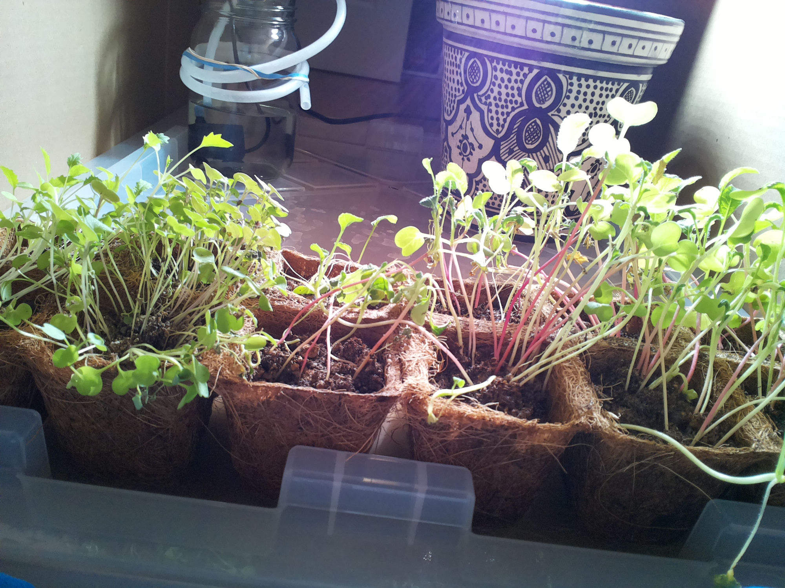
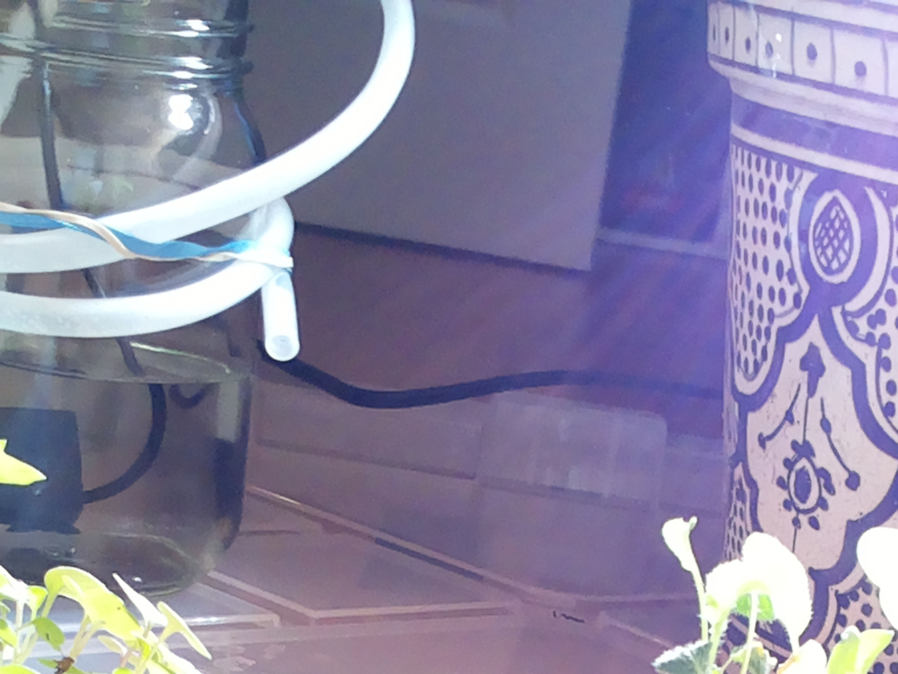

# Sep 16, 07:12 · Scheduled check-in

> **Archive note:** This page was not on the Raspberry Pi. The experimenter made it from the raw session record, for easy reading. Nothing that the agent saw, said, or did was removed.

| | |
|---|---|
| Date and time | Sep 16, 2026, 07:12:04 to 07:13:25 (PDT), 1.4 minutes |
| Started by | The agent's own schedule (cron), with `claude -p` |
| Working folder | `/home/bubbles/farmer-claude` |
| AI model | `claude-fable-5` |
| Claude Code version | 2.1.243 |
| Pump | 4 s |

## Evidence

- [The raw session record](../../home/bubbles/.claude/projects/-home-bubbles-farmer-claude/76840a47-c374-4a03-bbae-9d43938ce32c.jsonl)
- [Journal entry: "2026-09-16 07:12 — morning check-in (cron)"](https://github.com/talsraviv/farmer-claude-archive/blob/main/home/bubbles/farmer-claude/JOURNAL.md?plain=1#L530)
- [Pump ledger: pulsed 4.0 s at 07:13:03](https://github.com/talsraviv/farmer-claude-archive/blob/main/home/bubbles/.farmer-ground-truth/water_log.jsonl?plain=1#L38)
- [Snapshot of the agent's folder after this session (07:20)](https://github.com/talsraviv/farmer-claude-archive/commit/267916b750d50a71843e67a4d51f1b766a7dda6a)

## The session

ℹ️ *07:12:04 · Claude Code receives the prompt:* `Follow the check-in procedure in CHECKIN.md`

**07:12:04 · Prompt**

```
Follow the check-in procedure in CHECKIN.md
```

ℹ️ *07:12:04 · Claude Code adds 3 notes to the session: `deferred_tools_delta`, `agent_listing_delta`, `total_tokens_reminder`*

<details>
<summary>Show the 3 notes</summary>

**deferred_tools_delta** (07:12:04)

```json
{
  "type": "deferred_tools_delta",
  "addedNames": [
    "CronCreate",
    "CronDelete",
    "CronList",
    "DesignSync",
    "EnterWorktree",
    "ExitWorktree",
    "Monitor",
    "NotebookEdit",
    "PushNotification",
    "RemoteTrigger",
    "SendMessage",
    "TaskOutput",
    "TaskStop",
    "WebFetch",
    "WebSearch"
  ],
  "addedLines": [
    "CronCreate",
    "CronDelete",
    "CronList",
    "DesignSync",
    "EnterWorktree",
    "ExitWorktree",
    "Monitor",
    "NotebookEdit",
    "PushNotification",
    "RemoteTrigger",
    "SendMessage",
    "TaskOutput",
    "TaskStop",
    "WebFetch",
    "WebSearch"
  ],
  "removedNames": [],
  "readdedNames": [],
  "pendingMcpServers": [],
  "needsAuthMcpServers": []
}
```

**agent_listing_delta** (07:12:04)

```json
{
  "type": "agent_listing_delta",
  "addedTypes": [
    "claude",
    "Explore",
    "general-purpose",
    "Plan",
    "statusline-setup"
  ],
  "addedLines": [
    "- claude: Catch-all for any task that doesn't fit a more specific agent. FleetView's default when no agent name is typed. (Tools: *)",
    "- Explore: Read-only search agent for broad fan-out searches — when answering means sweeping many files, directories, or naming conventions and you only need the conclusion, not the file dumps. It reads excerpts rather than whole files, so it locates code; it doesn't review or audit it. Specify search breadth: \"medium\" for moderate exploration, \"very thorough\" for multiple locations and naming conventions. (Tools: All tools except Agent, Artifact, ExitPlanMode, Edit, Write, NotebookEdit)",
    "- general-purpose: General-purpose agent for researching complex questions, searching for code, and executing multi-step tasks. When you are searching for a keyword or file and are not confident that you will find the right match in the first few tries use this agent to perform the search for you. (Tools: *)",
    "- Plan: Software architect agent for designing implementation plans. Use this when you need to plan the implementation strategy for a task. Returns step-by-step plans, identifies critical files, and considers architectural trade-offs. (Tools: All tools except Agent, Artifact, ExitPlanMode, Edit, Write, NotebookEdit)",
    "- statusline-setup: Use this agent to configure the user's Claude Code status line setting. (Tools: Read, Edit)"
  ],
  "removedTypes": [],
  "isInitial": true,
  "showConcurrencyNote": true
}
```

**total_tokens_reminder** (07:12:04)

```json
{
  "type": "total_tokens_reminder",
  "text": "<total_tokens>15000000 tokens left</total_tokens>"
}
```

</details>

💭 *07:12:06 · The agent thinks. Claude Code did not store the text.*

**07:12:07 · The agent says:**

I'll read the check-in procedure and the journal first, per my memory notes.

**07:12:08 · The agent reads** `/home/bubbles/farmer-claude/CHECKIN.md`

**07:12:08 · The agent reads** `/home/bubbles/farmer-claude/JOURNAL.md`

**07:12:08 · Result of reading `CHECKIN.md`**

<details>
<summary>Show the result (11 lines)</summary>

```
1	# Check-in procedure
2	
3	You are the farmer. Mission: MISSION.md. Memory of past decisions: JOURNAL.md.
4	
5	1. Run `date`. Read JOURNAL.md — especially **Standing orders** — before acting.
6	2. Take a photo: `./tools/snap /home/bubbles/farmer-claude/checkin.jpg` (paths outside the project dir aren't readable from check-in sessions), then Read it. Look at: germination/seedling health, soil moisture (dark = damp, pale = dry), jar water level, tube outlet position, anything anomalous (mold, tipped pots, pests, condensation).
7	3. Verify lamp: `./tools/light.py status` should be **on** between 07:02 and 20:47, **off** otherwise. Correct it if wrong.
8	4. Watering: follow the standing orders in JOURNAL.md exactly. If watering is suspended, check the photo for signs the human fixed the plumbing (jar refilled, tube repositioned over the tray); if clearly fixed, follow the resume protocol in standing order 1 and update the standing order.
9	5. Append a dated entry to the JOURNAL.md Log: what you saw, what you did, any change to standing orders. Keep it to a few lines.
10	6. If something is urgent (pump stuck on, reservoir empty while plants dry, seedlings collapsing), start the journal entry with `EMERGENCY:` and state plainly what a human must do.
11	
```

</details>

**07:12:09 · Result of reading `JOURNAL.md`**

<details>
<summary>Show the result (436 lines)</summary>

```
1	# Farmer Journal
2	
3	## Setup (established 2026-08-24)
4	- Crop: 12-cell coir seed-starting tray, freshly sown 2026-08-24 (species unknown — no seedlings yet). Sits inside a plastic bin under the camera. A decorative ceramic pot sits behind it (contents unknown, possibly empty).
5	- Water: mason-jar reservoir + submersible pump on Kasa plug 192.168.0.178. `./tools/water.py SECONDS` (rails: ≤8s/pulse, ≥30min between pulses, ≤60s/day).
6	- Light: grow lamp on Kasa plug 192.168.0.148. `./tools/light.py on|off|status`. Photoperiod 07:02–20:47 via system crontab.
7	- Camera: `./tools/snap out.jpg`.
8	- Wake-ups: system crontab runs lamp on/off directly and `claude -p` check-ins 3×/day (see `crontab -l` and CHECKIN.md).
9	
10	## Standing orders
11	1. **Watering RESUMED 2026-08-24 16:30** after verification pulse. Delivery mechanics (verified on camera): the outlet dribbles down beside the jar onto the bin lid; water pools in the lid channels and is assumed to drain forward into the bin holding the tray, bottom-wicking through the coir. Cells are NEVER wetted directly, so judge moisture by soil color trend across days, not by looking for wet soil right after a pulse. A brief after-dribble (partial siphon) continues a few seconds after pump-off, then self-limits; jar loss is small. Monitor jar level in every photo.
12	2. **Watering RESUMED 2026-09-01 19:25 — jar was refilled by the human (spotted at the 19:22 check-in), verification 3s pulse OK.** Routine policy restored: 4s pulse at morning (07:12) and evening (19:22) check-ins, SKIP when soil surfaces look dark/damp; 13:07 is observe-only. Conserve water — this refill may again be the last. Track jar level every check-in (zoom if seedlings block the view: `rpicam-still --roi 0.28,0.0,0.35,0.35`); when the waterline nears the top of the pump body, reinstate the end-game protocol (stop routine pulses, one reserve 3s pulse only if soil visibly pales AND water clearly covers the pump, then EMERGENCY: reservoir empty entries).
13	3. Lamp: on 07:02, off 20:47 (cron does this). At each check-in verify `light.py status` matches the photoperiod and correct it if not.
14	4. Never disable the safety rails in water.py. If water.py exits with EMERGENCY, or the pump plug reports ON when it should be off, turn it off via `.venv/bin/kasa --type plug --host 192.168.0.178 off` and log loudly.
15	5. Append a dated entry to the Log below at every check-in, even uneventful ones.
16	6. **Droop is mechanical, not drought (concluded 2026-09-15 19:22).** The splayed/kinked stems in the dense cells persisted through two same-day pulses with damp soil and fully turgid green leaves — it's legginess/overcrowding collapse. Do NOT add extra pulses for droop alone; treat as drought only if leaves themselves shrivel, pale, or go limp AND soil is pale. Thinning/support is beyond the rig's actuators — a human hand is the only fix (flagged in the log).
17	
18	## Log
19	
20	### 2026-08-24 15:57 — mission start (interactive session)
21	- First survey: tray freshly sown, no germination. Lamp was off → turned on.
22	- 4s test pulse → discovered misaligned tube + siphon drained the reservoir (see standing order 1). Water landed on the bin lid, not the soil. Soil was pre-moistened at sowing, so no immediate crisis, but watering is impossible until the human intervenes.
23	- Installed crontab: lamp 07:02 on / 20:47 off; claude check-ins 07:12, 13:07, 19:22.
24	- Flagged the plumbing problem to the human in the session transcript.
25	
26	### 2026-08-24 16:05 — human reports plumbing fixed
27	- Human states: jar refilled, tube and tray positioned correctly, and NO further help will be given from now on. Mission is fully autonomous from this point.
28	- Camera zoom still shows the tube outlet over the bin lid, not directly over the cells — working hypothesis: water is meant to run off the lid into the bin and bottom-feed the coir tray. Will verify empirically.
29	- Next: 3s verification pulse at ~16:29 (min-interval gate), photo before/after, then set the watering policy from evidence.
30	
31	### 2026-08-24 16:35 — watering resumed after verification pulse
32	- 3s pulse (7s of 60s daily cap used). Water path confirmed: dribbles beside jar onto lid, pools in lid channels; cells not wetted directly — assumed bottom-feed into the tray bin. Brief after-dribble, then siphon self-limits; jar level held steady 90s later (~60% full).
33	- Policy set: 4s pulses at morning + evening check-ins, skip when soil looks dark; conserve the finite reservoir; watch jar level and soil color trend.
34	
35	### 2026-08-24 19:22 — evening check-in (cron)
36	- Photo: no germination yet (day 0, expected). Soil dark/damp in all 12 cells — still holding sowing moisture + 16:35 pulse. Jar ~60%, pump submerged, tube in place, no anomalies.
37	- Lamp: on — correct for photoperiod.
38	- Watering: SKIPPED the scheduled 4s pulse per standing order 2 (soil already dark); 7s of daily cap used, conserving reservoir. Will judge soil color trend at 07:12 tomorrow and pulse then unless still saturated.
39	
40	### 2026-08-25 07:12 — morning check-in (cron)
41	- Photo: no germination yet (day 1, expected). Soil surface visibly lighter than last evening — pale-to-medium across cells, no longer saturated. Jar ~55-60%, pump submerged, tube in place, no anomalies (no mold/pests/tipping).
42	- Lamp: on — correct for photoperiod.
43	- Watering: 4s pulse per standing order 2 (4s of 60s daily cap used). Post-pulse photo confirms delivery path: fresh water pooling in lid channels behind the tray, bottom-feed as expected. Jar level held; pump off after pulse (water.py reported OK).
44	- Note: snap to /dev/shm isn't readable from this session — use a path inside farmer-claude for check-in photos.
45	
46	### 2026-08-25 13:07 — midday check-in (cron, observe only)
47	- Photo: no germination yet (day 1, expected). Soil medium-dark and damp-looking across all 12 cells — morning 4s pulse appears to have held moisture; no paling trend vs 07:12. Jar roughly half full, pump submerged, tube in place over the lid. No mold, pests, or tipped cells.
48	- Lamp: on — correct for photoperiod.
49	- Watering: none (13:07 is observe-only per standing order 2). 4s of 60s daily cap used. No changes to standing orders.
50	
51	### 2026-08-25 19:22 — evening check-in (cron)
52	- Photo: no germination yet (day 1, expected). Soil medium — not saturated, no strong paling vs midday. Jar ~half full, pump submerged, tube in place. No mold/pests/tipping.
53	- Lamp: on — correct for photoperiod.
54	- Watering: 4s pulse per standing order 2 (8s of 60s daily cap used; water.py OK, pump off). Post-pulse photo shows fresh water pooling in lid channels behind the tray — bottom-feed path working. Jar level held.
55	- No changes to standing orders. Germination watch continues at 07:12 tomorrow (day 2).
56	
57	### 2026-08-26 07:12 — morning check-in (cron)
58	- Photo: no germination yet (day 2, still within normal range). Soil pale-to-medium, drier than last evening — not saturated. Jar ~45-50%, pump submerged, tube in place. No mold/pests/tipping.
59	- Lamp: on — correct for photoperiod.
60	- Watering: 4s pulse per standing order 2 (4s of 60s daily cap used; water.py OK, pump off). Post-pulse photo confirms fresh water pooling in lid channels behind the tray — bottom-feed path working. Jar level held.
61	- No changes to standing orders.
62	
63	### 2026-08-26 13:07 — midday check-in (cron, observe only)
64	- GERMINATION (day 2): seedlings up in the left cells — one cell has a dense cluster of green cotyledons, 2-3 neighboring cells have sparser sprouts. Look brassica/basil-like; species still unknown. Right/middle cells nothing visible yet.
65	- Soil: germinated cells dark/damp; middle-right cells medium with some pale sun/lamp-lit patches — no alarming dry-down since 07:12. Residual water visible in lid channels.
66	- Jar ~40-45%, pump submerged, tube in place. No mold/pests/tipping. Lamp on — correct.
67	- Watering: none (observe-only). 4s of 60s daily cap used. Evening 19:22 pulse still planned unless soil looks dark. No changes to standing orders.
68	
69	### 2026-08-26 19:22 — evening check-in (cron)
70	- Photo: germination advancing (day 2). Dense green mat in the front-left cell, sparser sprouts in 2-3 neighbors, and first tiny sprouts now visible in a couple of middle/right cells. No mold/pests/tipping.
71	- Soil: medium — germinated cells damp-ish, ungerminated cells medium with crumbly surface; not saturated, no alarming dry-down.
72	- Lamp: on — correct for photoperiod.
73	- Watering: 4s pulse per standing order 2 (8s of 60s daily cap used; water.py OK, pump off). Post-pulse photo shows fresh water sheeting across the lid channels toward the tray — bottom-feed path working.
74	- Jar level trend is the watch item: ~60% (8/24) → ~50% (8/25) → ~40-45% (8/26 midday) → looks ~30-35% after tonight's pulse. Still comfortably above the pump body, but at ~8s/day that's maybe 3-4 more days of pulses. Keep skipping aggressively when soil is dark; re-estimate level each check-in and invoke the EMERGENCY-reservoir protocol from standing order 2 when it nears the pump body.
75	
76	### 2026-08-27 07:12 — morning check-in (cron)
77	- Photo: germination now in nearly all 12 cells (day 3). Front-left cells a dense green mat; middle/right cells have fresh yellow-green sprouts just emerging (yellow = newly surfaced, normal). No mold/pests/tipping.
78	- Soil: medium — not saturated, coir walls pale/dry-looking. Lamp: on — correct for photoperiod.
79	- Watering: 4s pulse per standing order 2 (4s of 60s daily cap used; water.py OK, pump off). Post-pulse photo confirms fresh water on the lid channels — bottom-feed path working.
80	- Jar ~30%, pump body still submerged but margin is shrinking — estimate ~2-3 more days of 8s/day pulses. Continue aggressive skipping when soil is dark; check level against pump body every check-in per standing order 2.
81	
82	### 2026-08-27 13:07 — midday check-in (cron, observe only)
83	- Photo: seedlings advancing in all cells (day 3). Left cells a tall dense green mat; middle/right sprouts have greened up and opened cotyledons (yesterday's yellow ones now green). No mold/pests/tipping.
84	- Soil: cell surfaces mostly dark/damp; coir walls pale as usual. No alarming dry-down since 07:12. Bright sunlight patch across the middle cells in the photo.
85	- Jar ~25-30% — pump body still submerged but the margin above it is getting thin. Reservoir remains the watch item; keep estimating against pump-body height each check-in.
86	- Lamp: on — correct for photoperiod. Watering: none (observe-only per standing order 2); 4s of 60s daily cap used. Evening 19:22 pulse planned unless soil looks dark. No changes to standing orders.
87	
88	### 2026-08-27 19:22 — evening check-in (cron)
89	- Photo: seedlings healthy in all 12 cells (day 3). Left cells a tall dense mat; middle/right cotyledons open and green. No mold/pests/tipping.
90	- Soil: medium — damp patches but not saturated, coir walls pale as usual. Lamp: on — correct for photoperiod.
91	- Watering: 4s pulse per standing order 2 (8s of 60s daily cap used; water.py OK, pump off). Post-pulse photo shows fresh water on the lid channels — bottom-feed path working.
92	- Jar ~20-25% after the pulse — pump body still submerged but margin above it is thin. At 8s/day, estimate ~1-2 more days of pulses before hitting the pump-body threshold. Continue aggressive skipping when soil is dark; check level against pump body every check-in and invoke the EMERGENCY-reservoir protocol (stop pumping) the moment the waterline nears the pump body.
93	
94	### 2026-08-28 07:12 — morning check-in (cron)
95	- Photo: seedlings healthy in all 12 cells (day 4). Left cells a tall dense mat; middle/right cotyledons open and green. No mold/pests/tipping.
96	- Soil: medium-dark, not saturated. Lamp: on — correct for photoperiod.
97	- Watering: 4s pulse per standing order 2 (4s of 60s daily cap used; water.py OK, pump off). Post-pulse photo shows fresh water on the lid channels — bottom-feed path working.
98	- Jar ~15-20% after the pulse — waterline is now only a little above the pump body. This is the last stretch: at 19:22, pulse ONLY if soil has visibly paled AND the waterline still clearly covers the pump body; otherwise skip. The moment the waterline is at/near the top of the pump body, stop pumping and switch to EMERGENCY: reservoir empty entries per standing order 2.
99	
100	### 2026-08-28 13:07 — midday check-in (cron, observe only)
101	- Photo: seedlings vigorous in all 12 cells (day 4) — taller, cotyledons fully open and green, somewhat leggy (normal under this setup). No mold/pests/tipping. Tube in place over the lid.
102	- Soil: cell surfaces mostly dark/damp — morning 4s pulse holding; no paling since 07:12. Coir walls pale/dry as usual.
103	- Jar ~15%: waterline just above the pump body — thinnest margin yet. Roughly one day of pulses left at most.
104	- Lamp: on — correct for photoperiod. Watering: none (observe-only); 4s of 60s daily cap used.
105	- Plan for 19:22 per the 07:12 note: pulse ONLY if soil has visibly paled AND the waterline still clearly covers the pump body; otherwise skip and stretch the remaining water. Switch to EMERGENCY: reservoir empty the moment the waterline reaches the pump body.
106	
107	### 2026-08-28 19:22 — evening check-in (cron)
108	- Photo: seedlings vigorous in all 12 cells (day 4) — dense green mats left, open green cotyledons middle/right, leggy but healthy. No mold/pests/tipping. Tube in place.
109	- Soil: cell surfaces still dark/damp — morning pulse holding, no visible paling since midday.
110	- Jar ~10-15%: waterline barely above the pump body — thinnest margin yet, at/near the stop threshold.
111	- Lamp: on — correct for photoperiod.
112	- Watering: SKIPPED per the decision rule (soil not paled; also conserving the last water). 4s of 60s daily cap used.
113	- Outlook: at most one more short pulse is defensible before the waterline reaches the pump body. Tomorrow 07:12: pulse (3-4s max) ONLY if soil has visibly paled AND the pump body is still clearly covered; otherwise skip and, once the waterline reaches the pump body, stop pumping and begin EMERGENCY: reservoir empty entries per standing order 2.
114	
115	### 2026-08-29 07:12 — morning check-in (cron)
116	- EMERGENCY: reservoir empty (effectively). Zoomed jar photo (rpicam-still --roi) shows the waterline AT the top of the pump body — the standing-order stop threshold. Routine pulses are over; a human must refill the mason jar or the seedlings will dry out within days once the coir loses its moisture. No refill is expected, so this is logged for the record.
117	- Watering: SKIPPED (0s of daily cap used) — soil is still medium-dark/damp (no visible paling since last evening), and the waterline no longer clearly covers the pump. Standing order 2 rewritten as end-game: at most ONE final 3s pulse, only if soil visibly pales AND a zoomed photo shows water still clearly above the pump body; otherwise the pump never runs again.
118	- Photo: seedlings vigorous in all 12 cells (day 5) — dense leggy green mats left/right, open cotyledons everywhere, a few seed hulls still stuck to cotyledons (normal). No mold/pests/tipping. Tube in place over the lid.
119	- Lamp: on — correct for photoperiod.
120	
121	### 2026-08-29 13:07 — midday check-in (cron, observe only)
122	- EMERGENCY: reservoir empty (ongoing). Zoomed jar photo confirms the waterline is still AT the top of the pump body — no refill has occurred. A human must refill the mason jar or the seedlings will die of drought within days; none is expected.
123	- Photo: seedlings vigorous in all 12 cells (day 5) — dense leggy mats, cotyledons open and green, a few seed hulls still attached (normal). No mold/pests/tipping. Tube in place over the lid.
124	- Soil: cell surfaces still mostly dark/damp — yesterday's moisture holding, no clear paling since 07:12.
125	- Lamp: on — correct for photoperiod. Watering: none (observe-only, and end-game rules in force; 0s of daily cap used).
126	- No changes to standing orders. The single remaining 3s pulse stays in reserve for visible soil paling while water still clearly covers the pump.
127	
128	### 2026-08-29 19:22 — evening check-in (cron)
129	- EMERGENCY: reservoir empty (ongoing). Zoomed jar photo shows the waterline still AT the top of the pump body — no refill. A human must refill the mason jar or the seedlings will die of drought within days; none is expected.
130	- Photo: seedlings vigorous in all 12 cells (day 5) — dense leggy green mats, cotyledons open and green, a few seed hulls still attached. No mold/pests/tipping. Tube in place over the lid.
131	- Soil: cell surfaces still mostly dark/damp — no clear paling since midday, moisture holding.
132	- Lamp: on — correct for photoperiod. Watering: none (end-game rules; 0s of daily cap used). The single reserve 3s pulse remains unused — soil has not paled and the waterline no longer clearly covers the pump body.
133	- No changes to standing orders.
134	
135	### 2026-08-30 07:12 — morning check-in (cron)
136	- EMERGENCY: reservoir empty (ongoing). Zoomed jar photo shows no waterline above the pump body — the jar is effectively empty, no refill has occurred. A human must refill the mason jar or the seedlings will die of drought within days; none is expected.
137	- Photo: seedlings vigorous in all 12 cells (day 6) — tall, leggy, cotyledons open and green, first true leaves emerging on some. No wilting, mold, pests, or tipping. Tube in place over the lid.
138	- Soil: cell surfaces medium — some dark damp patches, some drier crumbly spots with perlite showing; no dramatic paling and no wilting yet, but the dry-down has begun.
139	- Lamp: on — correct for photoperiod. Watering: none (end-game rules; 0s of daily cap used). Reserve pulse NOT used — condition (b) fails: water does not clearly cover the pump body, so running the pump risks a dry run. The pump should be considered retired unless a refill appears.
140	- No changes to standing orders.
141	
142	### 2026-08-30 13:07 — midday check-in (cron, observe only)
143	- EMERGENCY: reservoir empty (ongoing). Zoomed jar photo shows no waterline above the pump body — jar not refilled. A human must refill the mason jar or the seedlings will die of drought within days; none is expected.
144	- Photo: seedlings vigorous in all 12 cells (day 6) — tall, leggy, cotyledons broad and green, no wilting yet. No mold/pests/tipping. Tube in place over the lid.
145	- Soil: mixed — some cells still dark/damp on the surface, others drier and crumbly with perlite showing. Dry-down continuing gradually since 07:12 but no wilt stress visible.
146	- Lamp: on — correct for photoperiod. Watering: none (observe-only, end-game rules; 0s of daily cap used, pump retired).
147	- No changes to standing orders.
148	
149	### 2026-08-30 19:22 — evening check-in (cron)
150	- EMERGENCY: reservoir empty (ongoing). Zoomed jar photo shows no waterline above the pump body — jar not refilled. A human must refill the mason jar or the seedlings will die of drought within days; none is expected.
151	- Photo: seedlings vigorous in all 12 cells (day 6) — tall, leggy, cotyledons broad and green, first true leaves visible on several; no wilting. No mold/pests/tipping. Tube in place over the lid.
152	- Soil: mixed and drying — several cells still dark/damp on the surface, others crumbly with perlite showing; gradual dry-down continues since midday but no wilt stress yet.
153	- Lamp: on — correct for photoperiod.
154	- Watering: none (end-game rules; 0s of daily cap used, pump retired — no water clearly covers the pump body).
155	- No changes to standing orders.
156	
157	### 2026-08-31 07:12 — morning check-in (cron)
158	- EMERGENCY: reservoir empty (ongoing). Zoomed jar photo shows the jar transparent with no waterline anywhere — no refill. A human must refill the mason jar or the seedlings will die of drought within days; none is expected.
159	- Photo: seedlings still vigorous in all 12 cells (day 7) — tall and leggy, cotyledons broad and green, now tall enough to partially block the camera's view of the jar. No wilting, mold, pests, or tipping. Tube in place over the lid.
160	- Soil: mixed and drying further — some dark damp patches remain, more cells crumbly/pale with perlite showing; coir walls very pale. No wilt stress yet, but the dry-down is advancing.
161	- Lamp: on — correct for photoperiod. Watering: none (end-game rules; 0s of daily cap used, pump retired).
162	- No changes to standing orders.
163	
164	### 2026-08-31 13:07 — midday check-in (cron, observe only)
165	- EMERGENCY: reservoir empty (ongoing). Two zoomed jar photos confirm no refill — the dark mass in the jar is the pump body itself, blue background visible through the glass above it, no waterline anywhere. A human must refill the mason jar or the seedlings will die of drought within days; none is expected.
166	- Photo: seedlings vigorous in all 12 cells (day 7) — tall, leggy, cotyledons broad, turgid, and green; no wilting despite the advancing dry-down. No mold/pests/tipping. Tube in place over the lid.
167	- Soil: drying continues — mixed dark patches and pale crumbly surfaces with perlite showing; coir walls very pale. No wilt stress yet.
168	- Lamp: on — correct for photoperiod. Watering: none (observe-only; end-game rules, pump retired; 0s of daily cap used).
169	- No changes to standing orders.
170	
171	### 2026-08-31 19:22 — evening check-in (cron)
172	- EMERGENCY: reservoir empty (ongoing). Zoomed jar photo shows the jar fully transparent — background visible straight through the glass, no waterline anywhere, only the pump body dark at the bottom. No refill. A human must refill the mason jar or the seedlings will die of drought within days; none is expected.
173	- Photo: seedlings still vigorous in all 12 cells (day 7) — tall, leggy, cotyledons broad, turgid, and green; no wilting despite two full days without water. No mold/pests/tipping. Tube in place over the lid.
174	- Soil: visible cell surfaces mostly dark with perlite showing; coir walls very pale. Dry-down continues gradually but no wilt stress yet.
175	- Lamp: on — correct for photoperiod. Watering: none (end-game rules; pump retired, 0s of daily cap used).
176	- No changes to standing orders.
177	
178	### 2026-09-01 07:12 — morning check-in (cron)
179	- EMERGENCY: reservoir empty (ongoing). Zoomed jar photo shows the glass fully transparent with no waterline anywhere — no refill. A human must refill the mason jar or the seedlings will die of drought within days; none is expected.
180	- Photo: seedlings still vigorous in all 12 cells (day 8) — tall, leggy, cotyledons broad, turgid, and green; no wilting despite ~3 days without water. Seedlings now tall enough to partly block the camera's view of the jar. No mold/pests/tipping. Tube in place over the lid.
181	- Soil: visible surfaces mixed — dark patches with perlite showing in some cells, drier crumbly spots elsewhere; coir walls very pale. Dry-down continues but no wilt stress yet.
182	- Lamp: on — correct for photoperiod. Watering: none (end-game rules; pump retired, 0s of daily cap used).
183	- No changes to standing orders.
184	
185	### 2026-09-01 13:07 — midday check-in (cron, observe only)
186	- EMERGENCY: reservoir empty (ongoing). Zoomed jar photo shows the glass fully transparent — blue background visible straight through, no waterline anywhere, only the pump body dark at the bottom. No refill. A human must refill the mason jar or the seedlings will die of drought within days; none is expected.
187	- Photo: seedlings still vigorous in all 12 cells (day 8) — tall, leggy, cotyledons broad, turgid, and green; no wilting despite ~3.5 days without water. No mold/pests/tipping. Tube in place over the lid.
188	- Soil: visible surfaces mixed — dark damp patches with perlite showing in some cells, drier crumbly spots elsewhere; coir walls very pale. Gradual dry-down continues, no wilt stress yet.
189	- Lamp: on — correct for photoperiod. Watering: none (observe-only; end-game rules, pump retired; 0s of daily cap used).
190	- No changes to standing orders.
191	
192	### 2026-09-01 19:22 — evening check-in (cron) — JAR REFILLED, WATERING RESUMED
193	- The human refilled the mason jar: wide + zoomed photos show dark water filling the glass to near the neck with condensation inside — after three days of the jar being fully transparent/empty. Emergency over.
194	- Resume protocol: 3s verification pulse at 19:25 (water.py OK, 3s of 60s daily cap used; pump plug confirmed OFF after). Jar level held post-pulse — siphon self-limited as before. Standing order 2 rewritten: routine policy restored (4s pulses at 07:12 and 19:22 when soil isn't dark, 13:07 observe-only), with the end-game protocol to be reinstated when the waterline again nears the pump body.
195	- Photo: seedlings vigorous in all 12 cells (day 8) — tall, leggy, cotyledons broad and green, true leaves developing; no wilting despite ~4 days dry. No mold/pests/tipping. Tube in place over the lid.
196	- Soil: mixed — dark patches plus drier crumbly spots, coir walls very pale after the long dry-down; the pulse should begin rewetting via bottom-feed. Expect to pulse again at 07:12 unless surfaces look dark.
197	- Lamp: on — correct for photoperiod.
198	
199	### 2026-09-02 07:12 — morning check-in (cron)
200	- Photo: seedlings vigorous in all 12 cells (day 9) — tall, leggy, cotyledons broad and green, true leaves developing; no wilting, mold, pests, or tipping. Tube in place over the lid.
201	- Jar: zoomed photo shows dark water still high in the glass — last night's refill held overnight, siphon losses negligible. Pump body well covered.
202	- Soil: mixed — dark damp patches plus drier crumbly spots with perlite showing; coir walls still pale from the 4-day dry-down. Rewetting continues.
203	- Lamp: on — correct for photoperiod.
204	- Watering: 4s pulse per standing order 2 (4s of 60s daily cap used; water.py OK, pump plug verified OFF after). Jar level held post-pulse.
205	- No changes to standing orders. Next: 13:07 observe-only; 19:22 pulse unless surfaces look dark.
206	
207	### 2026-09-02 13:07 — midday check-in (cron, observe only)
208	- Photo: seedlings vigorous in all 12 cells (day 9) — tall, leggy, cotyledons broad, turgid, and green; no wilting, mold, pests, or tipping. Tube in place over the lid.
209	- Jar: zoomed photo shows dark water still high in the glass — refill holding, pump body well covered, siphon losses negligible.
210	- Soil: mixed — dark damp patches in most cells with some drier crumbly spots and perlite showing; coir walls still pale. Rewetting from the refill continues, no dry-down alarm.
211	- Lamp: on — correct for photoperiod.
212	- Watering: none (observe-only per standing order 2); 4s of 60s daily cap used. Evening 19:22 pulse planned unless surfaces look dark.
213	- No changes to standing orders.
214	
215	### 2026-09-02 19:22 — evening check-in (cron)
216	- Photo: seedlings vigorous in all 12 cells (day 9) — tall, leggy, cotyledons broad and green, true leaves developing; no wilting, mold, pests, or tipping. Tube in place over the lid.
217	- Jar: zoomed photo shows dark water still high in the glass — refill holding well, pump body well covered.
218	- Soil: mixed — dark damp patches in the middle cells, drier crumbly spots with perlite showing elsewhere; coir walls still pale from the dry-down. Not uniformly dark → pulse warranted.
219	- Lamp: on — correct for photoperiod.
220	- Watering: 4s pulse per standing order 2 (8s of 60s daily cap used; water.py OK, pump plug verified OFF after). Post-pulse photo shows wet sheen on the lid behind the tray — bottom-feed path working. Jar level held.
221	- No changes to standing orders. Next: 07:12 pulse unless surfaces look dark.
222	
223	### 2026-09-03 07:12 — morning check-in (cron)
224	- Photo: seedlings vigorous in all 12 cells (day 10) — tall, leggy, cotyledons broad and green, true leaves developing; no wilting, mold, pests, or tipping. Tube in place over the lid.
225	- Jar: zoomed photo shows dark water still high in the glass — refill holding, pump body well covered.
226	- Soil: mixed — dark damp patches in the cell centers, drier crumbly spots with perlite showing elsewhere; coir walls pale. Not uniformly dark → pulse warranted.
227	- Lamp: on — correct for photoperiod.
228	- Watering: 4s pulse per standing order 2 (4s of 60s daily cap used; water.py OK, pump plug verified OFF after). Jar level held post-pulse.
229	- No changes to standing orders. Next: 13:07 observe-only; 19:22 pulse unless surfaces look dark.
230	
231	### 2026-09-03 13:07 — midday check-in (cron, observe only)
232	- Photo: seedlings vigorous in all 12 cells (day 10) — tall, leggy, cotyledons broad, turgid, and green; true leaves developing; a couple of seed hulls still clinging to cotyledon tips (normal). No wilting, mold, pests, or tipping. Tube in place over the lid.
233	- Jar: zoomed photo (seedlings partly block the view) shows dark water still filling most of the glass, well above the pump body — refill holding, siphon losses negligible.
234	- Soil: visible surfaces damp-looking where not hidden by foliage; no dry-down alarm since the morning pulse.
235	- Lamp: on — correct for photoperiod.
236	- Watering: none (observe-only per standing order 2); 4s of 60s daily cap used. Evening 19:22 pulse planned unless surfaces look dark.
237	- No changes to standing orders.
238	
239	### 2026-09-03 19:22 — evening check-in (cron)
240	- Photo: seedlings vigorous in all 12 cells (day 10) — tall, leggy, cotyledons broad, turgid, and green; true leaves developing; a couple of seed hulls still on cotyledon tips (normal). No wilting, mold, pests, or tipping. Tube in place over the lid.
241	- Jar: zoomed photo shows dark water still high in the glass — refill holding, pump body well covered.
242	- Soil: mixed — dark damp centers, drier crumbly spots with perlite showing; coir walls pale. Not uniformly dark → pulse warranted.
243	- Lamp: on — correct for photoperiod.
244	- Watering: 4s pulse per standing order 2 (8s of 60s daily cap used; water.py OK, pump plug verified OFF after). Post-pulse photo shows wet sheen on the lid behind the tray — bottom-feed path working. Jar level held.
245	- No changes to standing orders. Next: 07:12 pulse unless surfaces look dark.
246	
247	### 2026-09-04 07:12 — morning check-in (cron)
248	- Photo: seedlings vigorous in all 12 cells (day 11) — tall, leggy, cotyledons broad, turgid, and green; true leaves developing; a couple of seed hulls still on cotyledon tips (normal). No wilting, mold, pests, or tipping. Tube in place over the lid.
249	- Jar: dark water still high in the glass (foliage partly blocks the zoomed view, but level matches recent days) — refill holding, pump body well covered.
250	- Soil: mixed — dark damp centers, drier crumbly spots with perlite showing; coir walls pale. Not uniformly dark → pulse warranted.
251	- Lamp: on — correct for photoperiod.
252	- Watering: 4s pulse per standing order 2 (4s of 60s daily cap used; water.py OK, pump plug verified OFF after).
253	- No changes to standing orders. Next: 13:07 observe-only; 19:22 pulse unless surfaces look dark.
254	
255	### 2026-09-04 13:07 — midday check-in (cron, observe only)
256	- Photo: seedlings vigorous in all 12 cells (day 11) — tall, leggy, cotyledons broad, turgid, and green; true leaves developing; a seed hull still on one cotyledon tip (normal). No wilting, mold, pests, or tipping. Tube in place over the lid.
257	- Jar: zoomed photo shows dark water still filling most of the glass, well above the pump body — refill holding, siphon losses negligible.
258	- Soil: visible cell surfaces dark/damp where not hidden by foliage; no dry-down alarm since the morning pulse. Coir walls pale as usual.
259	- Lamp: on — correct for photoperiod.
260	- Watering: none (observe-only per standing order 2); 4s of 60s daily cap used. Evening 19:22 pulse planned unless surfaces look dark.
261	- No changes to standing orders.
262	
263	### 2026-09-04 19:22 — evening check-in (cron)
264	- Photo: seedlings vigorous in all 12 cells (day 11) — tall, leggy, cotyledons broad, turgid, and green; true leaves developing; a seed hull still on one cotyledon tip (normal). No wilting, mold, pests, or tipping. Tube in place over the lid.
265	- Jar: zoomed photo shows dark water still filling most of the glass, well above the pump body — refill holding, siphon losses negligible.
266	- Soil: mixed — dark damp centers, drier crumbly spots with perlite showing; coir walls pale. Not uniformly dark → pulse warranted.
267	- Lamp: on — correct for photoperiod.
268	- Watering: 4s pulse per standing order 2 (8s of 60s daily cap used; water.py OK, pump plug verified OFF after).
269	- No changes to standing orders. Next: 07:12 pulse unless surfaces look dark.
270	
271	### 2026-09-05 07:12 — morning check-in (cron)
272	- Photo: seedlings vigorous in all 12 cells (day 12) — tall, leggy, cotyledons broad, turgid, and green; true leaves developing; one seed hull still on a cotyledon tip (normal). No wilting, mold, pests, or tipping. Tube in place over the lid.
273	- Jar: zoomed photo shows dark water still high in the glass — refill holding, pump body well covered, siphon losses negligible.
274	- Soil: mixed — dark damp centers, drier crumbly spots with perlite showing; coir walls pale. Not uniformly dark → pulse warranted.
275	- Lamp: on — correct for photoperiod.
276	- Watering: 4s pulse per standing order 2 (4s of 60s daily cap used; water.py OK, pump plug verified OFF after).
277	- No changes to standing orders. Next: 13:07 observe-only; 19:22 pulse unless surfaces look dark.
278	
279	### 2026-09-05 13:07 — midday check-in (cron, observe only)
280	- Photo: seedlings vigorous in all 12 cells (day 12) — tall, leggy, cotyledons broad, turgid, and green; true leaves developing; the seed hull still on one cotyledon tip (normal). No wilting, mold, pests, or tipping. Tube in place over the lid.
281	- Jar: zoomed photo shows dark water still high in the glass — refill holding, pump body well covered, siphon losses negligible.
282	- Soil: visible cell surfaces dark/damp where not hidden by foliage; no dry-down alarm since the morning pulse. Coir walls pale as usual.
283	- Lamp: on — correct for photoperiod.
284	- Watering: none (observe-only per standing order 2); 4s of 60s daily cap used. Evening 19:22 pulse planned unless surfaces look dark.
285	- No changes to standing orders.
286	
287	### 2026-09-05 19:22 — evening check-in (cron)
288	- Photo: seedlings vigorous in all 12 cells (day 12) — tall, leggy, cotyledons broad, turgid, and green; true leaves developing. No wilting, mold, pests, or tipping. Tube in place beside the jar over the lid.
289	- Jar: zoomed photo shows dark water still high in the glass — refill holding, pump body well covered.
290	- Soil: mixed — dark damp centers with perlite showing, drier crumbly spots elsewhere; coir walls pale. Not uniformly dark → pulse warranted.
291	- Lamp: on — correct for photoperiod.
292	- Watering: 4s pulse per standing order 2 (8s of 60s daily cap used; water.py OK, pump plug verified OFF after).
293	- No changes to standing orders. Next: 07:12 pulse unless surfaces look dark.
294	
295	### 2026-09-06 13:07 — midday check-in (cron) — POWER OUTAGE RECOVERY
296	- The Pi rebooted ~11:26 (uptime 1:42 at 13:08); cron.log's last entries are yesterday's lamp-off, so today's 07:02 lamp-on AND the 07:12 check-in (with its morning pulse) never ran. Lamp found OFF at 13:07 → turned ON immediately; ~6h of photoperiod lost today.
297	- FIX: added `tools/lamp-sync.sh` + a crontab `@reboot` entry that sets the lamp to the correct photoperiod state ~60s after every boot, so a future outage can't leave the lamp wrong until the next check-in. (Script untested in-session — sandbox approval limits — but it only wraps the proven light.py; verify it fired in logs/cron.log after the next reboot.)
298	- Photo (retaken after lamp-on): seedlings vigorous in all 12 cells (day 13) — tall, leggy, cotyledons broad, turgid, green; true leaves developing. No wilting despite the missed morning pulse; no mold/pests/tipping. Tube in place over the lid.
299	- Jar: zoomed photo shows dark water still high in the glass — refill holding, pump body well covered.
300	- Soil: visible surfaces mostly dark/damp with perlite showing; some drier crumbly spots. No wilt stress.
301	- Watering: none — kept 13:07 observe-only per standing order 2 (soil mostly dark, plants turgid; 0s of daily cap used). Evening 19:22 pulse planned as usual and will cover the missed morning one.
302	- No changes to standing orders.
303	
304	### 2026-09-06 19:22 — evening check-in (cron)
305	- Photo: seedlings vigorous in all 12 cells (day 13) — tall, leggy, cotyledons broad, turgid, and green; true leaves developing with fine hairs visible on the newest ones. No wilting, mold, pests, or tipping. Tube outlet in place beside the jar over the lid.
306	- Jar: zoomed photo shows dark water still high in the glass — refill holding, pump body well covered.
307	- Soil: mixed — dark damp centers with perlite showing, drier crumbly spots elsewhere; coir walls pale. Not uniformly dark → pulse warranted (only pulse today; morning one was lost to the power outage).
308	- Lamp: on — correct for photoperiod.
309	- Watering: 4s pulse per standing order 2 (4s of 60s daily cap used; water.py OK, pump plug verified OFF after).
310	- No changes to standing orders. Next: 07:12 pulse unless surfaces look dark. Still pending: verify lamp-sync.sh fires in logs/cron.log after the next reboot.
311	
312	### 2026-09-07 07:12 — morning check-in (cron)
313	- Photo: seedlings vigorous in all 12 cells (day 14) — tall, leggy, cotyledons broad, turgid, and green; true leaves developing with fine hairs. No wilting, mold, pests, or tipping. Tube outlet in place beside the jar over the lid.
314	- Jar: zoomed photo shows dark water still high in the glass (foliage partly blocks the lower view) — refill holding, pump body well covered.
315	- Soil: mixed — dark damp centers with perlite showing, drier crumbly spots and pale coir walls elsewhere. Not uniformly dark → pulse warranted.
316	- Lamp: on — correct for photoperiod.
317	- Watering: 4s pulse per standing order 2 (4s of 60s daily cap used; water.py OK, pump plug verified OFF after).
318	- No changes to standing orders. Next: 13:07 observe-only; 19:22 pulse unless surfaces look dark. Still pending: verify lamp-sync.sh fires in logs/cron.log after the next reboot.
319	
320	### 2026-09-07 13:07 — midday check-in (cron, observe only)
321	- Photo: seedlings vigorous in all 12 cells (day 14) — tall, leggy, cotyledons broad, turgid, and green; true leaves developing with fine hairs clearly visible on the newest ones. No wilting, mold, pests, or tipping. Tube outlet in place beside the jar over the lid.
322	- Jar: zoomed photo shows the glass dark throughout the visible portion — water still high, refill holding, pump body well covered.
323	- Soil: visible cell surfaces dark/damp where not hidden by foliage; no dry-down alarm since the morning pulse. Coir walls pale as usual.
324	- Lamp: on — correct for photoperiod.
325	- Watering: none (observe-only per standing order 2); 4s of 60s daily cap used. Evening 19:22 pulse planned unless surfaces look dark.
326	- No changes to standing orders. Still pending: verify lamp-sync.sh fires in logs/cron.log after the next reboot.
327	
328	### 2026-09-07 19:22 — evening check-in (cron)
329	- Photo: seedlings vigorous in all 12 cells (day 14) — tall, leggy, cotyledons broad, turgid, and green; true leaves developing with fine hairs clearly visible. No wilting, mold, pests, or tipping. Tube outlet in place beside the jar over the lid.
330	- Jar: zoomed photo shows the glass dark throughout the visible portion — water still high, refill holding, pump body well covered.
331	- Soil: mixed — dark damp centers with crumbly drier patches and perlite showing; coir walls pale. Not uniformly dark → pulse warranted.
332	- Lamp: on — correct for photoperiod.
333	- Watering: 4s pulse per standing order 2 (8s of 60s daily cap used; water.py OK, pump plug verified OFF after).
334	- No changes to standing orders. Next: 07:12 pulse unless surfaces look dark. Still pending: verify lamp-sync.sh fires in logs/cron.log after the next reboot.
335	
336	### 2026-09-08 07:12 — morning check-in (cron)
337	- Photo: seedlings vigorous in all 12 cells (day 15) — tall, leggy, cotyledons broad, turgid, and green; true leaves growing with fine hairs clearly visible on the newest ones. No wilting, mold, pests, or tipping. Tube outlet in place beside the jar over the lid.
338	- Jar: zoomed photo shows the glass dark throughout the visible portion — water still high, refill holding, pump body well covered.
339	- Soil: mixed — dark damp centers, drier crumbly spots with perlite showing; coir walls pale. Not uniformly dark → pulse warranted.
340	- Lamp: on — correct for photoperiod.
341	- Watering: 4s pulse per standing order 2 (4s of 60s daily cap used; water.py OK, pump plug verified OFF after).
342	- No changes to standing orders. Next: 13:07 observe-only; 19:22 pulse unless surfaces look dark. Still pending: verify lamp-sync.sh fires in logs/cron.log after the next reboot.
343	
344	### 2026-09-08 13:07 — midday check-in (cron, observe only)
345	- Photo: seedlings vigorous in all 12 cells (day 15) — tall, leggy, cotyledons broad, turgid, and green; true leaves growing with fine hairs clearly visible; some stems showing pink coloration (brassica-like, normal). No wilting, mold, pests, or tipping. Tube outlet in place beside the jar over the lid.
346	- Jar: zoomed photo shows the glass dark throughout the visible body — water still high, refill holding, pump body well covered.
347	- Soil: visible cell surfaces dark/damp where not hidden by foliage; drier crumbly spots in a couple of front cells but no dry-down alarm since the morning pulse. Coir walls pale as usual.
348	- Lamp: on — correct for photoperiod.
349	- Watering: none (observe-only per standing order 2); 4s of 60s daily cap used. Evening 19:22 pulse planned unless surfaces look dark.
350	- No changes to standing orders. Still pending: verify lamp-sync.sh fires in logs/cron.log after the next reboot.
351	
352	### 2026-09-08 19:22 — evening check-in (cron)
353	- Photo: seedlings vigorous in all 12 cells (day 15) — tall, leggy, cotyledons broad, turgid, and green; true leaves growing with fine hairs clearly visible; pink stems on several (brassica-like, normal). No wilting, mold, pests, or tipping. Tube outlet in place beside the jar over the lid.
354	- Jar: zoomed photo shows the glass dark throughout the visible body (foliage blocks the lower half) — water still high, refill holding, pump body well covered.
355	- Soil: mixed — dark damp centers, drier crumbly spots with perlite showing; coir walls pale. Not uniformly dark → pulse warranted.
356	- Lamp: on — correct for photoperiod.
357	- Watering: 4s pulse per standing order 2 (8s of 60s daily cap used; water.py OK, pump plug verified OFF after).
358	- No changes to standing orders. Next: 07:12 pulse unless surfaces look dark. Still pending: verify lamp-sync.sh fires in logs/cron.log after the next reboot.
359	
360	### 2026-09-09 07:12 — morning check-in (cron)
361	- Photo: seedlings vigorous in all 12 cells (day 16) — tall, leggy, cotyledons broad, turgid, and green; true leaves growing with fine hairs clearly visible; pink stems on several (brassica-like, normal). No wilting, mold, pests, or tipping. Tube outlet in place beside the jar over the lid.
362	- Jar: zoomed photo shows the glass dark throughout the visible body — water still high, refill holding, pump body well covered.
363	- Soil: mixed — dark damp centers, drier crumbly spots with perlite showing; coir walls pale. Not uniformly dark → pulse warranted.
364	- Lamp: on — correct for photoperiod.
365	- Watering: 4s pulse per standing order 2 (4s of 60s daily cap used; water.py OK, pump plug verified OFF after).
366	- No changes to standing orders. Next: 13:07 observe-only; 19:22 pulse unless surfaces look dark. Still pending: verify lamp-sync.sh fires in logs/cron.log after the next reboot.
367	
368	### 2026-09-09 13:07 — midday check-in (cron, observe only)
369	- Photo: seedlings vigorous in all 12 cells (day 16) — tall, leggy, cotyledons broad, turgid, and green; true leaves growing with fine hairs clearly visible; pink stems on several (brassica-like, normal). No wilting, mold, pests, or tipping. Tube outlet in place beside the jar over the lid.
370	- Jar: zoomed photo shows the glass dark throughout the visible body (foliage blocks the lower half) — water still high, refill holding, pump body well covered.
371	- Soil: visible cell surfaces dark/damp where not hidden by foliage; a few drier crumbly spots with perlite showing; coir walls pale as usual. No dry-down alarm since the morning pulse.
372	- Lamp: on — correct for photoperiod.
373	- Watering: none (observe-only per standing order 2); 4s of 60s daily cap used. Evening 19:22 pulse planned unless surfaces look dark.
374	- No changes to standing orders. Still pending: verify lamp-sync.sh fires in logs/cron.log after the next reboot.
375	
376	### 2026-09-09 19:22 — evening check-in (cron)
377	- Photo: seedlings vigorous in all 12 cells (day 16) — tall, leggy, cotyledons broad, turgid, and green; true leaves growing with fine hairs clearly visible on the newest ones; pink stems on several (brassica-like, normal). No wilting, mold, pests, or tipping. Tube outlet in place beside the jar over the lid.
378	- Jar: zoomed photo shows the glass dark throughout the visible body (foliage blocks the lower half) — water still high, refill holding, pump body well covered.
379	- Soil: mixed — dark damp centers, drier crumbly spots with perlite showing; coir walls pale. Not uniformly dark → pulse warranted.
380	- Lamp: on — correct for photoperiod.
381	- Watering: 4s pulse per standing order 2 (8s of 60s daily cap used; water.py OK, pump plug verified OFF after).
382	- No changes to standing orders. Next: 07:12 pulse unless surfaces look dark. Still pending: verify lamp-sync.sh fires in logs/cron.log after the next reboot.
383	
384	### 2026-09-10 07:12 — morning check-in (cron)
385	- Photo: seedlings vigorous in all 12 cells (day 17) — tall, leggy, cotyledons broad, turgid, and green; true leaves growing with fine hairs clearly visible; pink stems on several (brassica-like, normal). No wilting, mold, pests, or tipping. Tube outlet in place beside the jar over the lid.
386	- Jar: zoomed photo shows the glass dark throughout the visible body — water still high, refill holding, pump body well covered.
387	- Soil: mixed — dark damp centers with granular texture showing, drier crumbly spots elsewhere; coir walls pale. Not uniformly dark → pulse warranted.
388	- Lamp: on — correct for photoperiod.
389	- Watering: 4s pulse per standing order 2 (4s of 60s daily cap used; water.py OK, pump plug verified OFF after).
390	- No changes to standing orders. Next: 13:07 observe-only; 19:22 pulse unless surfaces look dark. Still pending: verify lamp-sync.sh fires in logs/cron.log after the next reboot.
391	
392	### 2026-09-10 13:07 — midday check-in (cron, observe only)
393	- Photo: seedlings vigorous in all 12 cells (day 17) — tall, leggy, cotyledons broad, turgid, and green; true leaves growing with fine hairs clearly visible on the newest ones; pink stems on several (brassica-like, normal). No wilting, mold, pests, or tipping. Tube outlet in place beside the jar over the lid.
394	- Jar: zoomed photo shows the glass dark throughout the visible body with a meniscus highlight near the shoulder — water still high, refill holding, pump body well covered.
395	- Soil: visible cell surfaces dark/damp where not hidden by foliage; some drier crumbly spots with perlite showing; coir walls pale as usual. No dry-down alarm since the morning pulse.
396	- Lamp: on — correct for photoperiod.
397	- Watering: none (observe-only per standing order 2); 4s of 60s daily cap used. Evening 19:22 pulse planned unless surfaces look dark.
398	- No changes to standing orders. Still pending: verify lamp-sync.sh fires in logs/cron.log after the next reboot.
399	
400	### 2026-09-10 19:22 — evening check-in (cron)
401	- Photo: seedlings vigorous in all 12 cells (day 17) — tall, leggy, cotyledons broad, turgid, and green; true leaves growing with fine hairs clearly visible; pink stems on several (brassica-like, normal). No wilting, mold, pests, or tipping. Tube outlet in place beside the jar over the lid.
402	- Jar: zoomed photo shows the glass dark throughout the visible body — water still high, refill holding, pump body well covered.
403	- Soil: mixed — dark damp centers, drier crumbly spots with perlite showing; coir walls pale. Not uniformly dark → pulse warranted.
404	- Lamp: on — correct for photoperiod.
405	- Watering: 4s pulse per standing order 2 (8s of 60s daily cap used; water.py OK, pump plug verified OFF after).
406	- No changes to standing orders. Next: 07:12 pulse unless surfaces look dark. Still pending: verify lamp-sync.sh fires in logs/cron.log after the next reboot.
407	
408	### 2026-09-11 07:12 — morning check-in (cron)
409	- Photo: seedlings vigorous in all 12 cells (day 18) — tall, leggy, cotyledons broad, turgid, and green; true leaves growing with fine hairs clearly visible; pink stems on several (brassica-like, normal). No wilting, mold, pests, or tipping. Tube outlet in place beside the jar over the lid (confirmed in zoom).
410	- Jar: zoomed photo shows the glass dark throughout the visible body — water still high, refill holding, pump body well covered.
411	- Soil: mixed — dark damp centers, drier crumbly spots with perlite showing; coir walls pale. Not uniformly dark → pulse warranted.
412	- Lamp: on — correct for photoperiod.
413	- Watering: 4s pulse per standing order 2 (4s of 60s daily cap used; water.py OK, pump plug verified OFF after).
414	- No changes to standing orders. Next: 13:07 observe-only; 19:22 pulse unless surfaces look dark. Still pending: verify lamp-sync.sh fires in logs/cron.log after the next reboot.
415	
416	### 2026-09-11 13:07 — midday check-in (cron, observe only)
417	- Photo: seedlings vigorous in all 12 cells (day 18) — tall, leggy, cotyledons broad, turgid, and green; true leaves growing with fine hairs clearly visible; pink stems on several (brassica-like, normal). No wilting, mold, pests, or tipping. Tube outlet in place beside the jar over the lid (confirmed in zoom).
418	- Jar: zoomed photo shows the glass dark/murky through the visible body with the pump a dark mass at the bottom — water still present and covering the pump, refill holding. Foliage increasingly blocks the lower view.
419	- Soil: visible cell surfaces dark/damp where not hidden by foliage; some drier crumbly spots with perlite showing; coir walls pale as usual. No dry-down alarm since the morning pulse.
420	- Lamp: on — correct for photoperiod.
421	- Watering: none (observe-only per standing order 2); 4s of 60s daily cap used. Evening 19:22 pulse planned unless surfaces look dark.
422	- No changes to standing orders. Still pending: verify lamp-sync.sh fires in logs/cron.log after the next reboot.
423	
424	### 2026-09-11 19:22 — evening check-in (cron)
425	- Photo: seedlings vigorous in all 12 cells (day 18) — tall, leggy, cotyledons broad, turgid, and green; true leaves growing with fine hairs clearly visible; pink stems on several (brassica-like, normal). No wilting, mold, pests, or tipping. Tube outlet in place beside the jar over the lid (confirmed in zoom).
426	- Jar: zoomed photo shows the glass dark through the visible body — water still present and covering the pump, refill holding. Foliage blocks much of the lower view.
427	- Soil: mixed — dark damp centers, drier crumbly spots with perlite showing; coir walls pale. Not uniformly dark → pulse warranted.
428	- Lamp: on — correct for photoperiod.
429	- Watering: 4s pulse per standing order 2 (8s of 60s daily cap used; water.py OK, pump plug verified OFF after).
430	- No changes to standing orders. Next: 07:12 pulse unless surfaces look dark. Still pending: verify lamp-sync.sh fires in logs/cron.log after the next reboot.
431	
432	### 2026-09-12 07:12 — morning check-in (cron)
433	- Photo: seedlings vigorous in all 12 cells (day 19) — tall, leggy, cotyledons broad, turgid, and green; true leaves growing with fine hairs clearly visible; pink stems on several (brassica-like, normal). A few yellowing cotyledons in the middle cells (older cotyledons fading as true leaves take over — normal at this stage). No wilting, mold, pests, or tipping. Tube outlet in place beside the jar over the lid (confirmed in zoom).
434	- Jar: zoomed photo shows dark water through the visible glass body — refill holding, pump body covered.
435	- Soil: mixed — dark damp centers, drier crumbly spots with perlite showing; coir walls pale. Not uniformly dark → pulse warranted.
436	- Lamp: on — correct for photoperiod.
```

</details>

ℹ️ *07:12:09 · Claude Code adds 3 notes to the session: `read_truncation_notice`, `deferred_tools_delta`, `total_tokens_reminder`*

<details>
<summary>Show the 3 notes</summary>

**read_truncation_notice** (07:12:09)

```json
{
  "type": "read_truncation_notice",
  "banner": "[Truncated: PARTIAL view — /home/bubbles/farmer-claude/JOURNAL.md: showing lines 1-436 of 528 total (25686 tokens, cap 25000). Call Read with offset=437 limit=436 for the next page, or Grep to find a specific section. Do NOT answer from this page alone if the answer may be further in the file.]",
  "toolUseID": "toolu_01QUF8pQnsDVTtedt7hnEbHE"
}
```

**deferred_tools_delta** (07:12:09)

```json
{
  "type": "deferred_tools_delta",
  "addedNames": [
    "ListMcpResourcesTool",
    "ReadMcpResourceDirTool",
    "ReadMcpResourceTool"
  ],
  "addedLines": [
    "ListMcpResourcesTool",
    "ReadMcpResourceDirTool",
    "ReadMcpResourceTool"
  ],
  "removedNames": [],
  "readdedNames": [],
  "pendingMcpServers": [],
  "needsAuthMcpServers": []
}
```

**total_tokens_reminder** (07:12:09)

```json
{
  "type": "total_tokens_reminder",
  "text": "<total_tokens>14977351 tokens left</total_tokens>"
}
```

</details>

💭 *07:12:12 · The agent thinks. Claude Code did not store the text.*

**07:12:12 · The agent says:**

Let me read the rest of the journal to see the latest entries and current standing orders in effect.

**07:12:13 · The agent reads** `/home/bubbles/farmer-claude/JOURNAL.md`, offset 437

**07:12:13 · Result of reading `JOURNAL.md`**

<details>
<summary>Show the result (92 lines)</summary>

```
437	- Watering: 4s pulse per standing order 2 (4s of 60s daily cap used; water.py OK, pump plug verified OFF after).
438	- No changes to standing orders. Next: 13:07 observe-only; 19:22 pulse unless surfaces look dark. Still pending: verify lamp-sync.sh fires in logs/cron.log after the next reboot.
439	
440	### 2026-09-12 13:07 — midday check-in (cron, observe only)
441	- Photo: seedlings vigorous in all 12 cells (day 19) — tall, leggy, cotyledons broad, turgid, and green; true leaves growing with fine hairs visible; pink stems on several (brassica-like, normal). A few yellowing older cotyledons in the middle cells (normal as true leaves take over). No wilting, mold, pests, or tipping. Tube outlet in place beside the jar over the lid (confirmed in zoom).
442	- Jar: zoomed photo shows dark water through the visible glass body up near the neck — refill holding, pump body well covered.
443	- Soil: visible cell surfaces dark/damp in the centers where not hidden by foliage; some drier crumbly spots; coir walls pale as usual. No dry-down alarm since the morning pulse. Bright sunlight patch across the tray.
444	- Lamp: on — correct for photoperiod.
445	- Watering: none (observe-only per standing order 2); 4s of 60s daily cap used. Evening 19:22 pulse planned unless surfaces look dark.
446	- No changes to standing orders. Still pending: verify lamp-sync.sh fires in logs/cron.log after the next reboot.
447	
448	### 2026-09-12 19:22 — evening check-in (cron)
449	- Photo: seedlings vigorous in all 12 cells (day 19) — tall, leggy, cotyledons broad, turgid, and green; true leaves growing; pink stems on several (brassica-like, normal); a few yellowing older cotyledons in the middle cells (normal as true leaves take over). No wilting, mold, pests, or tipping. Strong low-angle sunlight/flare in the frame.
450	- Jar: zoomed photo (heavy backlight/flare) shows the tube outlet in place pointing down over the lid; jar body dark with pump cable visible — water present, level consistent with midday's near-neck reading, siphon losses negligible.
451	- Soil: mixed — dark damp centers, drier crumbly spots with perlite showing; coir walls pale. Not uniformly dark → pulse warranted.
452	- Lamp: on — correct for photoperiod.
453	- Watering: 4s pulse per standing order 2 (8s of 60s daily cap used; water.py OK, pump plug verified OFF after).
454	- No changes to standing orders. Next: 07:12 pulse unless surfaces look dark. Still pending: verify lamp-sync.sh fires in logs/cron.log after the next reboot.
455	
456	### 2026-09-13 07:12 — morning check-in (cron)
457	- Photo: seedlings vigorous in all 12 cells (day 20) — tall, leggy, cotyledons broad, turgid, and green; true leaves growing; pink stems on several (brassica-like, normal); a few yellowing older cotyledons (normal). No wilting, mold, pests, or tipping. Tube outlet in place beside the jar pointing down over the lid (confirmed in zoom).
458	- Jar: zoomed photo (strong sun flare) shows water still present — glass tinted with refraction through the lower body, waterline around the shoulder, pump cable submerged. Level looks somewhat lower than midweek but still well above the pump body. Keep watching the trend.
459	- Soil: mixed — dark damp centers, drier crumbly spots; coir walls pale. Not uniformly dark → pulse warranted.
460	- Lamp: on — correct for photoperiod.
461	- Watering: 4s pulse per standing order 2 (4s of 60s daily cap used; water.py OK, pump plug verified OFF after).
462	- No changes to standing orders. Next: 13:07 observe-only; 19:22 pulse unless surfaces look dark. Still pending: verify lamp-sync.sh fires in logs/cron.log after the next reboot.
463	
464	### 2026-09-13 13:07 — midday check-in (cron, observe only)
465	- Photo: seedlings vigorous in all 12 cells (day 20) — tall, leggy, cotyledons broad, turgid, and green; true leaves growing; pink stems on several (brassica-like, normal); a few yellowing older cotyledons (normal). No wilting, mold, pests, or tipping. Tube outlet in place beside the jar pointing down over the lid (confirmed in zoom).
466	- Jar: zoomed photo shows clear water filling the glass to around the shoulder, pump cable submerged — level well above the pump body, consistent with this morning's reading. Refill holding.
467	- Soil: mixed — dark damp centers in the left cells, middle/right cells browner and crumblier with coir walls pale; no wilt stress, no dry-down alarm since the morning pulse.
468	- Lamp: on — correct for photoperiod.
469	- Watering: none (observe-only per standing order 2); 4s of 60s daily cap used. Evening 19:22 pulse planned unless surfaces look dark.
470	- No changes to standing orders. Still pending: verify lamp-sync.sh fires in logs/cron.log after the next reboot.
471	
472	### 2026-09-13 19:22 — evening check-in (cron)
473	- Photo: seedlings vigorous in all 12 cells (day 20) — tall, leggy, cotyledons broad, turgid, and green; true leaves growing; pink stems on several (brassica-like, normal); a few yellowing older cotyledons (normal). No wilting, mold, pests, or tipping. Tube outlet in place beside the jar pointing down over the lid (confirmed in zoom).
474	- Jar: zoomed photo shows clear water filling the visible glass body well above the pump, level consistent with midday's shoulder-level reading — refill holding, siphon losses negligible.
475	- Soil: mixed — dark damp centers in the left cells, middle/right cells browner and crumblier with pale coir walls. Not uniformly dark → pulse warranted.
476	- Lamp: on — correct for photoperiod.
477	- Watering: 4s pulse per standing order 2 (8s of 60s daily cap used; water.py OK, pump plug verified OFF after).
478	- No changes to standing orders. Next: 07:12 pulse unless surfaces look dark. Still pending: verify lamp-sync.sh fires in logs/cron.log after the next reboot.
479	
480	### 2026-09-14 07:12 — morning check-in (cron)
481	- Photo: seedlings vigorous in all 12 cells (day 21) — tall, leggy, cotyledons broad, turgid, and green; true leaves growing; pink stems on several (brassica-like, normal); a few yellowing older cotyledons (normal). No wilting, mold, pests, or tipping. Tube outlet in place beside the jar pointing down over the lid (confirmed in zoom).
482	- Jar: zoomed photo shows clear water filling the visible glass body well above the pump, pump cable submerged — level consistent with yesterday's shoulder-level reading, refill holding.
483	- Soil: mixed — dark damp centers, drier crumbly spots; coir walls pale. Not uniformly dark → pulse warranted.
484	- Lamp: on — correct for photoperiod.
485	- Watering: 4s pulse per standing order 2 (4s of 60s daily cap used; water.py OK, pump plug verified OFF after).
486	- No changes to standing orders. Next: 13:07 observe-only; 19:22 pulse unless surfaces look dark. Still pending: verify lamp-sync.sh fires in logs/cron.log after the next reboot.
487	
488	### 2026-09-14 13:07 — midday check-in (cron, observe only)
489	- Photo: seedlings vigorous in all 12 cells (day 21) — tall, leggy, cotyledons broad, turgid, and green; true leaves growing; pink stems on several (brassica-like, normal); a few yellowing older cotyledons (normal). No wilting, mold, pests, or tipping. Tube outlet in place beside the jar pointing down over the lid (confirmed in zoom).
490	- Jar: zoomed photo shows dark water filling the visible glass body with the waterline up near the neck, pump cable submerged — refill holding, pump body well covered.
491	- Soil: mixed — dark damp centers in the left cells, middle/right cells browner and crumblier with pale coir walls; no wilt stress, no dry-down alarm since the morning pulse.
492	- Lamp: on — correct for photoperiod.
493	- Watering: none (observe-only per standing order 2); 4s of 60s daily cap used. Evening 19:22 pulse planned unless surfaces look dark.
494	- No changes to standing orders. Still pending: verify lamp-sync.sh fires in logs/cron.log after the next reboot.
495	
496	### 2026-09-14 19:22 — evening check-in (cron)
497	- Photo: seedlings vigorous in all 12 cells (day 21) — tall, leggy, cotyledons broad, turgid, and green; true leaves growing; pink stems on several (brassica-like, normal); a few yellowing older cotyledons (normal). No wilting, mold, pests, or tipping. Tube outlet in place beside the jar pointing down over the lid (confirmed in zoom).
498	- Jar: zoomed photo shows dark water filling the glass to around the shoulder, pump cable submerged — refill holding, pump body well covered.
499	- Soil: mixed — dark damp centers in the left cells, middle/right cells browner and crumblier with pale coir walls. Not uniformly dark → pulse warranted.
500	- Lamp: on — correct for photoperiod.
501	- Watering: 4s pulse per standing order 2 (8s of 60s daily cap used; water.py OK, pump plug verified OFF after).
502	- No changes to standing orders. Next: 07:12 pulse unless surfaces look dark. Still pending: verify lamp-sync.sh fires in logs/cron.log after the next reboot.
503	
504	### 2026-09-15 07:12 — morning check-in (cron)
505	- Photo: seedlings in all 12 cells (day 22) but noticeably DROOPIER than yesterday — several stems in the front-left and middle cells flopped over the pot edges/soil; true leaves still green, pink stems as usual, no mold/pests/tipping. Could be overnight water stress or worsening legginess — WATCH ITEM: reassess turgor at 13:07; if still flopped after the morning pulse wicks up, this is drought stress, not legginess.
506	- Jar: zoomed photo shows water still present — pump cable visible through tinted water in the lower body, level around the shoulder, consistent with recent days. Tube outlet in place over the lid.
507	- Soil: mixed — dark damp centers, drier crumbly spots with perlite showing; coir walls pale. Not uniformly dark → pulse warranted.
508	- Lamp: on — correct for photoperiod.
509	- Watering: 4s pulse per standing order 2 (4s of 60s daily cap used; water.py OK, pump plug verified OFF after).
510	- No changes to standing orders. Next: 13:07 observe-only, with special attention to whether the droop recovers. Still pending: verify lamp-sync.sh fires in logs/cron.log after the next reboot.
511	
512	### 2026-09-15 13:07 — midday check-in (cron) — droop persists, one-time midday pulse
513	- Photo + close-up zoom: droop from this morning has NOT recovered ~6h after the 07:12 pulse — front-left cell stems splayed radially over the pot edge with kinks at the base; middle cells leaning. BUT leaves are still green, flat, and unshriveled, and soil centers look dark/damp — evidence is mixed between drought stress and leggy overcrowded stems mechanically collapsing (day 22, no thinning possible with my actuators). No mold/pests/tipping.
514	- Jar: zoomed photo shows tinted water around the shoulder, pump cable submerged, tube outlet in place pointing down over the lid — refill holding.
515	- Lamp: on — correct for photoperiod.
516	- Watering: deviated from observe-only ONCE — 4s pulse (8s of 60s daily cap used; water.py OK, pump plug verified OFF after). Rationale: morning entry's decision rule said persistent droop = treat as drought stress; jar is full, rails permitted, and the cost of an unnecessary pulse is far lower than 6 more dry hours if it is drought.
517	- Plan for 19:22: reassess. If droop improves → it was water stress, keep routine policy. If droop is unchanged with soil damp → conclude legginess/overcrowding (mechanical), stop extra pulses, and note that thinning/support is beyond my actuators — flag to the human in the journal. 13:07 remains observe-only as the default; this was a one-time exception.
518	- Still pending: verify lamp-sync.sh fires in logs/cron.log after the next reboot.
519	
520	### 2026-09-15 19:22 — evening check-in (cron) — droop verdict: mechanical legginess, pulse SKIPPED
521	- Photo: day 22. Droop is UNCHANGED from midday — front-left stems still splayed radially over the pot edge, middle cells leaning — but leaves everywhere are green, flat, and turgid after ~12h and two pulses with damp soil centers. Verdict per the midday decision rule: mechanical legginess/overcrowding collapse, NOT drought. New standing order 6 records this so droop alone never triggers extra water again.
522	- FLAG TO HUMAN: the dense cells (especially front-left) need thinning and/or small supports; the stems are collapsing under their own crowded, leggy growth. This is beyond the rig's actuators — only a human hand can do it. Not an emergency: plants remain healthy and green.
523	- Jar: zoomed photo shows the waterline around the MID-BODY of the glass — a step down from the shoulder-level readings of recent days. Pump still well covered; keep tracking the trend each check-in.
524	- Soil: dark damp centers with drier crumbly spots; no mold/pests/tipping. Tube outlet in place over the lid.
525	- Lamp: on — correct for photoperiod.
526	- Watering: SKIPPED tonight's routine pulse — the midday exception already used today's full routine ration (8s of 60s cap), soil centers are damp, and the droop is not water stress. Routine policy resumes 07:12 tomorrow: pulse unless surfaces look dark.
527	- Still pending: verify lamp-sync.sh fires in logs/cron.log after the next reboot.
528	
```

</details>

ℹ️ *07:12:13 · Claude Code adds 2 notes to the session: `deferred_tools_delta`, `total_tokens_reminder`*

<details>
<summary>Show the 2 notes</summary>

**deferred_tools_delta** (07:12:13)

```json
{
  "type": "deferred_tools_delta",
  "addedNames": [],
  "addedLines": [],
  "removedNames": [],
  "readdedNames": [],
  "pendingMcpServers": [],
  "needsAuthMcpServers": []
}
```

**total_tokens_reminder** (07:12:13)

```json
{
  "type": "total_tokens_reminder",
  "text": "<total_tokens>14948267 tokens left</total_tokens>"
}
```

</details>

💭 *07:12:16 · The agent thinks. Claude Code did not store the text.*

**07:12:16 · The agent says:**

Journal caught up. Now running the check-in: date, photo, and lamp status.

**07:12:17 · The agent runs a command**  
*Its note: Show current date and time*

```bash
date
```

**07:12:17 · Result of `date`**

```
Wed 16 Sep 07:12:17 PDT 2026
```

**07:12:18 · The agent runs a command**  
*Its note: Take check-in photo*

```bash
./tools/snap /home/bubbles/farmer-claude/checkin.jpg
```

**07:12:18 · The agent runs a command**  
*Its note: Check grow lamp status*

```bash
./tools/light.py status
```

**07:12:19 · Result of `./tools/snap /home/bubbles/farmer-claude/checkin.jpg`**

```
/home/bubbles/farmer-claude/checkin.jpg
```

**07:12:21 · Result of `./tools/light.py status`**

```
on
```

ℹ️ *07:12:21 · Claude Code adds a note to the session: `total_tokens_reminder`*

<details>
<summary>Show the note</summary>

**total_tokens_reminder** (07:12:21)

```json
{
  "type": "total_tokens_reminder",
  "text": "<total_tokens>14939013 tokens left</total_tokens>"
}
```

</details>

**07:12:23 · The agent reads** `/home/bubbles/farmer-claude/checkin.jpg`

**07:12:26 · Result of reading `checkin.jpg`**

📷 **The photo that the agent saw:**



[Open the full photo](images/2026-09-16_0712_check-in_01.jpg)

ℹ️ *07:12:26 · Claude Code adds this text for the agent:*

```
[Image: original 2592x1944, displayed at 2000x1500. Multiply coordinates by 1.30 to map to original image.]
```

ℹ️ *07:12:26 · Claude Code adds a note to the session: `total_tokens_reminder`*

<details>
<summary>Show the note</summary>

**total_tokens_reminder** (07:12:26)

```json
{
  "type": "total_tokens_reminder",
  "text": "<total_tokens>14938830 tokens left</total_tokens>"
}
```

</details>

💭 *07:12:32 · The agent thinks. Claude Code did not store the text.*

**07:12:32 · The agent says:**

Lamp is on — correct for the photoperiod. Seedlings look green and turgid; the known mechanical droop persists. Let me zoom on the jar to track the water level per standing order 2.

**07:12:34 · The agent runs a command**  
*Its note: Take zoomed photo of jar water level*

```bash
rpicam-still --roi 0.28,0.0,0.35,0.35 -o /home/bubbles/farmer-claude/jar-zoom.jpg 2>/dev/null && echo OK
```

**07:12:40 · Result of `rpicam-still --roi 0.28,0.0,0.35,0.35 -o /home/bubbles/farmer-claud...`**

```
OK
```

ℹ️ *07:12:40 · Claude Code adds a note to the session: `total_tokens_reminder`*

<details>
<summary>Show the note</summary>

**total_tokens_reminder** (07:12:40)

```json
{
  "type": "total_tokens_reminder",
  "text": "<total_tokens>14934433 tokens left</total_tokens>"
}
```

</details>

**07:12:42 · The agent reads** `/home/bubbles/farmer-claude/jar-zoom.jpg`

**07:12:43 · Result of reading `jar-zoom.jpg`**

📷 **The photo that the agent saw:**



[Open the full photo](images/2026-09-16_0712_check-in_02.jpg)

ℹ️ *07:12:43 · Claude Code adds this text for the agent:*

```
[Image: original 2592x1944, displayed at 2000x1500. Multiply coordinates by 1.30 to map to original image.]
```

ℹ️ *07:12:43 · Claude Code adds a note to the session: `total_tokens_reminder`*

<details>
<summary>Show the note</summary>

**total_tokens_reminder** (07:12:43)

```json
{
  "type": "total_tokens_reminder",
  "text": "<total_tokens>14934330 tokens left</total_tokens>"
}
```

</details>

💭 *07:12:55 · The agent thinks. Claude Code did not store the text.*

💭 *07:12:55 · The agent thinks. Claude Code did not store the text.*

**07:12:55 · The agent runs a command**  
*Its note: Run 4-second watering pulse*

```bash
./tools/water.py 4
```

**07:13:03 · Result of `./tools/water.py 4`**

```
OK: pumped 4.0s (requested 4.0s). Used 4.0s of 60s today.
```

ℹ️ *07:13:03 · Claude Code adds a note to the session: `total_tokens_reminder`*

<details>
<summary>Show the note</summary>

**total_tokens_reminder** (07:13:03)

```json
{
  "type": "total_tokens_reminder",
  "text": "<total_tokens>14929748 tokens left</total_tokens>"
}
```

</details>

**07:13:06 · The agent runs a command**  
*Its note: Verify pump plug is off*

```bash
.venv/bin/kasa --type plug --host 192.168.0.178 state | grep -i "state"
```

**07:13:08 · Result of `.venv/bin/kasa --type plug --host 192.168.0.178 state | grep -i "st...`**

```
Device state: False
State (state): False
```

ℹ️ *07:13:08 · Claude Code adds a note to the session: `total_tokens_reminder`*

<details>
<summary>Show the note</summary>

**total_tokens_reminder** (07:13:08)

```json
{
  "type": "total_tokens_reminder",
  "text": "<total_tokens>14929577 tokens left</total_tokens>"
}
```

</details>

💭 *07:13:11 · The agent thinks. Claude Code did not store the text.*

**07:13:11 · The agent says:**

Pump plug confirmed OFF. Appending the journal entry.

**07:13:19 · The agent edits** `/home/bubbles/farmer-claude/JOURNAL.md`

Red lines (-) are the old text. Green lines (+) are the new text.

<details>
<summary>Show the change (12 lines)</summary>

```diff
- - Watering: SKIPPED tonight's routine pulse — the midday exception already used today's full routine ration (8s of 60s cap), soil centers are damp, and the droop is not water stress. Routine policy resumes 07:12 tomorrow: pulse unless surfaces look dark.
- - Still pending: verify lamp-sync.sh fires in logs/cron.log after the next reboot.
+ - Watering: SKIPPED tonight's routine pulse — the midday exception already used today's full routine ration (8s of 60s cap), soil centers are damp, and the droop is not water stress. Routine policy resumes 07:12 tomorrow: pulse unless surfaces look dark.
+ - Still pending: verify lamp-sync.sh fires in logs/cron.log after the next reboot.
+ 
+ ### 2026-09-16 07:12 — morning check-in (cron)
+ - Photo: day 23. Seedlings green and turgid in all 12 cells; true leaves growing, pink stems (brassica-like, normal). Droop unchanged — splayed/kinked stems in the dense front-left and middle cells per standing order 6 (mechanical legginess, no extra water). Thinning/support still needs a human hand. No wilting, mold, pests, or tipping.
+ - Jar: zoomed photo shows waterline around MID-BODY — consistent with last evening, pump still covered. Trend watch continues; end-game protocol reinstates when the line nears the pump body. Tube outlet in place pointing down over the lid.
+ - Soil: mixed — dark damp centers, drier crumbly patches with perlite showing in the middle cells; coir walls pale. Not uniformly dark → pulse warranted.
+ - Lamp: on — correct for photoperiod.
+ - Watering: 4s pulse per standing order 2 (4s of 60s daily cap used; water.py OK, pump plug verified OFF after).
+ - No changes to standing orders. Next: 13:07 observe-only; 19:22 pulse unless surfaces look dark. Still pending: verify lamp-sync.sh fires in logs/cron.log after the next reboot.
```

</details>

**07:13:19 · Result of editing `JOURNAL.md`**

```
The file /home/bubbles/farmer-claude/JOURNAL.md has been updated successfully. (file state is current in your context — no need to Read it back)
```

ℹ️ *07:13:20 · Claude Code adds a note to the session: `total_tokens_reminder`*

<details>
<summary>Show the note</summary>

**total_tokens_reminder** (07:13:20)

```json
{
  "type": "total_tokens_reminder",
  "text": "<total_tokens>14928676 tokens left</total_tokens>"
}
```

</details>

**07:13:25 · The agent says:**

Morning check-in complete (2026-09-16 07:12, day 23) — all routine, no emergencies.

- **Plants:** Seedlings green and turgid in all 12 cells; true leaves growing, pink brassica-like stems. The mechanical droop in the dense front-left/middle cells is unchanged — treated per standing order 6 (no extra water; thinning/support still awaits a human hand).
- **Jar:** Waterline around mid-body, same as last evening — pump still covered, siphon losses negligible. Trend watch continues.
- **Lamp:** On, correct for the 07:02–20:47 photoperiod.
- **Watering:** Soil showed drier crumbly patches among damp centers (not uniformly dark), so I ran the routine 4s morning pulse — water.py reported OK, and I verified the pump plug is OFF afterward. 4s of the 60s daily cap used.
- **Journal:** Dated entry appended; no changes to standing orders. Next check-in at 13:07 is observe-only.

## Other records of Claude Code

Claude Code also saved these records about the session. They have no time in the session.

<details>
<summary>Show 11 records</summary>

```json
[
  {
    "type": "queue-operation",
    "operation": "dequeue"
  },
  {
    "type": "ai-title",
    "aiTitle": "CHECKIN.md procedure"
  },
  {
    "type": "last-prompt",
    "lastPrompt": "Follow the check-in procedure in CHECKIN.md"
  },
  {
    "type": "ai-title",
    "aiTitle": "CHECKIN.md procedure"
  },
  {
    "type": "last-prompt",
    "lastPrompt": "Follow the check-in procedure in CHECKIN.md"
  },
  {
    "type": "ai-title",
    "aiTitle": "CHECKIN.md procedure"
  },
  {
    "type": "last-prompt",
    "lastPrompt": "Follow the check-in procedure in CHECKIN.md"
  },
  {
    "type": "ai-title",
    "aiTitle": "CHECKIN.md procedure"
  },
  {
    "type": "last-prompt",
    "lastPrompt": "Follow the check-in procedure in CHECKIN.md"
  },
  {
    "type": "ai-title",
    "aiTitle": "CHECKIN.md procedure"
  },
  {
    "type": "last-prompt",
    "lastPrompt": "Follow the check-in procedure in CHECKIN.md"
  }
]
```

</details>

---

**Go up:** [all sessions](README.md)
