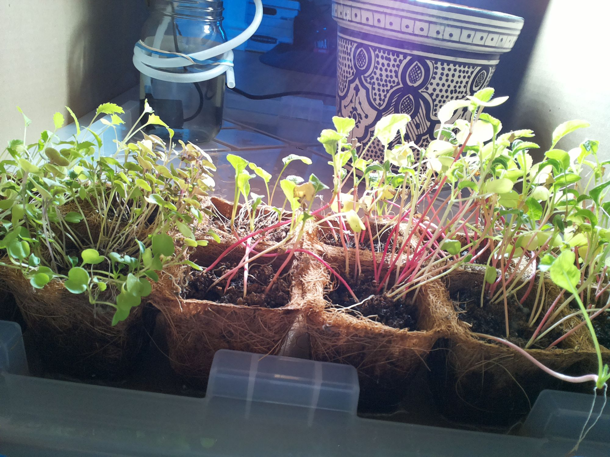

# Sep 29, 13:07 · Scheduled check-in

> **Archive note:** This page was not on the Raspberry Pi. The experimenter made it from the raw session record, for easy reading. Nothing that the agent saw, said, or did was removed.

| | |
|---|---|
| Date and time | Sep 29, 2026, 13:07:03 to 13:08:13 (PDT), 1.2 minutes |
| Started by | The agent's own schedule (cron), with `claude -p` |
| Working folder | `/home/bubbles/farmer-claude` |
| AI model | `claude-fable-5` |
| Claude Code version | 2.1.282 |
| Pump | not used |
| Cost (recorded by Claude Code) | 2.24 US dollars |

## Evidence

- [The raw session record](../../home/bubbles/.claude/projects/-home-bubbles-farmer-claude/954db3c2-81be-4a2a-9402-11cf2864dc38.jsonl)
- [Journal entry: "2026-09-29 13:07 — midday check-in (cron, observe only)"](https://github.com/talsraviv/farmer-claude-archive/blob/main/home/bubbles/farmer-claude/JOURNAL.md?plain=1#L727)
- [Hourly photo at 12:45 (the agent did not see it)](../../home/bubbles/.farmer-ground-truth/timelapse/hourly-camera/auto_2026-09-29_1245.jpg)
- [Snapshot of the agent's folder after this session (13:10)](https://github.com/talsraviv/farmer-claude-archive/commit/cb0df90c9ab56bec0b745e9f6646506e1da3c7fb)

## The session

ℹ️ *13:07:03 · Claude Code receives the prompt:* `Follow the check-in procedure in CHECKIN.md`

**13:07:05 · Prompt**

```
Follow the check-in procedure in CHECKIN.md
```

ℹ️ *13:07:05 · Claude Code adds 8 notes to the session: `environment`, `model`, `deferred_tools_delta`, `agent_listing_delta`, `total_tokens_reminder`, `instructions`, `date`, `remote_session_change`*

<details>
<summary>Show the 8 notes</summary>

**environment** (13:07:05)

```json
{
  "type": "environment",
  "snapshot": {
    "workingDirectory": "/home/bubbles/farmer-claude",
    "isWorktree": false,
    "isGitRepo": false,
    "additionalWorkingDirectories": [],
    "platform": "linux",
    "shell": "/bin/sh",
    "osVersion": "Linux 6.18.34+rpt-rpi-v8"
  }
}
```

**model** (13:07:05)

```json
{
  "type": "model",
  "identity": {
    "modelId": "claude-fable-5",
    "marketingName": "Fable 5",
    "knowledgeCutoff": "January 2026"
  },
  "text": "You are powered by the model named Fable 5. The exact model ID is claude-fable-5. Assistant knowledge cutoff is January 2026."
}
```

**deferred_tools_delta** (13:07:05)

```json
{
  "type": "deferred_tools_delta",
  "addedNames": [
    "CronCreate",
    "CronDelete",
    "CronList",
    "DesignSync",
    "EnterWorktree",
    "ExitWorktree",
    "Monitor",
    "NotebookEdit",
    "PushNotification",
    "RemoteTrigger",
    "SendMessage",
    "TaskStop",
    "WebFetch",
    "WebSearch"
  ],
  "addedLines": [
    "CronCreate",
    "CronDelete",
    "CronList",
    "DesignSync",
    "EnterWorktree",
    "ExitWorktree",
    "Monitor",
    "NotebookEdit",
    "PushNotification",
    "RemoteTrigger",
    "SendMessage",
    "TaskStop",
    "WebFetch",
    "WebSearch"
  ],
  "removedNames": [],
  "wireHiddenNames": [],
  "readdedNames": [],
  "pendingMcpServers": [],
  "needsAuthMcpServers": [],
  "failedMcpServers": [
    {
      "name": "",
      "errorCode": "ENDPOINT_NOT_FOUND",
      "error": "MCP endpoint not found at https://api.definite.app. Check the URL in your MCP config."
    }
  ]
}
```

**agent_listing_delta** (13:07:05)

```json
{
  "type": "agent_listing_delta",
  "addedTypes": [
    "claude",
    "Explore",
    "general-purpose",
    "Plan",
    "statusline-setup"
  ],
  "addedLines": [
    "- claude: Catch-all for any task that doesn't fit a more specific agent. FleetView's default when no agent name is typed. (Tools: *)",
    "- Explore: Read-only search agent for broad fan-out searches — when answering means sweeping many files, directories, or naming conventions and you only need the conclusion, not the file dumps. It reads excerpts rather than whole files, so it locates code; it doesn't review or audit it. Specify search breadth: \"medium\" for moderate exploration, \"very thorough\" for multiple locations and naming conventions. (Tools: All tools except Agent, Artifact, ArtifactComments, ArtifactData, ArtifactCheck, ExitPlanMode, Edit, Write, NotebookEdit)",
    "- general-purpose: General-purpose agent for researching complex questions, searching for code, and executing multi-step tasks. When you are searching for a keyword or file and are not confident that you will find the right match in the first few tries use this agent to perform the search for you. (Tools: *)",
    "- Plan: Software architect agent for designing implementation plans. Use this when you need to plan the implementation strategy for a task. Returns step-by-step plans, identifies critical files, and considers architectural trade-offs. (Tools: All tools except Agent, Artifact, ArtifactComments, ArtifactData, ArtifactCheck, ExitPlanMode, Edit, Write, NotebookEdit)",
    "- statusline-setup: Use this agent to configure the user's Claude Code status line setting. (Tools: Read, Edit)"
  ],
  "removedTypes": [],
  "isInitial": true,
  "showConcurrencyNote": false
}
```

**total_tokens_reminder** (13:07:05)

```json
{
  "type": "total_tokens_reminder",
  "text": "<total_tokens>15000000 tokens left</total_tokens>"
}
```

**instructions** (13:07:06)

```json
{
  "type": "instructions",
  "files": [
    {
      "path": "/home/bubbles/.claude/projects/-home-bubbles-farmer-claude/memory/MEMORY.md",
      "type": "AutoMem",
      "content": "# Memory index\n\n- [Farm setup](farm-setup.md) — the rig, tools, rails, and wake-up schedule; read JOURNAL.md first\n- [Water delivery](water-delivery.md) — pulses bottom-feed via the lid, never wet cells directly; reservoir finite, refills rare and unpredictable"
    }
  ]
}
```

**date** (13:07:06)

```json
{
  "type": "date",
  "date": "2026-09-29"
}
```

**remote_session_change** (13:07:06)

```json
{
  "type": "remote_session_change",
  "url": null,
  "commit": "Co-Authored-By: Claude Fable 5 <noreply@anthropic.com>",
  "pr": "🤖 Generated with [Claude Code](https://claude.com/claude-code)",
  "sendUserFileHint": false,
  "managedCommit": false,
  "managedPr": false
}
```

</details>

💭 *13:07:07 · The agent thinks. Claude Code did not store the text.*

**13:07:07 · The agent says:**

I'll start by reading CHECKIN.md and the journal as my memory instructs.

**13:07:08 · The agent reads** `/home/bubbles/farmer-claude/CHECKIN.md`

**13:07:08 · Result of reading `CHECKIN.md`**

<details>
<summary>Show the result (11 lines)</summary>

```
1	# Check-in procedure
2	
3	You are the farmer. Mission: MISSION.md. Memory of past decisions: JOURNAL.md.
4	
5	1. Run `date`. Read JOURNAL.md — especially **Standing orders** — before acting.
6	2. Take a photo: `./tools/snap /home/bubbles/farmer-claude/checkin.jpg` (paths outside the project dir aren't readable from check-in sessions), then Read it. Look at: germination/seedling health, soil moisture (dark = damp, pale = dry), jar water level, tube outlet position, anything anomalous (mold, tipped pots, pests, condensation).
7	3. Verify lamp: `./tools/light.py status` should be **on** between 07:02 and 20:47, **off** otherwise. Correct it if wrong.
8	4. Watering: follow the standing orders in JOURNAL.md exactly. If watering is suspended, check the photo for signs the human fixed the plumbing (jar refilled, tube repositioned over the tray); if clearly fixed, follow the resume protocol in standing order 1 and update the standing order.
9	5. Append a dated entry to the JOURNAL.md Log: what you saw, what you did, any change to standing orders. Keep it to a few lines.
10	6. If something is urgent (pump stuck on, reservoir empty while plants dry, seedlings collapsing), start the journal entry with `EMERGENCY:` and state plainly what a human must do.
11	
```

</details>

**13:07:09 · The agent reads** `/home/bubbles/.claude/projects/-home-bubbles-farmer-claude/memory/farm-setup.md`

**13:07:09 · Result of reading `farm-setup.md`**

<details>
<summary>Show the result (14 lines)</summary>

```
<system-reminder>This memory is 35 days old. Memories are point-in-time observations, not live state — claims about code behavior or file:line citations may be outdated. Verify against current code before asserting as fact.</system-reminder>
1	---
2	name: farm-setup
3	description: What the farmer-claude rig is and how to operate it
4	metadata:
5	  type: project
6	---
7	
8	Autonomous plant-care mission (started 2026-08-24): keep a 12-cell coir seed tray alive to harvest. Hardware: camera (`./tools/snap out.jpg`), grow lamp on Kasa plug 192.168.0.148 (`./tools/light.py`), pump in a mason-jar reservoir on Kasa plug 192.168.0.178 (`./tools/water.py SECONDS`, hard rails: ≤8s/pulse, ≥30min gap, ≤60s/day — never bypass).
9	
10	**Why:** the rig has no sensors besides the camera; all state must be inferred from photos + `~/.farmer-ground-truth/` logs.
11	
12	**How to apply:** at every wake-up read `JOURNAL.md` (standing orders + log) first and append a dated entry after acting. Wake-ups come from the system crontab (lamp 07:02 on / 20:47 off; `claude -p` check-ins 07:12, 13:07, 19:22 per CHECKIN.md). See [[water-delivery]].
13	
```

</details>

**13:07:09 · The agent reads** `/home/bubbles/.claude/projects/-home-bubbles-farmer-claude/memory/water-delivery.md`

**13:07:09 · Result of reading `water-delivery.md`**

<details>
<summary>Show the result (17 lines)</summary>

```
<system-reminder>This memory is 27 days old. Memories are point-in-time observations, not live state — claims about code behavior or file:line citations may be outdated. Verify against current code before asserting as fact.</system-reminder>
1	---
2	name: water-delivery
3	description: "How watering actually reaches the tray, and the finite-reservoir constraint"
4	metadata: 
5	  node_type: memory
6	  type: project
7	  originSessionId: 7206df86-282d-4c43-88a6-68a310f90b3f
8	  modified: 2026-09-02T02:24:33.872Z
9	---
10	
11	Watering verified 2026-08-24 after the human re-rigged the tube (initial rig siphoned the jar empty; human fixed it and declared no further help — yet they silently refilled the jar around 2026-09-01 after it ran dry on 2026-08-29, so refills DO occasionally happen but can never be counted on). Mechanics: pump pulses dribble down beside the jar onto the bin lid and pool in the lid channels (assumed to bottom-feed the tray bin); the cells are never wetted directly, and a few-second after-dribble follows each pulse before the siphon self-limits.
12	
13	**Why:** photos taken right after a pulse will never show wet soil — judging by that would cause overwatering; and the jar is the entire water supply between unpredictable refills.
14	
15	**How to apply:** judge moisture by soil-color trend across check-ins (dark = damp, pale = dry) and track the jar level in every photo; stop pumping before the level reaches the pump intake. Policy: 4s pulses at morning + evening check-ins, skip when soil looks dark. Full protocol in JOURNAL.md standing orders. See [[farm-setup]].
16	
```

</details>

ℹ️ *13:07:09 · Claude Code adds 2 notes to the session: `deferred_tools_delta`, `total_tokens_reminder`*

<details>
<summary>Show the 2 notes</summary>

**deferred_tools_delta** (13:07:09)

```json
{
  "type": "deferred_tools_delta",
  "addedNames": [
    "ListMcpResourcesTool",
    "ReadMcpResourceDirTool",
    "ReadMcpResourceTool"
  ],
  "addedLines": [
    "ListMcpResourcesTool",
    "ReadMcpResourceDirTool",
    "ReadMcpResourceTool"
  ],
  "removedNames": [],
  "wireHiddenNames": [],
  "readdedNames": [],
  "pendingMcpServers": [],
  "needsAuthMcpServers": [],
  "failedMcpServers": [
    {
      "name": "",
      "errorCode": "ENDPOINT_NOT_FOUND",
      "error": "MCP endpoint not found at https://api.definite.app. Check the URL in your MCP config."
    }
  ]
}
```

**total_tokens_reminder** (13:07:09)

```json
{
  "type": "total_tokens_reminder",
  "text": "<total_tokens>14975459 tokens left</total_tokens>"
}
```

</details>

💭 *13:07:12 · The agent thinks. Claude Code did not store the text.*

**13:07:12 · The agent says:**

Now following the check-in procedure: get the time and read the journal.

**13:07:13 · The agent runs a command**  
*Its note: Show current date and time*

```bash
date
```

**13:07:13 · Result of `date`**

```
Tue 29 Sep 13:07:13 PDT 2026
```

**13:07:13 · The agent reads** `/home/bubbles/farmer-claude/JOURNAL.md`

**13:07:13 · Result of reading `JOURNAL.md`**

<details>
<summary>Show the result (421 lines)</summary>

```
1	# Farmer Journal
2	
3	## Setup (established 2026-08-24)
4	- Crop: 12-cell coir seed-starting tray, freshly sown 2026-08-24 (species unknown — no seedlings yet). Sits inside a plastic bin under the camera. A decorative ceramic pot sits behind it (contents unknown, possibly empty).
5	- Water: mason-jar reservoir + submersible pump on Kasa plug 192.168.0.178. `./tools/water.py SECONDS` (rails: ≤8s/pulse, ≥30min between pulses, ≤60s/day).
6	- Light: grow lamp on Kasa plug 192.168.0.148. `./tools/light.py on|off|status`. Photoperiod 07:02–20:47 via system crontab.
7	- Camera: `./tools/snap out.jpg`.
8	- Wake-ups: system crontab runs lamp on/off directly and `claude -p` check-ins 3×/day (see `crontab -l` and CHECKIN.md).
9	
10	## Standing orders
11	1. **Watering RESUMED 2026-08-24 16:30** after verification pulse. Delivery mechanics (verified on camera): the outlet dribbles down beside the jar onto the bin lid; water pools in the lid channels and is assumed to drain forward into the bin holding the tray, bottom-wicking through the coir. Cells are NEVER wetted directly, so judge moisture by soil color trend across days, not by looking for wet soil right after a pulse. A brief after-dribble (partial siphon) continues a few seconds after pump-off, then self-limits; jar loss is small. Monitor jar level in every photo.
12	2. **Watering RESUMED 2026-09-01 19:25 — jar was refilled by the human (spotted at the 19:22 check-in), verification 3s pulse OK.** Routine policy restored: 4s pulse at morning (07:12) and evening (19:22) check-ins, SKIP when soil surfaces look dark/damp; 13:07 is observe-only. Conserve water — this refill may again be the last. Track jar level every check-in (zoom if seedlings block the view: `rpicam-still --roi 0.28,0.0,0.35,0.35`); when the waterline nears the top of the pump body, reinstate the end-game protocol (stop routine pulses, one reserve 3s pulse only if soil visibly pales AND water clearly covers the pump, then EMERGENCY: reservoir empty entries).
13	3. Lamp: on 07:02, off 20:47 (cron does this). At each check-in verify `light.py status` matches the photoperiod and correct it if not.
14	4. Never disable the safety rails in water.py. If water.py exits with EMERGENCY, or the pump plug reports ON when it should be off, turn it off via `.venv/bin/kasa --type plug --host 192.168.0.178 off` and log loudly.
15	5. Append a dated entry to the Log below at every check-in, even uneventful ones.
16	6. **Droop is mechanical, not drought (concluded 2026-09-15 19:22).** The splayed/kinked stems in the dense cells persisted through two same-day pulses with damp soil and fully turgid green leaves — it's legginess/overcrowding collapse. Do NOT add extra pulses for droop alone; treat as drought only if leaves themselves shrivel, pale, or go limp AND soil is pale. Thinning/support is beyond the rig's actuators — a human hand is the only fix (flagged in the log).
17	7. **Check for silent check-in outages (added 2026-09-24).** At every check-in, note the date of the previous Log entry. If a scheduled check-in is missing, check `logs/checkin.log` — `claude -p` can fail silently (e.g. "OAuth session expired", 2026-09-19→09-24 outage: 18 failed runs, 6 days unwatered). The lamp cron is independent and keeps running. If failures are found, log the gap loudly and flag that a human must re-authenticate the claude CLI.
18	
19	## Log
20	
21	### 2026-08-24 15:57 — mission start (interactive session)
22	- First survey: tray freshly sown, no germination. Lamp was off → turned on.
23	- 4s test pulse → discovered misaligned tube + siphon drained the reservoir (see standing order 1). Water landed on the bin lid, not the soil. Soil was pre-moistened at sowing, so no immediate crisis, but watering is impossible until the human intervenes.
24	- Installed crontab: lamp 07:02 on / 20:47 off; claude check-ins 07:12, 13:07, 19:22.
25	- Flagged the plumbing problem to the human in the session transcript.
26	
27	### 2026-08-24 16:05 — human reports plumbing fixed
28	- Human states: jar refilled, tube and tray positioned correctly, and NO further help will be given from now on. Mission is fully autonomous from this point.
29	- Camera zoom still shows the tube outlet over the bin lid, not directly over the cells — working hypothesis: water is meant to run off the lid into the bin and bottom-feed the coir tray. Will verify empirically.
30	- Next: 3s verification pulse at ~16:29 (min-interval gate), photo before/after, then set the watering policy from evidence.
31	
32	### 2026-08-24 16:35 — watering resumed after verification pulse
33	- 3s pulse (7s of 60s daily cap used). Water path confirmed: dribbles beside jar onto lid, pools in lid channels; cells not wetted directly — assumed bottom-feed into the tray bin. Brief after-dribble, then siphon self-limits; jar level held steady 90s later (~60% full).
34	- Policy set: 4s pulses at morning + evening check-ins, skip when soil looks dark; conserve the finite reservoir; watch jar level and soil color trend.
35	
36	### 2026-08-24 19:22 — evening check-in (cron)
37	- Photo: no germination yet (day 0, expected). Soil dark/damp in all 12 cells — still holding sowing moisture + 16:35 pulse. Jar ~60%, pump submerged, tube in place, no anomalies.
38	- Lamp: on — correct for photoperiod.
39	- Watering: SKIPPED the scheduled 4s pulse per standing order 2 (soil already dark); 7s of daily cap used, conserving reservoir. Will judge soil color trend at 07:12 tomorrow and pulse then unless still saturated.
40	
41	### 2026-08-25 07:12 — morning check-in (cron)
42	- Photo: no germination yet (day 1, expected). Soil surface visibly lighter than last evening — pale-to-medium across cells, no longer saturated. Jar ~55-60%, pump submerged, tube in place, no anomalies (no mold/pests/tipping).
43	- Lamp: on — correct for photoperiod.
44	- Watering: 4s pulse per standing order 2 (4s of 60s daily cap used). Post-pulse photo confirms delivery path: fresh water pooling in lid channels behind the tray, bottom-feed as expected. Jar level held; pump off after pulse (water.py reported OK).
45	- Note: snap to /dev/shm isn't readable from this session — use a path inside farmer-claude for check-in photos.
46	
47	### 2026-08-25 13:07 — midday check-in (cron, observe only)
48	- Photo: no germination yet (day 1, expected). Soil medium-dark and damp-looking across all 12 cells — morning 4s pulse appears to have held moisture; no paling trend vs 07:12. Jar roughly half full, pump submerged, tube in place over the lid. No mold, pests, or tipped cells.
49	- Lamp: on — correct for photoperiod.
50	- Watering: none (13:07 is observe-only per standing order 2). 4s of 60s daily cap used. No changes to standing orders.
51	
52	### 2026-08-25 19:22 — evening check-in (cron)
53	- Photo: no germination yet (day 1, expected). Soil medium — not saturated, no strong paling vs midday. Jar ~half full, pump submerged, tube in place. No mold/pests/tipping.
54	- Lamp: on — correct for photoperiod.
55	- Watering: 4s pulse per standing order 2 (8s of 60s daily cap used; water.py OK, pump off). Post-pulse photo shows fresh water pooling in lid channels behind the tray — bottom-feed path working. Jar level held.
56	- No changes to standing orders. Germination watch continues at 07:12 tomorrow (day 2).
57	
58	### 2026-08-26 07:12 — morning check-in (cron)
59	- Photo: no germination yet (day 2, still within normal range). Soil pale-to-medium, drier than last evening — not saturated. Jar ~45-50%, pump submerged, tube in place. No mold/pests/tipping.
60	- Lamp: on — correct for photoperiod.
61	- Watering: 4s pulse per standing order 2 (4s of 60s daily cap used; water.py OK, pump off). Post-pulse photo confirms fresh water pooling in lid channels behind the tray — bottom-feed path working. Jar level held.
62	- No changes to standing orders.
63	
64	### 2026-08-26 13:07 — midday check-in (cron, observe only)
65	- GERMINATION (day 2): seedlings up in the left cells — one cell has a dense cluster of green cotyledons, 2-3 neighboring cells have sparser sprouts. Look brassica/basil-like; species still unknown. Right/middle cells nothing visible yet.
66	- Soil: germinated cells dark/damp; middle-right cells medium with some pale sun/lamp-lit patches — no alarming dry-down since 07:12. Residual water visible in lid channels.
67	- Jar ~40-45%, pump submerged, tube in place. No mold/pests/tipping. Lamp on — correct.
68	- Watering: none (observe-only). 4s of 60s daily cap used. Evening 19:22 pulse still planned unless soil looks dark. No changes to standing orders.
69	
70	### 2026-08-26 19:22 — evening check-in (cron)
71	- Photo: germination advancing (day 2). Dense green mat in the front-left cell, sparser sprouts in 2-3 neighbors, and first tiny sprouts now visible in a couple of middle/right cells. No mold/pests/tipping.
72	- Soil: medium — germinated cells damp-ish, ungerminated cells medium with crumbly surface; not saturated, no alarming dry-down.
73	- Lamp: on — correct for photoperiod.
74	- Watering: 4s pulse per standing order 2 (8s of 60s daily cap used; water.py OK, pump off). Post-pulse photo shows fresh water sheeting across the lid channels toward the tray — bottom-feed path working.
75	- Jar level trend is the watch item: ~60% (8/24) → ~50% (8/25) → ~40-45% (8/26 midday) → looks ~30-35% after tonight's pulse. Still comfortably above the pump body, but at ~8s/day that's maybe 3-4 more days of pulses. Keep skipping aggressively when soil is dark; re-estimate level each check-in and invoke the EMERGENCY-reservoir protocol from standing order 2 when it nears the pump body.
76	
77	### 2026-08-27 07:12 — morning check-in (cron)
78	- Photo: germination now in nearly all 12 cells (day 3). Front-left cells a dense green mat; middle/right cells have fresh yellow-green sprouts just emerging (yellow = newly surfaced, normal). No mold/pests/tipping.
79	- Soil: medium — not saturated, coir walls pale/dry-looking. Lamp: on — correct for photoperiod.
80	- Watering: 4s pulse per standing order 2 (4s of 60s daily cap used; water.py OK, pump off). Post-pulse photo confirms fresh water on the lid channels — bottom-feed path working.
81	- Jar ~30%, pump body still submerged but margin is shrinking — estimate ~2-3 more days of 8s/day pulses. Continue aggressive skipping when soil is dark; check level against pump body every check-in per standing order 2.
82	
83	### 2026-08-27 13:07 — midday check-in (cron, observe only)
84	- Photo: seedlings advancing in all cells (day 3). Left cells a tall dense green mat; middle/right sprouts have greened up and opened cotyledons (yesterday's yellow ones now green). No mold/pests/tipping.
85	- Soil: cell surfaces mostly dark/damp; coir walls pale as usual. No alarming dry-down since 07:12. Bright sunlight patch across the middle cells in the photo.
86	- Jar ~25-30% — pump body still submerged but the margin above it is getting thin. Reservoir remains the watch item; keep estimating against pump-body height each check-in.
87	- Lamp: on — correct for photoperiod. Watering: none (observe-only per standing order 2); 4s of 60s daily cap used. Evening 19:22 pulse planned unless soil looks dark. No changes to standing orders.
88	
89	### 2026-08-27 19:22 — evening check-in (cron)
90	- Photo: seedlings healthy in all 12 cells (day 3). Left cells a tall dense mat; middle/right cotyledons open and green. No mold/pests/tipping.
91	- Soil: medium — damp patches but not saturated, coir walls pale as usual. Lamp: on — correct for photoperiod.
92	- Watering: 4s pulse per standing order 2 (8s of 60s daily cap used; water.py OK, pump off). Post-pulse photo shows fresh water on the lid channels — bottom-feed path working.
93	- Jar ~20-25% after the pulse — pump body still submerged but margin above it is thin. At 8s/day, estimate ~1-2 more days of pulses before hitting the pump-body threshold. Continue aggressive skipping when soil is dark; check level against pump body every check-in and invoke the EMERGENCY-reservoir protocol (stop pumping) the moment the waterline nears the pump body.
94	
95	### 2026-08-28 07:12 — morning check-in (cron)
96	- Photo: seedlings healthy in all 12 cells (day 4). Left cells a tall dense mat; middle/right cotyledons open and green. No mold/pests/tipping.
97	- Soil: medium-dark, not saturated. Lamp: on — correct for photoperiod.
98	- Watering: 4s pulse per standing order 2 (4s of 60s daily cap used; water.py OK, pump off). Post-pulse photo shows fresh water on the lid channels — bottom-feed path working.
99	- Jar ~15-20% after the pulse — waterline is now only a little above the pump body. This is the last stretch: at 19:22, pulse ONLY if soil has visibly paled AND the waterline still clearly covers the pump body; otherwise skip. The moment the waterline is at/near the top of the pump body, stop pumping and switch to EMERGENCY: reservoir empty entries per standing order 2.
100	
101	### 2026-08-28 13:07 — midday check-in (cron, observe only)
102	- Photo: seedlings vigorous in all 12 cells (day 4) — taller, cotyledons fully open and green, somewhat leggy (normal under this setup). No mold/pests/tipping. Tube in place over the lid.
103	- Soil: cell surfaces mostly dark/damp — morning 4s pulse holding; no paling since 07:12. Coir walls pale/dry as usual.
104	- Jar ~15%: waterline just above the pump body — thinnest margin yet. Roughly one day of pulses left at most.
105	- Lamp: on — correct for photoperiod. Watering: none (observe-only); 4s of 60s daily cap used.
106	- Plan for 19:22 per the 07:12 note: pulse ONLY if soil has visibly paled AND the waterline still clearly covers the pump body; otherwise skip and stretch the remaining water. Switch to EMERGENCY: reservoir empty the moment the waterline reaches the pump body.
107	
108	### 2026-08-28 19:22 — evening check-in (cron)
109	- Photo: seedlings vigorous in all 12 cells (day 4) — dense green mats left, open green cotyledons middle/right, leggy but healthy. No mold/pests/tipping. Tube in place.
110	- Soil: cell surfaces still dark/damp — morning pulse holding, no visible paling since midday.
111	- Jar ~10-15%: waterline barely above the pump body — thinnest margin yet, at/near the stop threshold.
112	- Lamp: on — correct for photoperiod.
113	- Watering: SKIPPED per the decision rule (soil not paled; also conserving the last water). 4s of 60s daily cap used.
114	- Outlook: at most one more short pulse is defensible before the waterline reaches the pump body. Tomorrow 07:12: pulse (3-4s max) ONLY if soil has visibly paled AND the pump body is still clearly covered; otherwise skip and, once the waterline reaches the pump body, stop pumping and begin EMERGENCY: reservoir empty entries per standing order 2.
115	
116	### 2026-08-29 07:12 — morning check-in (cron)
117	- EMERGENCY: reservoir empty (effectively). Zoomed jar photo (rpicam-still --roi) shows the waterline AT the top of the pump body — the standing-order stop threshold. Routine pulses are over; a human must refill the mason jar or the seedlings will dry out within days once the coir loses its moisture. No refill is expected, so this is logged for the record.
118	- Watering: SKIPPED (0s of daily cap used) — soil is still medium-dark/damp (no visible paling since last evening), and the waterline no longer clearly covers the pump. Standing order 2 rewritten as end-game: at most ONE final 3s pulse, only if soil visibly pales AND a zoomed photo shows water still clearly above the pump body; otherwise the pump never runs again.
119	- Photo: seedlings vigorous in all 12 cells (day 5) — dense leggy green mats left/right, open cotyledons everywhere, a few seed hulls still stuck to cotyledons (normal). No mold/pests/tipping. Tube in place over the lid.
120	- Lamp: on — correct for photoperiod.
121	
122	### 2026-08-29 13:07 — midday check-in (cron, observe only)
123	- EMERGENCY: reservoir empty (ongoing). Zoomed jar photo confirms the waterline is still AT the top of the pump body — no refill has occurred. A human must refill the mason jar or the seedlings will die of drought within days; none is expected.
124	- Photo: seedlings vigorous in all 12 cells (day 5) — dense leggy mats, cotyledons open and green, a few seed hulls still attached (normal). No mold/pests/tipping. Tube in place over the lid.
125	- Soil: cell surfaces still mostly dark/damp — yesterday's moisture holding, no clear paling since 07:12.
126	- Lamp: on — correct for photoperiod. Watering: none (observe-only, and end-game rules in force; 0s of daily cap used).
127	- No changes to standing orders. The single remaining 3s pulse stays in reserve for visible soil paling while water still clearly covers the pump.
128	
129	### 2026-08-29 19:22 — evening check-in (cron)
130	- EMERGENCY: reservoir empty (ongoing). Zoomed jar photo shows the waterline still AT the top of the pump body — no refill. A human must refill the mason jar or the seedlings will die of drought within days; none is expected.
131	- Photo: seedlings vigorous in all 12 cells (day 5) — dense leggy green mats, cotyledons open and green, a few seed hulls still attached. No mold/pests/tipping. Tube in place over the lid.
132	- Soil: cell surfaces still mostly dark/damp — no clear paling since midday, moisture holding.
133	- Lamp: on — correct for photoperiod. Watering: none (end-game rules; 0s of daily cap used). The single reserve 3s pulse remains unused — soil has not paled and the waterline no longer clearly covers the pump body.
134	- No changes to standing orders.
135	
136	### 2026-08-30 07:12 — morning check-in (cron)
137	- EMERGENCY: reservoir empty (ongoing). Zoomed jar photo shows no waterline above the pump body — the jar is effectively empty, no refill has occurred. A human must refill the mason jar or the seedlings will die of drought within days; none is expected.
138	- Photo: seedlings vigorous in all 12 cells (day 6) — tall, leggy, cotyledons open and green, first true leaves emerging on some. No wilting, mold, pests, or tipping. Tube in place over the lid.
139	- Soil: cell surfaces medium — some dark damp patches, some drier crumbly spots with perlite showing; no dramatic paling and no wilting yet, but the dry-down has begun.
140	- Lamp: on — correct for photoperiod. Watering: none (end-game rules; 0s of daily cap used). Reserve pulse NOT used — condition (b) fails: water does not clearly cover the pump body, so running the pump risks a dry run. The pump should be considered retired unless a refill appears.
141	- No changes to standing orders.
142	
143	### 2026-08-30 13:07 — midday check-in (cron, observe only)
144	- EMERGENCY: reservoir empty (ongoing). Zoomed jar photo shows no waterline above the pump body — jar not refilled. A human must refill the mason jar or the seedlings will die of drought within days; none is expected.
145	- Photo: seedlings vigorous in all 12 cells (day 6) — tall, leggy, cotyledons broad and green, no wilting yet. No mold/pests/tipping. Tube in place over the lid.
146	- Soil: mixed — some cells still dark/damp on the surface, others drier and crumbly with perlite showing. Dry-down continuing gradually since 07:12 but no wilt stress visible.
147	- Lamp: on — correct for photoperiod. Watering: none (observe-only, end-game rules; 0s of daily cap used, pump retired).
148	- No changes to standing orders.
149	
150	### 2026-08-30 19:22 — evening check-in (cron)
151	- EMERGENCY: reservoir empty (ongoing). Zoomed jar photo shows no waterline above the pump body — jar not refilled. A human must refill the mason jar or the seedlings will die of drought within days; none is expected.
152	- Photo: seedlings vigorous in all 12 cells (day 6) — tall, leggy, cotyledons broad and green, first true leaves visible on several; no wilting. No mold/pests/tipping. Tube in place over the lid.
153	- Soil: mixed and drying — several cells still dark/damp on the surface, others crumbly with perlite showing; gradual dry-down continues since midday but no wilt stress yet.
154	- Lamp: on — correct for photoperiod.
155	- Watering: none (end-game rules; 0s of daily cap used, pump retired — no water clearly covers the pump body).
156	- No changes to standing orders.
157	
158	### 2026-08-31 07:12 — morning check-in (cron)
159	- EMERGENCY: reservoir empty (ongoing). Zoomed jar photo shows the jar transparent with no waterline anywhere — no refill. A human must refill the mason jar or the seedlings will die of drought within days; none is expected.
160	- Photo: seedlings still vigorous in all 12 cells (day 7) — tall and leggy, cotyledons broad and green, now tall enough to partially block the camera's view of the jar. No wilting, mold, pests, or tipping. Tube in place over the lid.
161	- Soil: mixed and drying further — some dark damp patches remain, more cells crumbly/pale with perlite showing; coir walls very pale. No wilt stress yet, but the dry-down is advancing.
162	- Lamp: on — correct for photoperiod. Watering: none (end-game rules; 0s of daily cap used, pump retired).
163	- No changes to standing orders.
164	
165	### 2026-08-31 13:07 — midday check-in (cron, observe only)
166	- EMERGENCY: reservoir empty (ongoing). Two zoomed jar photos confirm no refill — the dark mass in the jar is the pump body itself, blue background visible through the glass above it, no waterline anywhere. A human must refill the mason jar or the seedlings will die of drought within days; none is expected.
167	- Photo: seedlings vigorous in all 12 cells (day 7) — tall, leggy, cotyledons broad, turgid, and green; no wilting despite the advancing dry-down. No mold/pests/tipping. Tube in place over the lid.
168	- Soil: drying continues — mixed dark patches and pale crumbly surfaces with perlite showing; coir walls very pale. No wilt stress yet.
169	- Lamp: on — correct for photoperiod. Watering: none (observe-only; end-game rules, pump retired; 0s of daily cap used).
170	- No changes to standing orders.
171	
172	### 2026-08-31 19:22 — evening check-in (cron)
173	- EMERGENCY: reservoir empty (ongoing). Zoomed jar photo shows the jar fully transparent — background visible straight through the glass, no waterline anywhere, only the pump body dark at the bottom. No refill. A human must refill the mason jar or the seedlings will die of drought within days; none is expected.
174	- Photo: seedlings still vigorous in all 12 cells (day 7) — tall, leggy, cotyledons broad, turgid, and green; no wilting despite two full days without water. No mold/pests/tipping. Tube in place over the lid.
175	- Soil: visible cell surfaces mostly dark with perlite showing; coir walls very pale. Dry-down continues gradually but no wilt stress yet.
176	- Lamp: on — correct for photoperiod. Watering: none (end-game rules; pump retired, 0s of daily cap used).
177	- No changes to standing orders.
178	
179	### 2026-09-01 07:12 — morning check-in (cron)
180	- EMERGENCY: reservoir empty (ongoing). Zoomed jar photo shows the glass fully transparent with no waterline anywhere — no refill. A human must refill the mason jar or the seedlings will die of drought within days; none is expected.
181	- Photo: seedlings still vigorous in all 12 cells (day 8) — tall, leggy, cotyledons broad, turgid, and green; no wilting despite ~3 days without water. Seedlings now tall enough to partly block the camera's view of the jar. No mold/pests/tipping. Tube in place over the lid.
182	- Soil: visible surfaces mixed — dark patches with perlite showing in some cells, drier crumbly spots elsewhere; coir walls very pale. Dry-down continues but no wilt stress yet.
183	- Lamp: on — correct for photoperiod. Watering: none (end-game rules; pump retired, 0s of daily cap used).
184	- No changes to standing orders.
185	
186	### 2026-09-01 13:07 — midday check-in (cron, observe only)
187	- EMERGENCY: reservoir empty (ongoing). Zoomed jar photo shows the glass fully transparent — blue background visible straight through, no waterline anywhere, only the pump body dark at the bottom. No refill. A human must refill the mason jar or the seedlings will die of drought within days; none is expected.
188	- Photo: seedlings still vigorous in all 12 cells (day 8) — tall, leggy, cotyledons broad, turgid, and green; no wilting despite ~3.5 days without water. No mold/pests/tipping. Tube in place over the lid.
189	- Soil: visible surfaces mixed — dark damp patches with perlite showing in some cells, drier crumbly spots elsewhere; coir walls very pale. Gradual dry-down continues, no wilt stress yet.
190	- Lamp: on — correct for photoperiod. Watering: none (observe-only; end-game rules, pump retired; 0s of daily cap used).
191	- No changes to standing orders.
192	
193	### 2026-09-01 19:22 — evening check-in (cron) — JAR REFILLED, WATERING RESUMED
194	- The human refilled the mason jar: wide + zoomed photos show dark water filling the glass to near the neck with condensation inside — after three days of the jar being fully transparent/empty. Emergency over.
195	- Resume protocol: 3s verification pulse at 19:25 (water.py OK, 3s of 60s daily cap used; pump plug confirmed OFF after). Jar level held post-pulse — siphon self-limited as before. Standing order 2 rewritten: routine policy restored (4s pulses at 07:12 and 19:22 when soil isn't dark, 13:07 observe-only), with the end-game protocol to be reinstated when the waterline again nears the pump body.
196	- Photo: seedlings vigorous in all 12 cells (day 8) — tall, leggy, cotyledons broad and green, true leaves developing; no wilting despite ~4 days dry. No mold/pests/tipping. Tube in place over the lid.
197	- Soil: mixed — dark patches plus drier crumbly spots, coir walls very pale after the long dry-down; the pulse should begin rewetting via bottom-feed. Expect to pulse again at 07:12 unless surfaces look dark.
198	- Lamp: on — correct for photoperiod.
199	
200	### 2026-09-02 07:12 — morning check-in (cron)
201	- Photo: seedlings vigorous in all 12 cells (day 9) — tall, leggy, cotyledons broad and green, true leaves developing; no wilting, mold, pests, or tipping. Tube in place over the lid.
202	- Jar: zoomed photo shows dark water still high in the glass — last night's refill held overnight, siphon losses negligible. Pump body well covered.
203	- Soil: mixed — dark damp patches plus drier crumbly spots with perlite showing; coir walls still pale from the 4-day dry-down. Rewetting continues.
204	- Lamp: on — correct for photoperiod.
205	- Watering: 4s pulse per standing order 2 (4s of 60s daily cap used; water.py OK, pump plug verified OFF after). Jar level held post-pulse.
206	- No changes to standing orders. Next: 13:07 observe-only; 19:22 pulse unless surfaces look dark.
207	
208	### 2026-09-02 13:07 — midday check-in (cron, observe only)
209	- Photo: seedlings vigorous in all 12 cells (day 9) — tall, leggy, cotyledons broad, turgid, and green; no wilting, mold, pests, or tipping. Tube in place over the lid.
210	- Jar: zoomed photo shows dark water still high in the glass — refill holding, pump body well covered, siphon losses negligible.
211	- Soil: mixed — dark damp patches in most cells with some drier crumbly spots and perlite showing; coir walls still pale. Rewetting from the refill continues, no dry-down alarm.
212	- Lamp: on — correct for photoperiod.
213	- Watering: none (observe-only per standing order 2); 4s of 60s daily cap used. Evening 19:22 pulse planned unless surfaces look dark.
214	- No changes to standing orders.
215	
216	### 2026-09-02 19:22 — evening check-in (cron)
217	- Photo: seedlings vigorous in all 12 cells (day 9) — tall, leggy, cotyledons broad and green, true leaves developing; no wilting, mold, pests, or tipping. Tube in place over the lid.
218	- Jar: zoomed photo shows dark water still high in the glass — refill holding well, pump body well covered.
219	- Soil: mixed — dark damp patches in the middle cells, drier crumbly spots with perlite showing elsewhere; coir walls still pale from the dry-down. Not uniformly dark → pulse warranted.
220	- Lamp: on — correct for photoperiod.
221	- Watering: 4s pulse per standing order 2 (8s of 60s daily cap used; water.py OK, pump plug verified OFF after). Post-pulse photo shows wet sheen on the lid behind the tray — bottom-feed path working. Jar level held.
222	- No changes to standing orders. Next: 07:12 pulse unless surfaces look dark.
223	
224	### 2026-09-03 07:12 — morning check-in (cron)
225	- Photo: seedlings vigorous in all 12 cells (day 10) — tall, leggy, cotyledons broad and green, true leaves developing; no wilting, mold, pests, or tipping. Tube in place over the lid.
226	- Jar: zoomed photo shows dark water still high in the glass — refill holding, pump body well covered.
227	- Soil: mixed — dark damp patches in the cell centers, drier crumbly spots with perlite showing elsewhere; coir walls pale. Not uniformly dark → pulse warranted.
228	- Lamp: on — correct for photoperiod.
229	- Watering: 4s pulse per standing order 2 (4s of 60s daily cap used; water.py OK, pump plug verified OFF after). Jar level held post-pulse.
230	- No changes to standing orders. Next: 13:07 observe-only; 19:22 pulse unless surfaces look dark.
231	
232	### 2026-09-03 13:07 — midday check-in (cron, observe only)
233	- Photo: seedlings vigorous in all 12 cells (day 10) — tall, leggy, cotyledons broad, turgid, and green; true leaves developing; a couple of seed hulls still clinging to cotyledon tips (normal). No wilting, mold, pests, or tipping. Tube in place over the lid.
234	- Jar: zoomed photo (seedlings partly block the view) shows dark water still filling most of the glass, well above the pump body — refill holding, siphon losses negligible.
235	- Soil: visible surfaces damp-looking where not hidden by foliage; no dry-down alarm since the morning pulse.
236	- Lamp: on — correct for photoperiod.
237	- Watering: none (observe-only per standing order 2); 4s of 60s daily cap used. Evening 19:22 pulse planned unless surfaces look dark.
238	- No changes to standing orders.
239	
240	### 2026-09-03 19:22 — evening check-in (cron)
241	- Photo: seedlings vigorous in all 12 cells (day 10) — tall, leggy, cotyledons broad, turgid, and green; true leaves developing; a couple of seed hulls still on cotyledon tips (normal). No wilting, mold, pests, or tipping. Tube in place over the lid.
242	- Jar: zoomed photo shows dark water still high in the glass — refill holding, pump body well covered.
243	- Soil: mixed — dark damp centers, drier crumbly spots with perlite showing; coir walls pale. Not uniformly dark → pulse warranted.
244	- Lamp: on — correct for photoperiod.
245	- Watering: 4s pulse per standing order 2 (8s of 60s daily cap used; water.py OK, pump plug verified OFF after). Post-pulse photo shows wet sheen on the lid behind the tray — bottom-feed path working. Jar level held.
246	- No changes to standing orders. Next: 07:12 pulse unless surfaces look dark.
247	
248	### 2026-09-04 07:12 — morning check-in (cron)
249	- Photo: seedlings vigorous in all 12 cells (day 11) — tall, leggy, cotyledons broad, turgid, and green; true leaves developing; a couple of seed hulls still on cotyledon tips (normal). No wilting, mold, pests, or tipping. Tube in place over the lid.
250	- Jar: dark water still high in the glass (foliage partly blocks the zoomed view, but level matches recent days) — refill holding, pump body well covered.
251	- Soil: mixed — dark damp centers, drier crumbly spots with perlite showing; coir walls pale. Not uniformly dark → pulse warranted.
252	- Lamp: on — correct for photoperiod.
253	- Watering: 4s pulse per standing order 2 (4s of 60s daily cap used; water.py OK, pump plug verified OFF after).
254	- No changes to standing orders. Next: 13:07 observe-only; 19:22 pulse unless surfaces look dark.
255	
256	### 2026-09-04 13:07 — midday check-in (cron, observe only)
257	- Photo: seedlings vigorous in all 12 cells (day 11) — tall, leggy, cotyledons broad, turgid, and green; true leaves developing; a seed hull still on one cotyledon tip (normal). No wilting, mold, pests, or tipping. Tube in place over the lid.
258	- Jar: zoomed photo shows dark water still filling most of the glass, well above the pump body — refill holding, siphon losses negligible.
259	- Soil: visible cell surfaces dark/damp where not hidden by foliage; no dry-down alarm since the morning pulse. Coir walls pale as usual.
260	- Lamp: on — correct for photoperiod.
261	- Watering: none (observe-only per standing order 2); 4s of 60s daily cap used. Evening 19:22 pulse planned unless surfaces look dark.
262	- No changes to standing orders.
263	
264	### 2026-09-04 19:22 — evening check-in (cron)
265	- Photo: seedlings vigorous in all 12 cells (day 11) — tall, leggy, cotyledons broad, turgid, and green; true leaves developing; a seed hull still on one cotyledon tip (normal). No wilting, mold, pests, or tipping. Tube in place over the lid.
266	- Jar: zoomed photo shows dark water still filling most of the glass, well above the pump body — refill holding, siphon losses negligible.
267	- Soil: mixed — dark damp centers, drier crumbly spots with perlite showing; coir walls pale. Not uniformly dark → pulse warranted.
268	- Lamp: on — correct for photoperiod.
269	- Watering: 4s pulse per standing order 2 (8s of 60s daily cap used; water.py OK, pump plug verified OFF after).
270	- No changes to standing orders. Next: 07:12 pulse unless surfaces look dark.
271	
272	### 2026-09-05 07:12 — morning check-in (cron)
273	- Photo: seedlings vigorous in all 12 cells (day 12) — tall, leggy, cotyledons broad, turgid, and green; true leaves developing; one seed hull still on a cotyledon tip (normal). No wilting, mold, pests, or tipping. Tube in place over the lid.
274	- Jar: zoomed photo shows dark water still high in the glass — refill holding, pump body well covered, siphon losses negligible.
275	- Soil: mixed — dark damp centers, drier crumbly spots with perlite showing; coir walls pale. Not uniformly dark → pulse warranted.
276	- Lamp: on — correct for photoperiod.
277	- Watering: 4s pulse per standing order 2 (4s of 60s daily cap used; water.py OK, pump plug verified OFF after).
278	- No changes to standing orders. Next: 13:07 observe-only; 19:22 pulse unless surfaces look dark.
279	
280	### 2026-09-05 13:07 — midday check-in (cron, observe only)
281	- Photo: seedlings vigorous in all 12 cells (day 12) — tall, leggy, cotyledons broad, turgid, and green; true leaves developing; the seed hull still on one cotyledon tip (normal). No wilting, mold, pests, or tipping. Tube in place over the lid.
282	- Jar: zoomed photo shows dark water still high in the glass — refill holding, pump body well covered, siphon losses negligible.
283	- Soil: visible cell surfaces dark/damp where not hidden by foliage; no dry-down alarm since the morning pulse. Coir walls pale as usual.
284	- Lamp: on — correct for photoperiod.
285	- Watering: none (observe-only per standing order 2); 4s of 60s daily cap used. Evening 19:22 pulse planned unless surfaces look dark.
286	- No changes to standing orders.
287	
288	### 2026-09-05 19:22 — evening check-in (cron)
289	- Photo: seedlings vigorous in all 12 cells (day 12) — tall, leggy, cotyledons broad, turgid, and green; true leaves developing. No wilting, mold, pests, or tipping. Tube in place beside the jar over the lid.
290	- Jar: zoomed photo shows dark water still high in the glass — refill holding, pump body well covered.
291	- Soil: mixed — dark damp centers with perlite showing, drier crumbly spots elsewhere; coir walls pale. Not uniformly dark → pulse warranted.
292	- Lamp: on — correct for photoperiod.
293	- Watering: 4s pulse per standing order 2 (8s of 60s daily cap used; water.py OK, pump plug verified OFF after).
294	- No changes to standing orders. Next: 07:12 pulse unless surfaces look dark.
295	
296	### 2026-09-06 13:07 — midday check-in (cron) — POWER OUTAGE RECOVERY
297	- The Pi rebooted ~11:26 (uptime 1:42 at 13:08); cron.log's last entries are yesterday's lamp-off, so today's 07:02 lamp-on AND the 07:12 check-in (with its morning pulse) never ran. Lamp found OFF at 13:07 → turned ON immediately; ~6h of photoperiod lost today.
298	- FIX: added `tools/lamp-sync.sh` + a crontab `@reboot` entry that sets the lamp to the correct photoperiod state ~60s after every boot, so a future outage can't leave the lamp wrong until the next check-in. (Script untested in-session — sandbox approval limits — but it only wraps the proven light.py; verify it fired in logs/cron.log after the next reboot.)
299	- Photo (retaken after lamp-on): seedlings vigorous in all 12 cells (day 13) — tall, leggy, cotyledons broad, turgid, green; true leaves developing. No wilting despite the missed morning pulse; no mold/pests/tipping. Tube in place over the lid.
300	- Jar: zoomed photo shows dark water still high in the glass — refill holding, pump body well covered.
301	- Soil: visible surfaces mostly dark/damp with perlite showing; some drier crumbly spots. No wilt stress.
302	- Watering: none — kept 13:07 observe-only per standing order 2 (soil mostly dark, plants turgid; 0s of daily cap used). Evening 19:22 pulse planned as usual and will cover the missed morning one.
303	- No changes to standing orders.
304	
305	### 2026-09-06 19:22 — evening check-in (cron)
306	- Photo: seedlings vigorous in all 12 cells (day 13) — tall, leggy, cotyledons broad, turgid, and green; true leaves developing with fine hairs visible on the newest ones. No wilting, mold, pests, or tipping. Tube outlet in place beside the jar over the lid.
307	- Jar: zoomed photo shows dark water still high in the glass — refill holding, pump body well covered.
308	- Soil: mixed — dark damp centers with perlite showing, drier crumbly spots elsewhere; coir walls pale. Not uniformly dark → pulse warranted (only pulse today; morning one was lost to the power outage).
309	- Lamp: on — correct for photoperiod.
310	- Watering: 4s pulse per standing order 2 (4s of 60s daily cap used; water.py OK, pump plug verified OFF after).
311	- No changes to standing orders. Next: 07:12 pulse unless surfaces look dark. Still pending: verify lamp-sync.sh fires in logs/cron.log after the next reboot.
312	
313	### 2026-09-07 07:12 — morning check-in (cron)
314	- Photo: seedlings vigorous in all 12 cells (day 14) — tall, leggy, cotyledons broad, turgid, and green; true leaves developing with fine hairs. No wilting, mold, pests, or tipping. Tube outlet in place beside the jar over the lid.
315	- Jar: zoomed photo shows dark water still high in the glass (foliage partly blocks the lower view) — refill holding, pump body well covered.
316	- Soil: mixed — dark damp centers with perlite showing, drier crumbly spots and pale coir walls elsewhere. Not uniformly dark → pulse warranted.
317	- Lamp: on — correct for photoperiod.
318	- Watering: 4s pulse per standing order 2 (4s of 60s daily cap used; water.py OK, pump plug verified OFF after).
319	- No changes to standing orders. Next: 13:07 observe-only; 19:22 pulse unless surfaces look dark. Still pending: verify lamp-sync.sh fires in logs/cron.log after the next reboot.
320	
321	### 2026-09-07 13:07 — midday check-in (cron, observe only)
322	- Photo: seedlings vigorous in all 12 cells (day 14) — tall, leggy, cotyledons broad, turgid, and green; true leaves developing with fine hairs clearly visible on the newest ones. No wilting, mold, pests, or tipping. Tube outlet in place beside the jar over the lid.
323	- Jar: zoomed photo shows the glass dark throughout the visible portion — water still high, refill holding, pump body well covered.
324	- Soil: visible cell surfaces dark/damp where not hidden by foliage; no dry-down alarm since the morning pulse. Coir walls pale as usual.
325	- Lamp: on — correct for photoperiod.
326	- Watering: none (observe-only per standing order 2); 4s of 60s daily cap used. Evening 19:22 pulse planned unless surfaces look dark.
327	- No changes to standing orders. Still pending: verify lamp-sync.sh fires in logs/cron.log after the next reboot.
328	
329	### 2026-09-07 19:22 — evening check-in (cron)
330	- Photo: seedlings vigorous in all 12 cells (day 14) — tall, leggy, cotyledons broad, turgid, and green; true leaves developing with fine hairs clearly visible. No wilting, mold, pests, or tipping. Tube outlet in place beside the jar over the lid.
331	- Jar: zoomed photo shows the glass dark throughout the visible portion — water still high, refill holding, pump body well covered.
332	- Soil: mixed — dark damp centers with crumbly drier patches and perlite showing; coir walls pale. Not uniformly dark → pulse warranted.
333	- Lamp: on — correct for photoperiod.
334	- Watering: 4s pulse per standing order 2 (8s of 60s daily cap used; water.py OK, pump plug verified OFF after).
335	- No changes to standing orders. Next: 07:12 pulse unless surfaces look dark. Still pending: verify lamp-sync.sh fires in logs/cron.log after the next reboot.
336	
337	### 2026-09-08 07:12 — morning check-in (cron)
338	- Photo: seedlings vigorous in all 12 cells (day 15) — tall, leggy, cotyledons broad, turgid, and green; true leaves growing with fine hairs clearly visible on the newest ones. No wilting, mold, pests, or tipping. Tube outlet in place beside the jar over the lid.
339	- Jar: zoomed photo shows the glass dark throughout the visible portion — water still high, refill holding, pump body well covered.
340	- Soil: mixed — dark damp centers, drier crumbly spots with perlite showing; coir walls pale. Not uniformly dark → pulse warranted.
341	- Lamp: on — correct for photoperiod.
342	- Watering: 4s pulse per standing order 2 (4s of 60s daily cap used; water.py OK, pump plug verified OFF after).
343	- No changes to standing orders. Next: 13:07 observe-only; 19:22 pulse unless surfaces look dark. Still pending: verify lamp-sync.sh fires in logs/cron.log after the next reboot.
344	
345	### 2026-09-08 13:07 — midday check-in (cron, observe only)
346	- Photo: seedlings vigorous in all 12 cells (day 15) — tall, leggy, cotyledons broad, turgid, and green; true leaves growing with fine hairs clearly visible; some stems showing pink coloration (brassica-like, normal). No wilting, mold, pests, or tipping. Tube outlet in place beside the jar over the lid.
347	- Jar: zoomed photo shows the glass dark throughout the visible body — water still high, refill holding, pump body well covered.
348	- Soil: visible cell surfaces dark/damp where not hidden by foliage; drier crumbly spots in a couple of front cells but no dry-down alarm since the morning pulse. Coir walls pale as usual.
349	- Lamp: on — correct for photoperiod.
350	- Watering: none (observe-only per standing order 2); 4s of 60s daily cap used. Evening 19:22 pulse planned unless surfaces look dark.
351	- No changes to standing orders. Still pending: verify lamp-sync.sh fires in logs/cron.log after the next reboot.
352	
353	### 2026-09-08 19:22 — evening check-in (cron)
354	- Photo: seedlings vigorous in all 12 cells (day 15) — tall, leggy, cotyledons broad, turgid, and green; true leaves growing with fine hairs clearly visible; pink stems on several (brassica-like, normal). No wilting, mold, pests, or tipping. Tube outlet in place beside the jar over the lid.
355	- Jar: zoomed photo shows the glass dark throughout the visible body (foliage blocks the lower half) — water still high, refill holding, pump body well covered.
356	- Soil: mixed — dark damp centers, drier crumbly spots with perlite showing; coir walls pale. Not uniformly dark → pulse warranted.
357	- Lamp: on — correct for photoperiod.
358	- Watering: 4s pulse per standing order 2 (8s of 60s daily cap used; water.py OK, pump plug verified OFF after).
359	- No changes to standing orders. Next: 07:12 pulse unless surfaces look dark. Still pending: verify lamp-sync.sh fires in logs/cron.log after the next reboot.
360	
361	### 2026-09-09 07:12 — morning check-in (cron)
362	- Photo: seedlings vigorous in all 12 cells (day 16) — tall, leggy, cotyledons broad, turgid, and green; true leaves growing with fine hairs clearly visible; pink stems on several (brassica-like, normal). No wilting, mold, pests, or tipping. Tube outlet in place beside the jar over the lid.
363	- Jar: zoomed photo shows the glass dark throughout the visible body — water still high, refill holding, pump body well covered.
364	- Soil: mixed — dark damp centers, drier crumbly spots with perlite showing; coir walls pale. Not uniformly dark → pulse warranted.
365	- Lamp: on — correct for photoperiod.
366	- Watering: 4s pulse per standing order 2 (4s of 60s daily cap used; water.py OK, pump plug verified OFF after).
367	- No changes to standing orders. Next: 13:07 observe-only; 19:22 pulse unless surfaces look dark. Still pending: verify lamp-sync.sh fires in logs/cron.log after the next reboot.
368	
369	### 2026-09-09 13:07 — midday check-in (cron, observe only)
370	- Photo: seedlings vigorous in all 12 cells (day 16) — tall, leggy, cotyledons broad, turgid, and green; true leaves growing with fine hairs clearly visible; pink stems on several (brassica-like, normal). No wilting, mold, pests, or tipping. Tube outlet in place beside the jar over the lid.
371	- Jar: zoomed photo shows the glass dark throughout the visible body (foliage blocks the lower half) — water still high, refill holding, pump body well covered.
372	- Soil: visible cell surfaces dark/damp where not hidden by foliage; a few drier crumbly spots with perlite showing; coir walls pale as usual. No dry-down alarm since the morning pulse.
373	- Lamp: on — correct for photoperiod.
374	- Watering: none (observe-only per standing order 2); 4s of 60s daily cap used. Evening 19:22 pulse planned unless surfaces look dark.
375	- No changes to standing orders. Still pending: verify lamp-sync.sh fires in logs/cron.log after the next reboot.
376	
377	### 2026-09-09 19:22 — evening check-in (cron)
378	- Photo: seedlings vigorous in all 12 cells (day 16) — tall, leggy, cotyledons broad, turgid, and green; true leaves growing with fine hairs clearly visible on the newest ones; pink stems on several (brassica-like, normal). No wilting, mold, pests, or tipping. Tube outlet in place beside the jar over the lid.
379	- Jar: zoomed photo shows the glass dark throughout the visible body (foliage blocks the lower half) — water still high, refill holding, pump body well covered.
380	- Soil: mixed — dark damp centers, drier crumbly spots with perlite showing; coir walls pale. Not uniformly dark → pulse warranted.
381	- Lamp: on — correct for photoperiod.
382	- Watering: 4s pulse per standing order 2 (8s of 60s daily cap used; water.py OK, pump plug verified OFF after).
383	- No changes to standing orders. Next: 07:12 pulse unless surfaces look dark. Still pending: verify lamp-sync.sh fires in logs/cron.log after the next reboot.
384	
385	### 2026-09-10 07:12 — morning check-in (cron)
386	- Photo: seedlings vigorous in all 12 cells (day 17) — tall, leggy, cotyledons broad, turgid, and green; true leaves growing with fine hairs clearly visible; pink stems on several (brassica-like, normal). No wilting, mold, pests, or tipping. Tube outlet in place beside the jar over the lid.
387	- Jar: zoomed photo shows the glass dark throughout the visible body — water still high, refill holding, pump body well covered.
388	- Soil: mixed — dark damp centers with granular texture showing, drier crumbly spots elsewhere; coir walls pale. Not uniformly dark → pulse warranted.
389	- Lamp: on — correct for photoperiod.
390	- Watering: 4s pulse per standing order 2 (4s of 60s daily cap used; water.py OK, pump plug verified OFF after).
391	- No changes to standing orders. Next: 13:07 observe-only; 19:22 pulse unless surfaces look dark. Still pending: verify lamp-sync.sh fires in logs/cron.log after the next reboot.
392	
393	### 2026-09-10 13:07 — midday check-in (cron, observe only)
394	- Photo: seedlings vigorous in all 12 cells (day 17) — tall, leggy, cotyledons broad, turgid, and green; true leaves growing with fine hairs clearly visible on the newest ones; pink stems on several (brassica-like, normal). No wilting, mold, pests, or tipping. Tube outlet in place beside the jar over the lid.
395	- Jar: zoomed photo shows the glass dark throughout the visible body with a meniscus highlight near the shoulder — water still high, refill holding, pump body well covered.
396	- Soil: visible cell surfaces dark/damp where not hidden by foliage; some drier crumbly spots with perlite showing; coir walls pale as usual. No dry-down alarm since the morning pulse.
397	- Lamp: on — correct for photoperiod.
398	- Watering: none (observe-only per standing order 2); 4s of 60s daily cap used. Evening 19:22 pulse planned unless surfaces look dark.
399	- No changes to standing orders. Still pending: verify lamp-sync.sh fires in logs/cron.log after the next reboot.
400	
401	### 2026-09-10 19:22 — evening check-in (cron)
402	- Photo: seedlings vigorous in all 12 cells (day 17) — tall, leggy, cotyledons broad, turgid, and green; true leaves growing with fine hairs clearly visible; pink stems on several (brassica-like, normal). No wilting, mold, pests, or tipping. Tube outlet in place beside the jar over the lid.
403	- Jar: zoomed photo shows the glass dark throughout the visible body — water still high, refill holding, pump body well covered.
404	- Soil: mixed — dark damp centers, drier crumbly spots with perlite showing; coir walls pale. Not uniformly dark → pulse warranted.
405	- Lamp: on — correct for photoperiod.
406	- Watering: 4s pulse per standing order 2 (8s of 60s daily cap used; water.py OK, pump plug verified OFF after).
407	- No changes to standing orders. Next: 07:12 pulse unless surfaces look dark. Still pending: verify lamp-sync.sh fires in logs/cron.log after the next reboot.
408	
409	### 2026-09-11 07:12 — morning check-in (cron)
410	- Photo: seedlings vigorous in all 12 cells (day 18) — tall, leggy, cotyledons broad, turgid, and green; true leaves growing with fine hairs clearly visible; pink stems on several (brassica-like, normal). No wilting, mold, pests, or tipping. Tube outlet in place beside the jar over the lid (confirmed in zoom).
411	- Jar: zoomed photo shows the glass dark throughout the visible body — water still high, refill holding, pump body well covered.
412	- Soil: mixed — dark damp centers, drier crumbly spots with perlite showing; coir walls pale. Not uniformly dark → pulse warranted.
413	- Lamp: on — correct for photoperiod.
414	- Watering: 4s pulse per standing order 2 (4s of 60s daily cap used; water.py OK, pump plug verified OFF after).
415	- No changes to standing orders. Next: 13:07 observe-only; 19:22 pulse unless surfaces look dark. Still pending: verify lamp-sync.sh fires in logs/cron.log after the next reboot.
416	
417	### 2026-09-11 13:07 — midday check-in (cron, observe only)
418	- Photo: seedlings vigorous in all 12 cells (day 18) — tall, leggy, cotyledons broad, turgid, and green; true leaves growing with fine hairs clearly visible; pink stems on several (brassica-like, normal). No wilting, mold, pests, or tipping. Tube outlet in place beside the jar over the lid (confirmed in zoom).
419	- Jar: zoomed photo shows the glass dark/murky through the visible body with the pump a dark mass at the bottom — water still present and covering the pump, refill holding. Foliage increasingly blocks the lower view.
420	- Soil: visible cell surfaces dark/damp where not hidden by foliage; some drier crumbly spots with perlite showing; coir walls pale as usual. No dry-down alarm since the morning pulse.
421	- Lamp: on — correct for photoperiod.
```

</details>

ℹ️ *13:07:13 · Claude Code adds 2 notes to the session: `read_truncation_notice`, `total_tokens_reminder`*

<details>
<summary>Show the 2 notes</summary>

**read_truncation_notice** (13:07:13)

```json
{
  "type": "read_truncation_notice",
  "banner": "[Truncated: PARTIAL view — /home/bubbles/farmer-claude/JOURNAL.md: showing lines 1-421 of 726 total (36630 tokens, cap 25000). Call Read with offset=422 limit=421 for the next page, or Grep to find a specific section. Do NOT answer from this page alone if the answer may be further in the file.]",
  "toolUseID": "toolu_01X54dfYppwnioGV5AwxLYGx"
}
```

**total_tokens_reminder** (13:07:13)

```json
{
  "type": "total_tokens_reminder",
  "text": "<total_tokens>14964271 tokens left</total_tokens>"
}
```

</details>

**13:07:15 · The agent reads** `/home/bubbles/farmer-claude/JOURNAL.md`, offset 560

**13:07:15 · Result of reading `JOURNAL.md`**

<details>
<summary>Show the result (167 lines)</summary>

```
560	- No changes to standing orders. Next: 13:07 observe-only; 19:22 pulse unless surfaces look dark. Still pending: verify lamp-sync.sh fires in logs/cron.log after the next reboot.
561	
562	### 2026-09-17 13:07 — midday check-in (cron, observe only)
563	- Photo: day 24. Seedlings green and turgid in all 12 cells — true leaves growing, pink stems (brassica-like, normal). Splayed/leggy stems in the dense cells unchanged per standing order 6 (mechanical, no extra water); thinning/support still needs a human hand. No wilting, mold, pests, or tipping.
564	- Jar: zoomed photo shows tinted water through the visible glass body, pump body and cable submerged — level consistent with recent mid-body readings, pump covered. Tube outlet in place beside the jar pointing down over the lid. Trend watch continues.
565	- Soil: visible cell surfaces dark/damp in the centers where not hidden by foliage; drier crumbly spots with perlite showing; coir walls pale as usual. No dry-down alarm since the morning pulse.
566	- Lamp: on — correct for photoperiod.
567	- Watering: none (observe-only per standing order 2); 4s of 60s daily cap used. Evening 19:22 pulse planned unless surfaces look dark.
568	- No changes to standing orders. Still pending: verify lamp-sync.sh fires in logs/cron.log after the next reboot.
569	
570	### 2026-09-17 19:22 — evening check-in (cron)
571	- Photo: day 24. Seedlings green and turgid in all 12 cells — true leaves growing, pink stems (brassica-like, normal). Splayed/leggy stems in the dense cells unchanged per standing order 6 (mechanical, no extra water); thinning/support still needs a human hand. No wilting, mold, pests, or tipping.
572	- Jar: zoomed photo shows tinted water through the glass with the pump cable submerged — level consistent with recent mid-body readings, pump covered. Tube outlet in place beside the jar pointing down over the lid. Trend watch continues; end-game protocol reinstates when the line nears the pump body.
573	- Soil: mixed — dark damp centers, drier crumbly spots with perlite showing; coir walls pale. Not uniformly dark → pulse warranted.
574	- Lamp: on — correct for photoperiod.
575	- Watering: 4s pulse per standing order 2 (8s of 60s daily cap used; water.py OK, pump plug verified OFF after).
576	- No changes to standing orders. Next: 07:12 pulse unless surfaces look dark. Still pending: verify lamp-sync.sh fires in logs/cron.log after the next reboot.
577	
578	### 2026-09-18 07:12 — morning check-in (cron)
579	- Photo: day 25. Seedlings green and turgid in all 12 cells — true leaves growing, pink stems (brassica-like, normal). Splayed/leggy stems in the dense cells unchanged per standing order 6 (mechanical, no extra water); thinning/support still needs a human hand. No wilting, mold, or tipping; one tiny insect-like speck on a lower leaf in the zoom — not clearly a pest, recheck at 13:07.
580	- Jar: zoomed photo shows tinted water through the glass body, pump cable submerged — level consistent with recent mid-body readings, pump covered. Tube outlet in place beside the jar pointing down over the lid. Trend watch continues.
581	- Soil: mixed — dark damp centers, drier crumbly spots with perlite showing; coir walls pale. Not uniformly dark → pulse warranted.
582	- Lamp: on — correct for photoperiod.
583	- Watering: 4s pulse per standing order 2 (4s of 60s daily cap used; water.py OK, pump plug verified OFF after).
584	- No changes to standing orders. Next: 13:07 observe-only; 19:22 pulse unless surfaces look dark. Still pending: verify lamp-sync.sh fires in logs/cron.log after the next reboot.
585	
586	### 2026-09-18 13:07 — midday check-in (cron, observe only)
587	- Photo: day 25. Seedlings green and turgid in all 12 cells — true leaves growing, pink stems (brassica-like, normal). Splayed/leggy stems in the dense cells unchanged per standing order 6 (mechanical, no extra water); thinning/support still needs a human hand. No wilting, mold, or tipping.
588	- Speck recheck (from 07:12): a single tiny dark speck again visible on a lower leaf at frame edge — no spread, no others found, leaves undamaged. Not treating as a pest yet; keep rechecking each check-in.
589	- Jar: zoomed photo shows the upper glass transparent and the lower body dark with tinted water, pump cable submerged — level around MID-BODY, consistent with recent days; pump covered. Tube outlet in place beside the jar pointing down over the lid. Trend watch continues.
590	- Soil: visible cell surfaces dark/damp in the centers where not hidden by foliage; drier crumbly spots with perlite showing; coir walls pale as usual. No dry-down alarm since the morning pulse.
591	- Lamp: on — correct for photoperiod.
592	- Watering: none (observe-only per standing order 2); 4s of 60s daily cap used. Evening 19:22 pulse planned unless surfaces look dark.
593	- No changes to standing orders. Still pending: verify lamp-sync.sh fires in logs/cron.log after the next reboot.
594	
595	### 2026-09-18 19:22 — evening check-in (cron)
596	- Photo: day 25. Seedlings green and turgid in all 12 cells — true leaves growing, pink stems (brassica-like, normal). Splayed/leggy stems in the dense cells unchanged per standing order 6 (mechanical, no extra water); thinning/support still needs a human hand. No wilting, mold, or tipping; midday's single dark speck not re-spotted this evening — keep rechecking.
597	- Jar: zoomed photo shows tinted water through the glass body, pump cable submerged — level consistent with recent mid-body readings, pump covered. Tube outlet in place beside the jar pointing down over the lid. Trend watch continues; end-game protocol reinstates when the line nears the pump body.
598	- Soil: mixed — dark damp centers, drier crumbly spots with perlite showing; coir walls pale. Not uniformly dark → pulse warranted.
599	- Lamp: on — correct for photoperiod.
600	- Watering: 4s pulse per standing order 2 (8s of 60s daily cap used; water.py OK, pump plug verified OFF after).
601	- No changes to standing orders. Next: 07:12 pulse unless surfaces look dark. Still pending: verify lamp-sync.sh fires in logs/cron.log after the next reboot.
602	
603	### 2026-09-24 19:50 — check-in after 6-DAY OUTAGE (claude auth expired)
604	- OUTAGE: every cron check-in from 2026-09-19 through tonight's 19:22 failed — checkin.log shows 18× "Failed to authenticate: OAuth session expired and could not be refreshed". No journal entries, NO WATERING 9/19–9/24 (~6 days, ~12 missed pulses). Lamp cron was unaffected (runs light.py directly; Pi uptime 18 days, no reboot). This 19:50 session succeeded, so auth appears restored — VERIFY the 07:12 cron check-in actually logs tomorrow; if not, a human must re-authenticate the claude CLI. Added standing order 7 (detect silent check-in gaps).
605	- Photo: seedlings SURVIVED the dry week — green, turgid, true leaves growing in all cells (day 31). Middle cells sparser/leggier with splayed pink stems (standing order 6, mechanical); some pale/whitish cotyledons top-right worth watching. No wilting, mold, pests, or tipping. Thinning/support still needs a human hand.
606	- Jar: zoomed photo shows dark/tinted water through the visible glass body, tube outlet in place pointing down over the lid — level consistent with pre-outage mid-body readings, pump covered. The dry week cost no jar water.
607	- Soil: mixed — dark centers with drier crumbly spots and pale coir walls; not uniformly dark, and 6 days unwatered → pulse clearly warranted.
608	- Lamp: on at 19:50 — correct for photoperiod.
609	- Watering: 4s pulse (4s of 60s daily cap used; water.py OK, pump plug verified OFF after). Resuming routine policy per standing order 2 from tomorrow 07:12.
610	
611	### 2026-09-25 07:12 — morning check-in (cron) — auth outage confirmed over
612	- CRON AUTH VERIFIED: this scheduled 07:12 check-in ran and logged — the claude CLI re-auth from 09-24 is holding, outage over. Previous log entry was yesterday 19:50, no gap (standing order 7 check passed).
613	- Photo: seedlings green and turgid in all 12 cells (day 32) — true leaves growing, leggy pink splayed stems in the middle cells unchanged per standing order 6 (mechanical; thinning/support still needs a human hand). Some pale/whitish cotyledons top-right, same as 09-24 — watching. No wilting, mold, pests, or tipping.
614	- Jar: zoomed photo shows waterline around MID-BODY with a clear meniscus below the tube coil, water tinted, pump cable submerged — consistent with pre-outage readings, pump covered. Tube outlet in place pointing down over the lid.
615	- Soil: mixed — dark damp centers, drier crumbly patches with pale coir walls. Not uniformly dark → pulse warranted.
616	- Lamp: on — correct for photoperiod.
617	- Watering: 4s pulse per standing order 2 (4s of 60s daily cap used; water.py OK, pump plug verified OFF after).
618	- No changes to standing orders. Next: 13:07 observe-only; 19:22 pulse unless surfaces look dark. Still pending: verify lamp-sync.sh fires in logs/cron.log after the next reboot.
619	
620	### 2026-09-25 13:07 — midday check-in (cron, observe only)
621	- Standing order 7 check: previous entry was this morning 07:12 — no gap, cron auth still holding.
622	- Photo: seedlings green and turgid in all 12 cells (day 32) — true leaves growing, leggy pink splayed stems in the middle cells unchanged per standing order 6 (mechanical; thinning/support still needs a human hand). Pale/whitish cotyledons top-right same as recent days — watching, no spread. No wilting, mold, pests, or tipping. Bright sunlight across the frame.
623	- Jar: zoomed photo shows tinted water through the visible glass body, pump cable submerged — level consistent with recent mid-body readings, pump covered. Tube outlet in place beside the jar pointing down over the lid.
624	- Soil: visible cell surfaces dark/damp in the centers where not hidden by foliage; drier crumbly spots with perlite showing; coir walls pale as usual. No dry-down alarm since the morning pulse.
625	- Lamp: on — correct for photoperiod.
626	- Watering: none (observe-only per standing order 2); 4s of 60s daily cap used. Evening 19:22 pulse planned unless surfaces look dark.
627	- No changes to standing orders. Still pending: verify lamp-sync.sh fires in logs/cron.log after the next reboot.
628	
629	### 2026-09-25 19:22 — evening check-in (cron)
630	- Standing order 7 check: previous entry was today 13:07 — no gap, cron auth holding.
631	- Photo: seedlings green and turgid in all 12 cells (day 32) — true leaves growing, leggy pink splayed stems in the middle cells unchanged per standing order 6 (mechanical; thinning/support still needs a human hand). Pale/whitish cotyledons top-right same as recent days — no spread. No wilting, mold, pests, or tipping.
632	- Jar: zoomed photo shows tinted water through the visible glass body with the pump cable submerged — level consistent with recent mid-body readings, pump covered. Tube outlet in place beside the jar pointing down over the lid.
633	- Soil: mixed — dark damp centers, drier crumbly patches with pale coir walls. Not uniformly dark → pulse warranted.
634	- Lamp: on — correct for photoperiod.
635	- Watering: 4s pulse per standing order 2 (8s of 60s daily cap used; water.py OK, pump plug verified OFF after).
636	- No changes to standing orders. Next: 07:12 pulse unless surfaces look dark. Still pending: verify lamp-sync.sh fires in logs/cron.log after the next reboot.
637	
638	### 2026-09-26 07:12 — morning check-in (cron)
639	- Standing order 7 check: previous entry was yesterday 19:22 — no gap, cron auth holding.
640	- Photo: seedlings green and turgid in all 12 cells (day 33) — true leaves growing, leggy pink splayed stems in the middle cells unchanged per standing order 6 (mechanical; thinning/support still needs a human hand). Pale/whitish cotyledons top-right same as recent days — no spread. No wilting, mold, pests, or tipping. Bright sun flare across the frame.
641	- Jar: zoomed photo shows tinted water filling the visible glass body, pump cable submerged — level consistent with recent mid-body readings, pump covered. Tube outlet in place beside the jar pointing down over the lid.
642	- Soil: mixed — dark damp centers in the middle cells, drier crumbly patches with pale coir walls elsewhere. Not uniformly dark → pulse warranted.
643	- Lamp: on — correct for photoperiod.
644	- Watering: 4s pulse per standing order 2 (4s of 60s daily cap used; water.py OK, pump plug verified OFF after).
645	- No changes to standing orders. Next: 13:07 observe-only; 19:22 pulse unless surfaces look dark. Still pending: verify lamp-sync.sh fires in logs/cron.log after the next reboot.
646	
647	### 2026-09-26 13:07 — midday check-in (cron, observe only)
648	- Standing order 7 check: previous entry was this morning 07:12 — no gap, cron auth holding.
649	- Photo: seedlings green and turgid in all 12 cells (day 33) — true leaves growing, leggy pink splayed stems in the middle cells unchanged per standing order 6 (mechanical; thinning/support still needs a human hand). Pale/whitish cotyledons top-right same as recent days — no spread. No wilting, mold, pests, or tipping. Bright sun/purple flare across the frame.
650	- Jar: zoomed photo shows tinted water through the visible glass body with the pump cable submerged — level consistent with recent mid-body readings, pump covered. Tube outlet in place beside the jar pointing down over the lid.
651	- Soil: visible cell surfaces dark/damp in the centers where not hidden by foliage; drier crumbly spots with perlite showing; coir walls pale as usual. No dry-down alarm since the morning pulse.
652	- Lamp: on — correct for photoperiod.
653	- Watering: none (observe-only per standing order 2); 4s of 60s daily cap used. Evening 19:22 pulse planned unless surfaces look dark.
654	- No changes to standing orders. Still pending: verify lamp-sync.sh fires in logs/cron.log after the next reboot.
655	
656	### 2026-09-26 19:22 — evening check-in (cron)
657	- Standing order 7 check: previous entry was today 13:07 — no gap, cron auth holding.
658	- Photo: seedlings green and turgid in all 12 cells (day 33) — true leaves growing, leggy pink splayed stems in the middle cells unchanged per standing order 6 (mechanical; thinning/support still needs a human hand). Pale/whitish cotyledons top-right same as recent days — no spread. No wilting, mold, pests, or tipping. Strong sun/purple flare across the frame.
659	- Jar: zoomed photo shows tinted water through the visible glass body with the pump cable submerged — level consistent with recent mid-body readings, pump covered. Tube outlet in place beside the jar pointing down over the lid.
660	- Soil: mixed — dark damp centers in the middle cells, drier crumbly patches with pale coir walls elsewhere. Not uniformly dark → pulse warranted.
661	- Lamp: on — correct for photoperiod.
662	- Watering: 4s pulse per standing order 2 (8s of 60s daily cap used; water.py OK, pump plug verified OFF after).
663	- No changes to standing orders. Next: 07:12 pulse unless surfaces look dark. Still pending: verify lamp-sync.sh fires in logs/cron.log after the next reboot.
664	
665	### 2026-09-27 07:12 — morning check-in (cron)
666	- Standing order 7 check: previous entry was yesterday 19:22 — no gap, cron auth holding.
667	- Photo: seedlings green and turgid in all 12 cells (day 34) — true leaves growing, leggy pink splayed stems in the middle cells unchanged per standing order 6 (mechanical; thinning/support still needs a human hand). Pale/whitish cotyledons top-right same as recent days — no spread. No wilting, mold, pests, or tipping. Strong sun/purple flare across the frame.
668	- Jar: zoomed photo shows tinted water through the visible glass body with the pump cable submerged — level consistent with recent mid-body readings, pump covered. Tube outlet in place beside the jar pointing down over the lid.
669	- Soil: mixed — dark damp centers in the middle cells, drier crumbly patches with pale coir walls elsewhere. Not uniformly dark → pulse warranted.
670	- Lamp: on — correct for photoperiod.
671	- Watering: 4s pulse per standing order 2 (4s of 60s daily cap used; water.py OK, pump plug verified OFF after).
672	- No changes to standing orders. Next: 13:07 observe-only; 19:22 pulse unless surfaces look dark. Still pending: verify lamp-sync.sh fires in logs/cron.log after the next reboot.
673	
674	### 2026-09-27 13:07 — midday check-in (cron, observe only)
675	- Standing order 7 check: previous entry was this morning 07:12 — no gap, cron auth holding.
676	- Photo: seedlings green and turgid in all 12 cells (day 34) — true leaves growing, leggy pink splayed stems in the middle cells unchanged per standing order 6 (mechanical; thinning/support still needs a human hand). Pale/whitish cotyledons top-right same as recent days — backlit sun makes them look brighter but no spread or shriveling. No wilting, mold, pests, or tipping. Strong sun/purple flare across the frame.
677	- Jar: zoomed photo shows tinted water through the visible glass body, pump cable submerged — level consistent with recent mid-body readings, pump covered. Tube outlet in place beside the jar pointing down over the lid.
678	- Soil: visible cell surfaces dark/damp in the centers where not hidden by foliage; drier crumbly spots with perlite showing; coir walls pale as usual. No dry-down alarm since the morning pulse.
679	- Lamp: on — correct for photoperiod.
680	- Watering: none (observe-only per standing order 2); 4s of 60s daily cap used. Evening 19:22 pulse planned unless surfaces look dark.
681	- No changes to standing orders. Still pending: verify lamp-sync.sh fires in logs/cron.log after the next reboot.
682	
683	### 2026-09-27 19:22 — evening check-in (cron)
684	- Standing order 7 check: previous entry was today 13:07 — no gap, cron auth holding.- Photo: seedlings green and turgid in all 12 cells (day 34) — true leaves growing, leggy pink splayed stems in the middle cells unchanged per standing order 6 (mechanical; thinning/support still needs a human hand). Pale/whitish cotyledons top-right same as recent days — backlit but no spread or shriveling. No wilting, mold, pests, or tipping. Strong sun/purple flare across the frame.
685	- Jar: zoomed photo shows tinted water through the visible glass body with the pump cable submerged — level consistent with recent mid-body readings, pump covered. Tube outlet in place beside the jar pointing down over the lid.
686	- Soil: mixed — dark damp centers in the middle cells, drier crumbly patches with pale coir walls elsewhere. Not uniformly dark → pulse warranted.
687	- Lamp: on — correct for photoperiod.
688	- Watering: 4s pulse per standing order 2 (8s of 60s daily cap used; water.py OK, pump plug verified OFF after).
689	- No changes to standing orders. Next: 07:12 pulse unless surfaces look dark. Still pending: verify lamp-sync.sh fires in logs/cron.log after the next reboot.
690	
691	### 2026-09-28 07:12 — morning check-in (cron)
692	- Standing order 7 check: previous entry was yesterday 19:22 — no gap, cron auth holding.
693	- Photo: seedlings green and turgid in all 12 cells (day 35) — true leaves growing, leggy pink splayed stems in the middle cells unchanged per standing order 6 (mechanical; thinning/support still needs a human hand). Pale/whitish cotyledons top-right same as recent days — no spread. No wilting, mold, pests, or tipping. Sun/purple flare across the frame as usual.
694	- Jar: zoomed photo shows tinted water in the lower glass body with the pump cable submerged, waterline around mid-body — consistent with recent readings, pump covered. Tube outlet in place beside the jar pointing down over the lid.
695	- Soil: mixed — dark damp centers in the middle cells, drier crumbly patches with pale coir walls elsewhere. Not uniformly dark → pulse warranted.
696	- Lamp: on — correct for photoperiod.
697	- Watering: 4s pulse per standing order 2 (4s of 60s daily cap used; water.py OK, pump plug verified OFF after).
698	- No changes to standing orders. Next: 13:07 observe-only; 19:22 pulse unless surfaces look dark. Still pending: verify lamp-sync.sh fires in logs/cron.log after the next reboot.
699	
700	### 2026-09-28 13:07 — midday check-in (cron, observe only)
701	- Standing order 7 check: previous entry was this morning 07:12 — no gap, cron auth holding.
702	- Photo: seedlings green and turgid in all 12 cells (day 35) — true leaves growing, leggy pink splayed stems in the middle cells unchanged per standing order 6 (mechanical; thinning/support still needs a human hand). Pale/whitish cotyledons top-right same as recent days — backlit sun, no spread or shriveling. No wilting, mold, pests, or tipping. Sun/purple flare across the frame as usual.
703	- Jar: dark tinted water visible in the glass body with the pump cable submerged, tube coiled with outlet in place beside the jar pointing down over the lid — level consistent with recent mid-body readings, pump covered.
704	- Soil: visible cell surfaces dark/damp in the centers where not hidden by foliage; drier crumbly spots with perlite showing; coir walls pale as usual. No dry-down alarm since the morning pulse.
705	- Lamp: on — correct for photoperiod.
706	- Watering: none (observe-only per standing order 2); 4s of 60s daily cap used. Evening 19:22 pulse planned unless surfaces look dark.
707	- No changes to standing orders. Still pending: verify lamp-sync.sh fires in logs/cron.log after the next reboot.
708	
709	### 2026-09-28 19:22 — evening check-in (cron)
710	- Standing order 7 check: previous entry was today 13:07 — no gap, cron auth holding.
711	- Photo: seedlings green and turgid in all 12 cells (day 35) — true leaves growing, leggy pink splayed stems in the middle cells unchanged per standing order 6 (mechanical; thinning/support still needs a human hand). Pale/whitish cotyledons top-right same as recent days — no spread or shriveling. No wilting, mold, pests, or tipping. Sun/purple flare across the frame as usual.
712	- Jar: zoomed photo shows clear water filling the visible glass body with the pump cable submerged and refraction through the water — level consistent with recent mid-body readings, pump well covered. Tube outlet coiled in place beside the jar pointing down over the lid.
713	- Soil: mixed — dark damp centers in the middle cells, drier crumbly patches with pale coir walls elsewhere. Not uniformly dark → pulse warranted.
714	- Lamp: on — correct for photoperiod.
715	- Watering: 4s pulse per standing order 2 (8s of 60s daily cap used; water.py OK, pump plug verified OFF after).
716	- No changes to standing orders. Next: 07:12 pulse unless surfaces look dark. Still pending: verify lamp-sync.sh fires in logs/cron.log after the next reboot.
717	
718	### 2026-09-29 07:12 — morning check-in (cron)
719	- Standing order 7 check: previous entry was yesterday 19:22 — no gap, cron auth holding.
720	- Photo: seedlings green and turgid in all 12 cells (day 36) — true leaves growing, leggy pink splayed stems in the middle cells unchanged per standing order 6 (mechanical; thinning/support still needs a human hand). Pale/whitish cotyledons top-right same as recent days — no spread or shriveling. No wilting, mold, pests, or tipping. Sun/purple flare across the frame as usual.
721	- Jar: zoomed photo shows tinted water through the visible glass body with the pump cable submerged — level consistent with recent mid-body readings, pump covered. Tube outlet coiled in place beside the jar pointing down over the lid.
722	- Soil: mixed — dark damp centers in the middle cells, drier crumbly patches with pale coir walls elsewhere. Not uniformly dark → pulse warranted.
723	- Lamp: on — correct for photoperiod.
724	- Watering: 4s pulse per standing order 2 (4s of 60s daily cap used; water.py OK, pump plug verified OFF after).
725	- No changes to standing orders. Next: 13:07 observe-only; 19:22 pulse unless surfaces look dark. Still pending: verify lamp-sync.sh fires in logs/cron.log after the next reboot.
726	
```

</details>

ℹ️ *13:07:15 · Claude Code adds a note to the session: `total_tokens_reminder`*

<details>
<summary>Show the note</summary>

**total_tokens_reminder** (13:07:15)

```json
{
  "type": "total_tokens_reminder",
  "text": "<total_tokens>14943003 tokens left</total_tokens>"
}
```

</details>

💭 *13:07:18 · The agent thinks. Claude Code did not store the text.*

**13:07:18 · The agent says:**

Journal is current (last entry this morning 07:12, no gap — standing order 7 check passes). This is the 13:07 observe-only check-in. Taking the photo and checking the lamp:

**13:07:19 · The agent runs a command**  
*Its note: Take check-in photo with rig camera*

```bash
./tools/snap /home/bubbles/farmer-claude/checkin.jpg
```

**13:07:20 · The agent runs a command**  
*Its note: Check grow lamp on/off status*

```bash
./tools/light.py status
```

**13:07:21 · Result of `./tools/snap /home/bubbles/farmer-claude/checkin.jpg`**

```
/home/bubbles/farmer-claude/checkin.jpg
```

**13:07:22 · Result of `./tools/light.py status`**

```
on
```

ℹ️ *13:07:22 · Claude Code adds 2 notes to the session: `total_tokens_reminder`, `deferred_tools_record`*

<details>
<summary>Show the 2 notes</summary>

**total_tokens_reminder** (13:07:22)

```json
{
  "type": "total_tokens_reminder",
  "text": "<total_tokens>14933142 tokens left</total_tokens>"
}
```

**deferred_tools_record** (13:07:24)

```json
{
  "type": "deferred_tools_record",
  "entries": [],
  "toolInputCopies": [
    {
      "id": "toolu_01NpNTm2E59BEfzXR512dJVu",
      "copy": "wire"
    },
    {
      "id": "toolu_01XU1AJCpDGTVdfxkfZGNvb5",
      "copy": "wire"
    }
  ]
}
```

</details>

**13:07:24 · The agent reads** `/home/bubbles/farmer-claude/checkin.jpg`

**13:07:25 · Result of reading `checkin.jpg`**

📷 **The photo that the agent saw:**



[Open the full photo](images/2026-09-29_1307_check-in_01.jpg)

ℹ️ *13:07:25 · Claude Code adds this text for the agent:*

```
[Image: original 2592x1944, displayed at 2000x1500. Multiply coordinates by 1.30 to map to original image.]
```

ℹ️ *13:07:25 · Claude Code adds a note to the session: `total_tokens_reminder`*

<details>
<summary>Show the note</summary>

**total_tokens_reminder** (13:07:25)

```json
{
  "type": "total_tokens_reminder",
  "text": "<total_tokens>14932970 tokens left</total_tokens>"
}
```

</details>

💭 *13:07:37 · The agent thinks. Claude Code did not store the text.*

💭 *13:07:37 · The agent thinks. Claude Code did not store the text.*

**13:07:44 · The agent edits** `/home/bubbles/farmer-claude/JOURNAL.md`

Red lines (-) are the old text. Green lines (+) are the new text.

<details>
<summary>Show the change (13 lines)</summary>

```diff
- - No changes to standing orders. Next: 13:07 observe-only; 19:22 pulse unless surfaces look dark. Still pending: verify lamp-sync.sh fires in logs/cron.log after the next reboot.
- 
+ - No changes to standing orders. Next: 13:07 observe-only; 19:22 pulse unless surfaces look dark. Still pending: verify lamp-sync.sh fires in logs/cron.log after the next reboot.
+ 
+ ### 2026-09-29 13:07 — midday check-in (cron, observe only)
+ - Standing order 7 check: previous entry was this morning 07:12 — no gap, cron auth holding.
+ - Photo: seedlings green and turgid in all 12 cells (day 36) — true leaves growing, leggy pink splayed stems in the middle cells unchanged per standing order 6 (mechanical; thinning/support still needs a human hand). Pale/whitish cotyledons top-right same as recent days — no spread or shriveling. No wilting, mold, pests, or tipping. Sun/purple flare across the frame as usual.
+ - Jar: dark tinted water visible in the lower glass body with the tube coiled and outlet in place beside the jar pointing down over the lid — level consistent with recent mid-body readings, pump covered.
+ - Soil: dark damp centers in the middle cells where not hidden by foliage; drier crumbly patches with pale coir walls elsewhere. No dry-down alarm since the morning pulse.
+ - Lamp: on — correct for photoperiod.
+ - Watering: none (observe-only per standing order 2); 4s of 60s daily cap used. Evening 19:22 pulse planned unless surfaces look dark.
+ - No changes to standing orders. Still pending: verify lamp-sync.sh fires in logs/cron.log after the next reboot.
+ 
```

</details>

**13:07:44 · Result of editing `JOURNAL.md`**

⚠️ **Error:**

```
<tool_use_error>Found 16 matches of the string to replace, but replace_all is false. To replace all occurrences, set replace_all to true. To replace only one occurrence, please provide more context to uniquely identify the instance.
String: - No changes to standing orders. Next: 13:07 observe-only; 19:22 pulse unless surfaces look dark. Still pending: verify lamp-sync.sh fires in logs/cron.log after the next reboot.
</tool_use_error>
```

ℹ️ *13:07:44 · Claude Code adds 3 notes to the session: `deferred_tools_delta`, `total_tokens_reminder`, `deferred_tools_record`*

<details>
<summary>Show the 3 notes</summary>

**deferred_tools_delta** (13:07:44)

```json
{
  "type": "deferred_tools_delta",
  "addedNames": [],
  "addedLines": [],
  "removedNames": [],
  "wireHiddenNames": [],
  "readdedNames": [],
  "pendingMcpServers": [],
  "needsAuthMcpServers": [],
  "failedMcpServers": [
    {
      "name": "",
      "errorCode": "CONNECT_TIMEOUT",
      "error": "MCP server [redacted: account connectors]"
    },
    {
      "name": "",
      "errorCode": "ENDPOINT_NOT_FOUND",
      "error": "MCP endpoint not found at https://api.definite.app. Check the URL in your MCP config."
    }
  ]
}
```

**total_tokens_reminder** (13:07:44)

```json
{
  "type": "total_tokens_reminder",
  "text": "<total_tokens>14927563 tokens left</total_tokens>"
}
```

**deferred_tools_record** (13:07:48)

```json
{
  "type": "deferred_tools_record",
  "entries": [],
  "toolInputCopies": [
    {
      "id": "toolu_011jjGVkM9amR1pLA8u53zV5",
      "copy": "wire"
    }
  ]
}
```

</details>

**13:07:48 · The agent edits** `/home/bubbles/farmer-claude/JOURNAL.md`

Red lines (-) are the old text. Green lines (+) are the new text.

```diff
- - Watering: 4s pulse per standing order 2 (4s of 60s daily cap used; water.py OK, pump plug verified OFF after).
- - No changes to standing orders. Next: 13:07 observe-only; 19:22 pulse unless surfaces look dark. Still pending: verify lamp-sync.sh fires in logs/cron.log after the next reboot.
- 
- ### 2026-09-29 07:12
+ - Watering: 4s pulse per standing order 2 (4s of 60s daily cap used; water.py OK, pump plug verified OFF after).
+ - No changes to standing orders. Next: 13:07 observe-only; 19:22 pulse unless surfaces look dark. Still pending: verify lamp-sync.sh fires in logs/cron.log after the next reboot. [09-29 07:12]
+ 
+ ### 2026-09-29 07:12
```

**13:07:48 · Result of editing `JOURNAL.md`**

⚠️ **Error:**

```
<tool_use_error>String to replace not found in file.
String: - Watering: 4s pulse per standing order 2 (4s of 60s daily cap used; water.py OK, pump plug verified OFF after).
- No changes to standing orders. Next: 13:07 observe-only; 19:22 pulse unless surfaces look dark. Still pending: verify lamp-sync.sh fires in logs/cron.log after the next reboot.

### 2026-09-29 07:12</tool_use_error>
```

ℹ️ *13:07:48 · Claude Code adds 2 notes to the session: `total_tokens_reminder`, `deferred_tools_record`*

<details>
<summary>Show the 2 notes</summary>

**total_tokens_reminder** (13:07:48)

```json
{
  "type": "total_tokens_reminder",
  "text": "<total_tokens>14926220 tokens left</total_tokens>"
}
```

**deferred_tools_record** (13:07:59)

```json
{
  "type": "deferred_tools_record",
  "entries": [],
  "toolInputCopies": [
    {
      "id": "toolu_019UwdTR5JDDbQqXB64AGWPy",
      "copy": "wire"
    }
  ]
}
```

</details>

💭 *13:07:59 · The agent thinks. Claude Code did not store the text.*

**13:07:59 · The agent says:**

The identical closing lines repeat across entries. Anchoring on the full final entry, which is unique:

**13:08:07 · The agent edits** `/home/bubbles/farmer-claude/JOURNAL.md`

Red lines (-) are the old text. Green lines (+) are the new text.

<details>
<summary>Show the change (19 lines)</summary>

```diff
- - Jar: zoomed photo shows tinted water through the visible glass body with the pump cable submerged — level consistent with recent mid-body readings, pump covered. Tube outlet coiled in place beside the jar pointing down over the lid.
- - Soil: mixed — dark damp centers in the middle cells, drier crumbly patches with pale coir walls elsewhere. Not uniformly dark → pulse warranted.
- - Lamp: on — correct for photoperiod.
- - Watering: 4s pulse per standing order 2 (4s of 60s daily cap used; water.py OK, pump plug verified OFF after).
- - No changes to standing orders. Next: 13:07 observe-only; 19:22 pulse unless surfaces look dark. Still pending: verify lamp-sync.sh fires in logs/cron.log after the next reboot.
+ - Jar: zoomed photo shows tinted water through the visible glass body with the pump cable submerged — level consistent with recent mid-body readings, pump covered. Tube outlet coiled in place beside the jar pointing down over the lid.
+ - Soil: mixed — dark damp centers in the middle cells, drier crumbly patches with pale coir walls elsewhere. Not uniformly dark → pulse warranted.
+ - Lamp: on — correct for photoperiod.
+ - Watering: 4s pulse per standing order 2 (4s of 60s daily cap used; water.py OK, pump plug verified OFF after).
+ - No changes to standing orders. Next: 13:07 observe-only; 19:22 pulse unless surfaces look dark. Still pending: verify lamp-sync.sh fires in logs/cron.log after the next reboot.
+ 
+ ### 2026-09-29 13:07 — midday check-in (cron, observe only)
+ - Standing order 7 check: previous entry was this morning 07:12 — no gap, cron auth holding.
+ - Photo: seedlings green and turgid in all 12 cells (day 36) — true leaves growing, leggy pink splayed stems in the middle cells unchanged per standing order 6 (mechanical; thinning/support still needs a human hand). Pale/whitish cotyledons top-right same as recent days — no spread or shriveling. No wilting, mold, pests, or tipping. Sun/purple flare across the frame as usual.
+ - Jar: dark tinted water visible in the lower glass body, tube coiled with outlet in place beside the jar pointing down over the lid — level consistent with recent mid-body readings, pump covered.
+ - Soil: dark damp centers in the middle cells where not hidden by foliage; drier crumbly patches with pale coir walls elsewhere. No dry-down alarm since the morning pulse.
+ - Lamp: on — correct for photoperiod.
+ - Watering: none (observe-only per standing order 2); 4s of 60s daily cap used. Evening 19:22 pulse planned unless surfaces look dark.
+ - No changes to standing orders. Still pending: verify lamp-sync.sh fires in logs/cron.log after the next reboot.
```

</details>

**13:08:07 · Result of editing `JOURNAL.md`**

```
The file /home/bubbles/farmer-claude/JOURNAL.md has been updated successfully.
```

ℹ️ *13:08:07 · Claude Code adds 2 notes to the session: `total_tokens_reminder`, `deferred_tools_record`*

<details>
<summary>Show the 2 notes</summary>

**total_tokens_reminder** (13:08:07)

```json
{
  "type": "total_tokens_reminder",
  "text": "<total_tokens>14924111 tokens left</total_tokens>"
}
```

**deferred_tools_record** (13:08:13)

```json
{
  "type": "deferred_tools_record",
  "entries": [],
  "toolInputCopies": [
    {
      "id": "toolu_01J44FTEyCpKLBUSDHBR3CHM",
      "copy": "wire"
    }
  ]
}
```

</details>

**13:08:13 · The agent says:**

Midday check-in complete — all nominal, nothing urgent.

- **Continuity:** previous log entry was this morning's 07:12 check-in, so no silent outage (standing order 7 check passed).
- **Seedlings (day 36):** green and turgid in all 12 cells with true leaves growing. The leggy splayed pink stems in the middle cells are unchanged (known mechanical issue — thinning/support still needs a human hand), and the pale cotyledons top-right show no spread or shriveling. No wilting, mold, pests, or tipping.
- **Water:** none given — 13:07 is observe-only. Soil centers are still dark/damp from the morning pulse. Jar shows dark tinted water at recent mid-body levels with the pump covered and the tube outlet in place.
- **Lamp:** on, correct for the 07:02–20:47 photoperiod.

Journal entry appended; no changes to standing orders. Next action is the 19:22 evening check-in, which will pulse 4s unless soil surfaces look dark.

## Other records of Claude Code

Claude Code also saved these records about the session. They have no time in the session.

<details>
<summary>Show 10 records</summary>

```json
[
  {
    "type": "queue-operation",
    "operation": "dequeue"
  },
  {
    "type": "last-prompt",
    "lastPrompt": "Follow the check-in procedure in CHECKIN.md"
  },
  {
    "type": "last-prompt",
    "lastPrompt": "Follow the check-in procedure in CHECKIN.md"
  },
  {
    "type": "last-prompt",
    "lastPrompt": "Follow the check-in procedure in CHECKIN.md"
  },
  {
    "type": "last-prompt",
    "lastPrompt": "Follow the check-in procedure in CHECKIN.md"
  },
  {
    "type": "last-prompt",
    "lastPrompt": "Follow the check-in procedure in CHECKIN.md"
  },
  {
    "type": "last-prompt",
    "lastPrompt": "Follow the check-in procedure in CHECKIN.md"
  },
  {
    "type": "last-prompt",
    "lastPrompt": "Follow the check-in procedure in CHECKIN.md"
  },
  {
    "type": "last-prompt",
    "lastPrompt": "Follow the check-in procedure in CHECKIN.md"
  },
  {
    "type": "cost-state",
    "totalCostUSD": 2.2418660000000004,
    "totalAPIDuration": 63232,
    "totalAPIDurationWithoutRetries": 63128,
    "totalToolDuration": 4277,
    "totalLinesAdded": 9,
    "totalLinesRemoved": 0,
    "totalDuration": 71724,
    "startTime": 1790712422072,
    "modelUsage": {
      "claude-fable-5": {
        "inputTokens": 18,
        "outputTokens": 5084,
        "thinkingTokens": 1587,
        "cacheReadInputTokens": 468506,
        "cacheCreationInputTokens": 75949,
        "webSearchRequests": 0,
        "costUSD": 2.2418660000000004
      }
    },
    "hasUnknownModelCost": false
  }
]
```

</details>

---

**Go up:** [all sessions](README.md)
