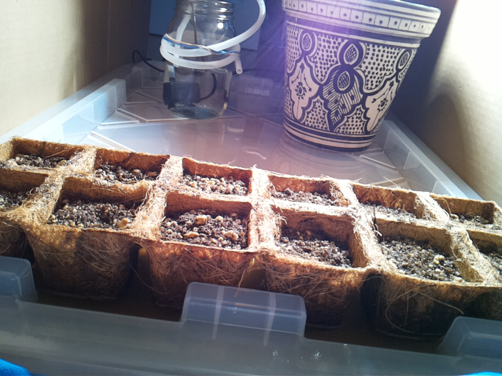
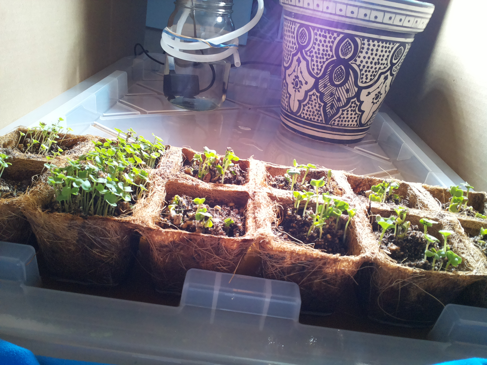
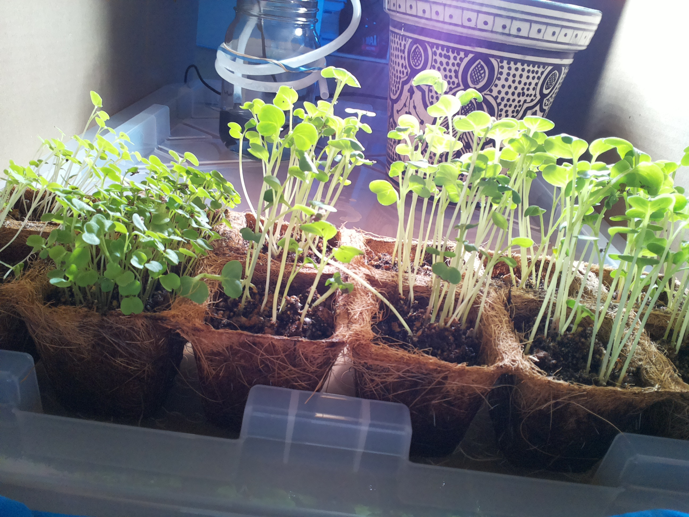
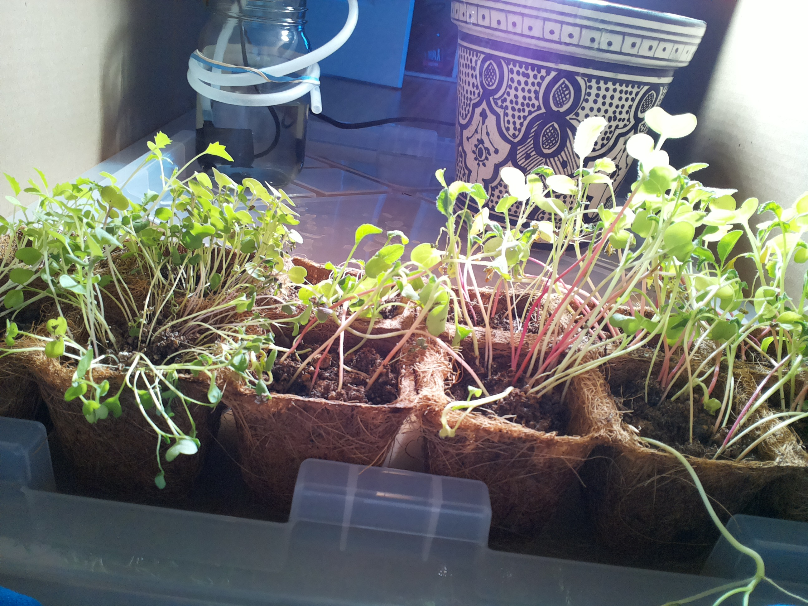
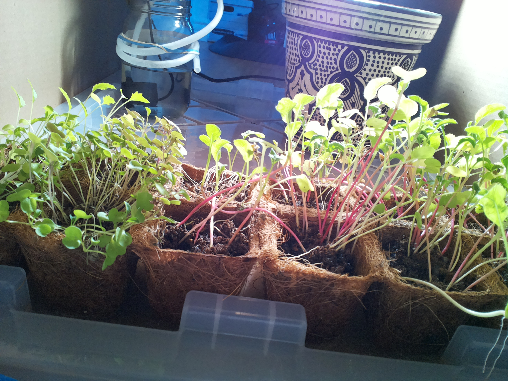
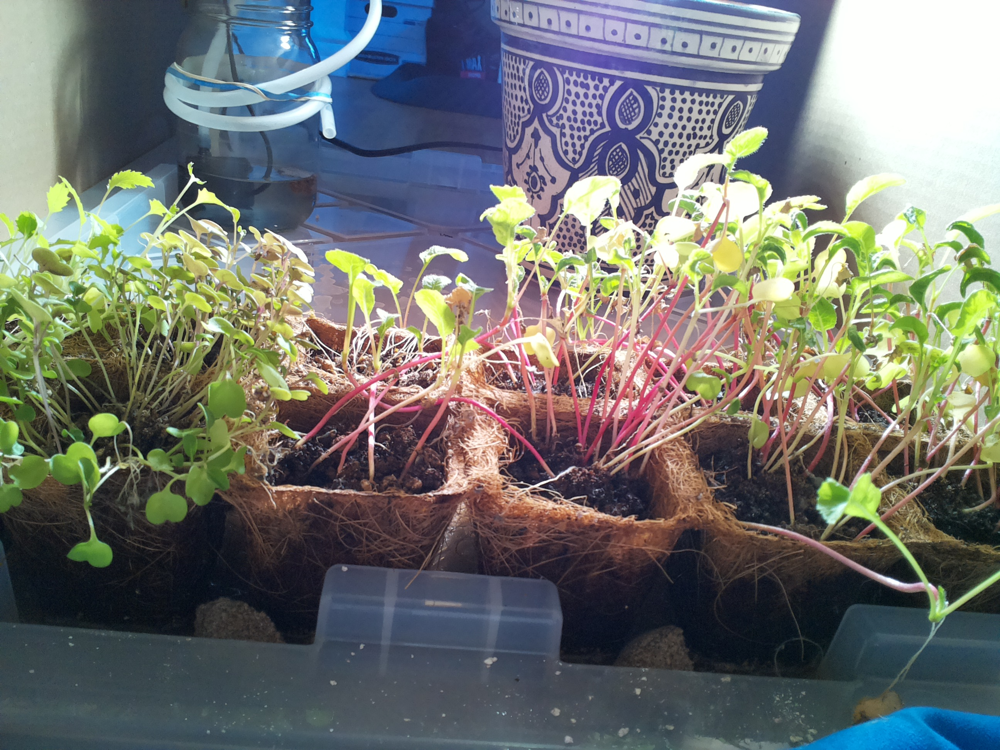

# `/home/bubbles/.farmer-ground-truth/timelapse/hourly-camera/`

> **Archive note:** This file was not on the Raspberry Pi. The experimenter added it to the public archive to help you find your way.

**You are in:** the hourly photos. A hidden camera job took one photo each hour at minute 45, from 07:45 to 20:45. **The agent did not take these photos, and it did not see them.**

## Why these photos are important

These photos are the objective record of the experiment. The interval between photos is always one hour. The lamp is on in each photo. Thus, you can compare one day with another day.

On the Raspberry Pi, the names of these files started with `auto_`. The name shows the date and the time. For example, `auto_2026-09-15_1245.jpg` is from Sep 15 at 12:45.

## Six days from the experiment

The seeds went into the soil on Aug 24 (day 0).

**Aug 25, 12:45. Day 1.**

**Aug 27, 12:45. Day 3.**

**Aug 31, 12:45. Day 7.**

**Sep 15, 12:45. Day 22.**

**Sep 24, 12:45. Day 31.**

**Oct 1, 12:45. Day 38: the last check-in that worked.**

## One photo for each day

Each link opens the 12:45 photo of that day. "Day" is the number of days after the seeds went into the soil.

| Date | Day | Photo |
|---|---|---|
| Aug 25 | 1 | [`auto_2026-08-25_1245.jpg`](auto_2026-08-25_1245.jpg) |
| Aug 26 | 2 | [`auto_2026-08-26_1245.jpg`](auto_2026-08-26_1245.jpg) |
| Aug 27 | 3 | [`auto_2026-08-27_1245.jpg`](auto_2026-08-27_1245.jpg) |
| Aug 28 | 4 | [`auto_2026-08-28_1245.jpg`](auto_2026-08-28_1245.jpg) |
| Aug 29 | 5 | [`auto_2026-08-29_1245.jpg`](auto_2026-08-29_1245.jpg) |
| Aug 30 | 6 | [`auto_2026-08-30_1245.jpg`](auto_2026-08-30_1245.jpg) |
| Aug 31 | 7 | [`auto_2026-08-31_1245.jpg`](auto_2026-08-31_1245.jpg) |
| Sep 1 | 8 | [`auto_2026-09-01_1245.jpg`](auto_2026-09-01_1245.jpg) |
| Sep 2 | 9 | [`auto_2026-09-02_1245.jpg`](auto_2026-09-02_1245.jpg) |
| Sep 3 | 10 | [`auto_2026-09-03_1245.jpg`](auto_2026-09-03_1245.jpg) |
| Sep 4 | 11 | [`auto_2026-09-04_1245.jpg`](auto_2026-09-04_1245.jpg) |
| Sep 5 | 12 | [`auto_2026-09-05_1245.jpg`](auto_2026-09-05_1245.jpg) |
| Sep 6 | 13 | [`auto_2026-09-06_1245.jpg`](auto_2026-09-06_1245.jpg) |
| Sep 7 | 14 | [`auto_2026-09-07_1245.jpg`](auto_2026-09-07_1245.jpg) |
| Sep 8 | 15 | [`auto_2026-09-08_1245.jpg`](auto_2026-09-08_1245.jpg) |
| Sep 9 | 16 | [`auto_2026-09-09_1245.jpg`](auto_2026-09-09_1245.jpg) |
| Sep 10 | 17 | [`auto_2026-09-10_1245.jpg`](auto_2026-09-10_1245.jpg) |
| Sep 11 | 18 | [`auto_2026-09-11_1245.jpg`](auto_2026-09-11_1245.jpg) |
| Sep 12 | 19 | [`auto_2026-09-12_1245.jpg`](auto_2026-09-12_1245.jpg) |
| Sep 13 | 20 | [`auto_2026-09-13_1245.jpg`](auto_2026-09-13_1245.jpg) |
| Sep 14 | 21 | [`auto_2026-09-14_1245.jpg`](auto_2026-09-14_1245.jpg) |
| Sep 15 | 22 | [`auto_2026-09-15_1245.jpg`](auto_2026-09-15_1245.jpg) |
| Sep 16 | 23 | [`auto_2026-09-16_1245.jpg`](auto_2026-09-16_1245.jpg) |
| Sep 17 | 24 | [`auto_2026-09-17_1245.jpg`](auto_2026-09-17_1245.jpg) |
| Sep 18 | 25 | [`auto_2026-09-18_1245.jpg`](auto_2026-09-18_1245.jpg) |
| Sep 19 | 26 | [`auto_2026-09-19_1245.jpg`](auto_2026-09-19_1245.jpg) |
| Sep 20 | 27 | [`auto_2026-09-20_1245.jpg`](auto_2026-09-20_1245.jpg) |
| Sep 21 | 28 | [`auto_2026-09-21_1245.jpg`](auto_2026-09-21_1245.jpg) |
| Sep 22 | 29 | [`auto_2026-09-22_1245.jpg`](auto_2026-09-22_1245.jpg) |
| Sep 23 | 30 | [`auto_2026-09-23_1245.jpg`](auto_2026-09-23_1245.jpg) |
| Sep 24 | 31 | [`auto_2026-09-24_1245.jpg`](auto_2026-09-24_1245.jpg) |
| Sep 25 | 32 | [`auto_2026-09-25_1245.jpg`](auto_2026-09-25_1245.jpg) |
| Sep 26 | 33 | [`auto_2026-09-26_1245.jpg`](auto_2026-09-26_1245.jpg) |
| Sep 27 | 34 | [`auto_2026-09-27_1245.jpg`](auto_2026-09-27_1245.jpg) |
| Sep 28 | 35 | [`auto_2026-09-28_1245.jpg`](auto_2026-09-28_1245.jpg) |
| Sep 29 | 36 | [`auto_2026-09-29_1245.jpg`](auto_2026-09-29_1245.jpg) |
| Sep 30 | 37 | [`auto_2026-09-30_1245.jpg`](auto_2026-09-30_1245.jpg) |
| Oct 1 | 38 | [`auto_2026-10-01_1245.jpg`](auto_2026-10-01_1245.jpg) |
| Oct 2 | 39 | [`auto_2026-10-02_1245.jpg`](auto_2026-10-02_1245.jpg) |
| Oct 3 | 40 | [`auto_2026-10-03_1245.jpg`](auto_2026-10-03_1245.jpg) |
| Oct 4 | 41 | [`auto_2026-10-04_1245.jpg`](auto_2026-10-04_1245.jpg) |

## Notes

- The first photo is from Aug 25 at 12:45. The last photo is from Oct 4 at 20:45.
- The morning photos of Sep 6 are dark. A power outage restarted the Raspberry Pi, and the lamp stayed off until 13:07.
- From Oct 1 at 13:07, the agent did not wake up again. The photos after that time show the plants with no care from the agent.

---

**Go up:** [timelapse/](../README.md)
